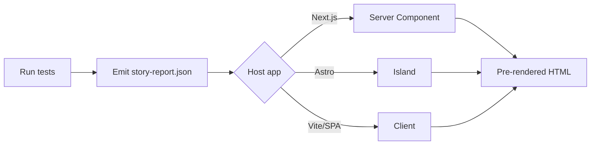

Your tests already produce living documentation. The `executable-stories-react` package lets that documentation live where your team already works — your docs portal, internal dashboard, or product site — rather than as a standalone HTML file.

This guide shows how to wire it up in the three host frameworks people most commonly ask about.

## The flow



1. Run your tests with one of the framework adapters (Vitest, Jest, Playwright, Cypress, Go, Ruby, Rust, Python, JUnit 5, xUnit).
2. Emit the JSON: `executable-stories format raw-run.json --format story-report-json`.
3. Drop `<Report>` (or `<ReportInteractive>`) into your host app, passing the parsed JSON.

The full reference for components, props, and theming lives at [React renderer](/reference/react-renderer).

## Next.js (App Router)

Install:

```bash
pnpm add executable-stories-react executable-stories-formatters
```

Import the stylesheet once in your root layout:

```tsx
// app/layout.tsx
import "executable-stories-react/styles.css";

export default function RootLayout({ children }) {
  return (
    <html lang="en">
      <body>{children}</body>
    </html>
  );
}
```

A static, server-rendered report:

```tsx
// app/report/page.tsx
import { readFile } from "node:fs/promises";
import { join } from "node:path";
import { parseStoryReport } from "executable-stories-react/parse";
import { Report } from "executable-stories-react";

export default async function ReportPage() {
  const raw = await readFile(join(process.cwd(), "public", "story-report.json"), "utf8");
  return <Report report={parseStoryReport(JSON.parse(raw))} title="Test report" />;
}
```

For the interactive flavor (live search, failure jump, keyboard shortcuts), keep the parsing in the server component and pass the result to a thin client component:

```tsx
// app/report/page.tsx (server)
import { readFile } from "node:fs/promises";
import { parseStoryReport } from "executable-stories-react/parse";
import { ClientReport } from "./client";

export default async function Page() {
  const raw = await readFile("./public/story-report.json", "utf8");
  return <ClientReport result={parseStoryReport(JSON.parse(raw))} />;
}
```

```tsx
// app/report/client.tsx (client)
"use client";
import { ReportInteractive } from "executable-stories-react/interactive";
import type { Result, StoryReport } from "executable-stories-react/parse";

export function ClientReport({ result }: { result: Result<StoryReport> }) {
  return <ReportInteractive report={result} title="Test report" />;
}
```

A working end-to-end example with two routes (static + interactive) lives at [`apps/react-report-example`](https://github.com/jagreehal/executable-stories/tree/main/apps/react-report-example) in the monorepo. Both routes produce fully prerendered static HTML.

## Astro / Starlight

The same pattern works in `.astro` pages. The static `<Report>` is plain semantic HTML on the server, so it works without a `client:` directive at all:

```astro
---
// src/pages/report.astro
import "executable-stories-react/styles.css";
import { Report } from "executable-stories-react";
import { parseStoryReport } from "executable-stories-react/parse";
import data from "../../public/story-report.json";

const result = parseStoryReport(data);
---

<html>
  <body>
    <Report report={result} title="Test report" client:load={false} />
  </body>
</html>
```

For interactivity, wrap with `client:visible`:

```astro
---
import { ReportInteractive } from "executable-stories-react/interactive";
import { parseStoryReport } from "executable-stories-react/parse";
import data from "../../public/story-report.json";

const result = parseStoryReport(data);
---

<ReportInteractive report={result} client:visible />
```

This works well alongside the [Astro docs site formatter](/guides/astro-docs-site): use the Astro/Markdown formatter for the canonical published spec, and embed the live React component on a separate "Latest test run" page that updates with every CI build.

## Vite / SPA

In a standalone React + Vite app, fetch the JSON at runtime and render:

```tsx
// src/App.tsx
import { useEffect, useState } from "react";
import { Report } from "executable-stories-react";
import { parseStoryReport, type Result, type StoryReport } from "executable-stories-react/parse";
import "executable-stories-react/styles.css";

export function App() {
  const [result, setResult] = useState<Result<StoryReport> | null>(null);

  useEffect(() => {
    fetch("/story-report.json")
      .then((r) => r.json())
      .then((json) => setResult(parseStoryReport(json)));
  }, []);

  if (!result) return <p>Loading…</p>;
  return <Report report={result} />;
}
```

The leaf component itself doesn't fetch (that's the consumer's job); pair it with your data layer of choice (React Query, SWR, plain `useEffect`).

## Theming to match your site

Override CSS variables anywhere above the report:

```css
/* matches whatever your site already uses */
:root {
  --es-color-passed: var(--brand-success, oklch(72% 0.16 145));
  --es-color-failed: var(--brand-danger, oklch(64% 0.20 25));
  --es-font-body: var(--site-body-font, system-ui);
  --es-radius: var(--site-radius, 0.25rem);
}
```

Dark mode adapts automatically to `prefers-color-scheme`. Force a scheme with `data-theme="dark"` (or `"light"`) on any ancestor — useful if your site already has a theme toggle.

The complete token catalog is documented at [React renderer → Theming](/reference/react-renderer#theming). The same tokens are emitted by the standalone HTML formatter, so one stylesheet themes both surfaces.

## Plugging in your own renderers

For user-defined doc entries (`story.custom({ type: "chart", data: ... })`), supply a registry:

```tsx
<Report
  report={result}
  customRenderers={{
    chart: (entry) => <YourChartComponent spec={entry.data} />,
    "trace-waterfall": (entry) => <Waterfall spans={entry.data} />,
  }}
/>
```

For the three heavy built-ins (Mermaid, code highlighting, Markdown sections), opt into your own implementation if you already ship one:

```tsx
<Report
  report={result}
  renderers={{
    mermaid: (entry) => <YourMermaid code={entry.code} />,
    code: (entry) => <Shiki code={entry.content} lang={entry.lang} />,
  }}
/>
```

The defaults are deliberately small (Mermaid renders source as `<pre>`; code as `<pre><code class="language-X">`). They're AI-readable, screen-reader friendly, and zero-JS — perfect for static export. Override only when you need richer client-side rendering.

## When to use this vs. the standalone HTML report

| Use the standalone HTML report when… | Use `executable-stories-react` when… |
| --- | --- |
| You want one self-contained file you can open or attach. | You already have a React docs portal, dashboard, or internal app. |
| You're shipping to consumers who don't run a host site. | You want the report to live alongside your team's other tooling. |
| You need print-out / PDF distribution. | You need custom layout, navigation, or auth integration. |

Both surfaces consume the same data model and share the same `--es-*` theme tokens, so you can ship both from one source of truth.

## See also

- [React renderer reference](/reference/react-renderer) — components, props, primitives, schema validation.
- [Formatters API](/reference/formatters-api) — emit `story-report-json` from any framework adapter.
- [Theming](/reference/themes) — the shared `--es-*` token catalog.
