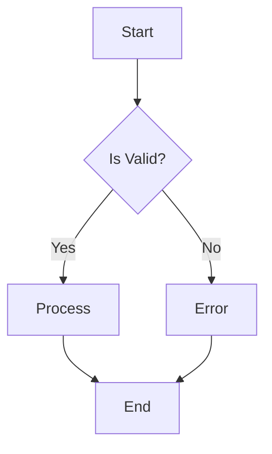
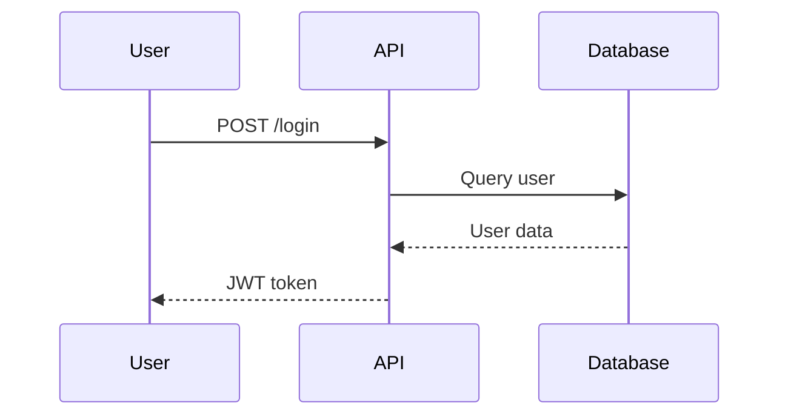
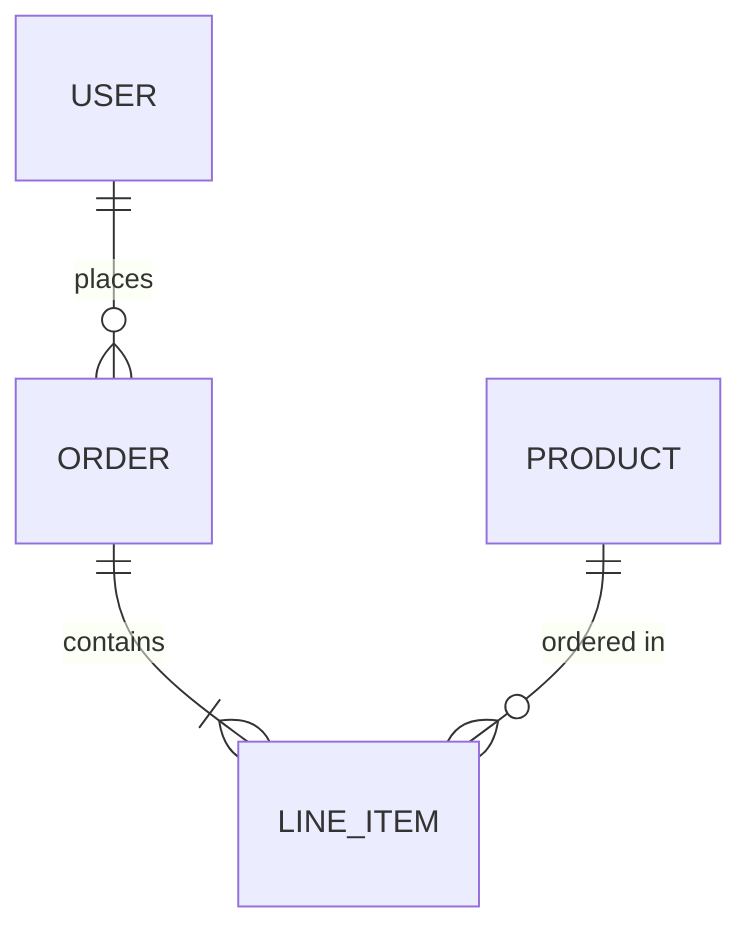
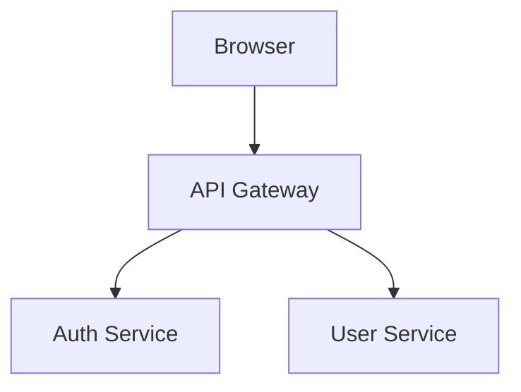
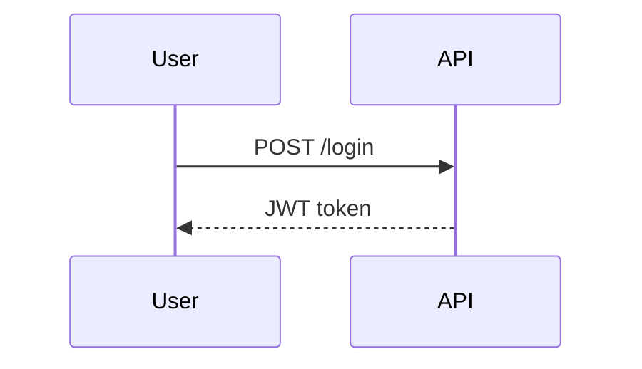
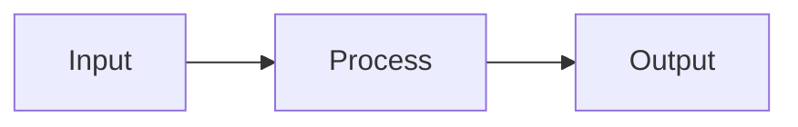
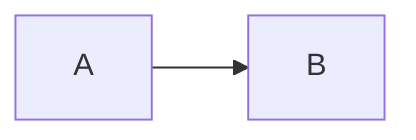

# User Stories

| Key | Value |
| --- | --- |
| Date | 2026-02-14T21:50:26.530Z |
| Version | 1.0.0 |
| Git SHA | e478969 |

## src/all-doc-api.story.test.ts

### ✅ doc.note() demonstration

> This is a simple note about the story
> Notes can span multiple lines
and include line breaks
- **Given** a precondition with a note
    > Notes can appear between steps
- **When** an action occurs
    > Final note before assertion
- **Then** verification passes

### ✅ doc.tag() demonstration

`smoke`
`regression` `critical`
`api`
`doc-api`
- **Given** tags are added
- **Then** story has multiple tags for filtering

### ✅ doc.kv() demonstration

- **Environment:** test
- **Version:** 1.0.0
- **Author:** Test Team
- **Priority:** high
- **Numeric Value:** 42
- **Boolean Value:** true
- **Given** key-value pairs are defined
    - **Step-specific Key:** value after step
- **Then** all key-value pairs appear in documentation

### ✅ doc.code() demonstration

**TypeScript Example**

```typescript
const greeting: string = "Hello, World!";
console.log(greeting);

function add(a: number, b: number): number {
  return a + b;
}
```

**JavaScript Example**

```javascript
const data = { name: "test", value: 42 };
console.log(JSON.stringify(data));
```

**SQL Query**

```sql
SELECT users.name, orders.total
FROM users
INNER JOIN orders ON users.id = orders.user_id
WHERE orders.total > 100
ORDER BY orders.total DESC;
```

**Shell Command**

```bash
#!/bin/bash
npm install
npm run build
npm test
```

- **Given** code blocks with different languages
- **Then** code is syntax highlighted in docs

### ✅ doc.json() demonstration

**Simple Object**

```json
{
  "name": "test",
  "value": 42,
  "active": true
}
```

**Nested Configuration**

```json
{
  "database": {
    "host": "localhost",
    "port": 5432,
    "credentials": {
      "username": "admin",
      "password": "****"
    }
  },
  "features": [
    "auth",
    "cache",
    "logging"
  ],
  "settings": {
    "maxConnections": 100,
    "timeout": 30000
  }
}
```

**Array of Items**

```json
[
  {
    "id": 1,
    "name": "Item 1"
  },
  {
    "id": 2,
    "name": "Item 2"
  },
  {
    "id": 3,
    "name": "Item 3"
  }
]
```

- **Given** JSON objects are documented
- **Then** JSON is formatted and displayed

### ✅ doc.table() demonstration

**Test Results Summary**

| Test Suite | Status | Duration | Coverage |
| --- | --- | --- | --- |
| Unit Tests | Passed | 2.3s | 95% |
| Integration Tests | Passed | 5.1s | 87% |
| E2E Tests | Failed | 12.4s | 72% |
| Performance Tests | Skipped | - | - |

**Feature Matrix**

| Feature | Chrome | Firefox | Safari |
| --- | --- | --- | --- |
| WebGL | Yes | Yes | Partial |
| WebRTC | Yes | Yes | Yes |
| Service Workers | Yes | Yes | Yes |

- **Given** tables are defined
- **Then** tables render as markdown

### ✅ doc.link() demonstration

[Project Documentation](https://example.com/docs)
[API Reference](https://example.com/api)
[Issue Tracker](https://github.com/example/project/issues)
[CI/CD Pipeline](https://ci.example.com/pipeline/123)
- **Given** links to external resources
- **Then** links are clickable in docs

### ✅ doc.section() demonstration

**Prerequisites**

Before running this test, ensure:

- Node.js 18+ is installed
- Database is running
- Environment variables are set

```bash
export API_KEY=your-key-here
```

**Expected Behavior**

The system should:

1. Validate user input
2. Process the request
3. Return appropriate response

> **Note:** Error handling is tested separately.

- **Given** sections with rich markdown
- **Then** sections appear as collapsible or titled blocks

### ✅ doc.mermaid() demonstration

**Flow Diagram**

**Sequence Diagram**

**Entity Relationship**

- **Given** mermaid diagrams are defined
- **Then** diagrams render in documentation

### ✅ doc.screenshot() demonstration


- **Given** screenshot paths are recorded
- **Then** screenshots appear in documentation

### ✅ doc.custom() demonstration

**[chart]**

```json
{
  "type": "bar",
  "data": [
    10,
    20,
    30,
    40
  ],
  "labels": [
    "Q1",
    "Q2",
    "Q3",
    "Q4"
  ]
}
```

**[metric]**

```json
{
  "name": "Response Time",
  "value": 145,
  "unit": "ms",
  "threshold": 200
}
```

**[badge]**

```json
{
  "label": "Coverage",
  "value": "95%",
  "color": "green"
}
```

- **Given** custom content types are added
- **Then** custom renderers can process them

### ✅ Runtime doc.* demonstration

> Static doc added at registration time
- **Given** setup with runtime values
- **When** action produces runtime data
- **Then** runtime values appear in docs

### ✅ Complete doc API demonstration

> This story demonstrates all doc API methods in one place
`comprehensive` `documentation` `example`
- **Author:** Documentation Team
- **Version:** 2.0
[Full Documentation](https://example.com/docs/complete)
- **Given** all documentation methods are available
    **Test Configuration**
    
    ```json
    {
      "environment": "test",
      "features": [
        "all"
      ]
    }
    ```
    
- **When** documentation is generated
    **API Coverage**
    
    | Method | Supported | Example |
    | --- | --- | --- |
    | note() | Yes | Free text notes |
    | tag() | Yes | Categorization |
    | kv() | Yes | Key-value pairs |
    | code() | Yes | Syntax highlighted code |
    | json() | Yes | JSON objects |
    | table() | Yes | Markdown tables |
    | link() | Yes | Hyperlinks |
    | section() | Yes | Markdown sections |
    | mermaid() | Yes | Diagrams |
    | screenshot() | Yes | Images |
    | custom() | Yes | Custom types |
    | runtime.* | Yes | Runtime values |
    
    **Documentation Flow**
    ```mermaid
    graph LR
        A[Doc API] --> B[Static Docs]
        A --> C[Runtime Docs]
        B --> D[Generated MD]
        C --> D
    ```
- **Then** all methods work together

## src/api-variations.story.test.ts

### ✅ Framework native with doc.story


### ✅ Optional callbacks for all step keywords

- **Given** given context without callback
- **When** when action without callback
- **Then** then assertion without callback
- **And** and additional step without callback
- **Given** arrange context without callback
- **When** act action without callback
- **Then** assert with callback
- **Given** setup context without callback
- **Given** context setup without callback
- **When** execute action without callback
- **When** action execute without callback
- **Then** verify with callback

### ✅ Multiple steps become And

- **Given** first given
- **Given** second given becomes And
- **When** first when
- **When** second when becomes And
- **Then** first then
- **Then** second then becomes And

### ✅ Story with metadata
Tags: `api`, `smoke` | Tickets: `JIRA-123`

- **Given** context
- **Then** assertion

### ✅ Story with notes and tags

> This is a note about the story
`smoke`
`api` `important`
- **Given** context
    - **key:** value
- **Then** assertion

## src/async-patterns.story.test.ts

### ✅ Basic async/await in steps

> Steps can be async functions using async/await syntax
- **Given** user ID is known
- **When** user data is fetched
- **Then** user data is available

### ✅ Parallel async operations with Promise.all

> Multiple async operations can run in parallel using Promise.all
- **Given** user is authenticated
- **When** user data and orders are fetched in parallel
- **Then** all data is available
- **And** total order value is calculated

### ✅ Sequential async operations

> Some operations must be sequential due to dependencies
- **Given** nothing is loaded yet
- **When** user is fetched first
- **And** then orders are fetched using user ID
- **Then** both user and orders are available

### ✅ Async setup and teardown pattern

> Setup and teardown can be async for database connections, etc.
- **Given** database connection is established
- **Given** transaction is started
- **When** data is saved
- **Then** transaction can be committed
- **Then** connection is still open for cleanup

### ✅ Error handling in async steps

> Async errors should be properly caught and handled
- **Given** an async operation that might fail
- **When** the operation fails
- **Then** error is caught and can be asserted

### ✅ Working with timeouts and delays

> Async operations can include deliberate delays for timing
- **Given** timer starts
- **When** operation with delay completes
- **Then** elapsed time is measurable

### ✅ Async iteration over collections

> Processing collections asynchronously
- **Given** a collection of items
- **When** items are processed asynchronously
- **Then** all items are processed

### ✅ Parallel iteration with Promise.all and map

> Processing all items in parallel for better performance
- **Given** a collection of numbers
- **When** items are processed in parallel
- **Then** all items are doubled

### ✅ Real-world async API test pattern

> Simulates a complete async API test scenario
`async`
- **Given** API client is configured
- **When** GET request is made
- **When** POST request is made
- **Then** GET response is valid
- **Then** POST response is valid
- **Then** both responses have timestamps

### ✅ Async steps with runtime documentation

> Runtime docs capture async operation results
- **Given** async operation is prepared
- **When** async data is fetched
- **Then** runtime docs contain async results

## src/calculator.story.test.ts

### ✅ Calculator Calculator adds two numbers

- **Given** two numbers 5 and 3
- **When** the numbers are added
- **Then** the result is 8

### ✅ Calculator Calculator subtracts two numbers

- **Given** two numbers 10 and 4
- **When** the second is subtracted from the first
- **Then** the result is 6

### ✅ Calculator Calculator multiplies two numbers

- **Given** two numbers 7 and 6
- **When** the numbers are multiplied
- **Then** the result is 42

### ✅ Calculator Calculator divides two numbers

- **Given** two numbers 20 and 4
- **When** the first is divided by the second
- **Then** the result is 5

### ✅ Calculator Calculator throws error on division by zero

> Division by zero should throw an error
- **Given** a number 10 and zero
- **When** division is attempted
- **Then** an error is thrown

## src/complex-data.story.test.ts

### ✅ Deeply nested JSON structures

> Demonstrating complex nested JSON in documentation
**Application Configuration**

```json
{
  "app": {
    "name": "MyApplication",
    "version": "2.1.0",
    "environment": "production"
  },
  "server": {
    "host": "api.example.com",
    "port": 443,
    "ssl": {
      "enabled": true,
      "certificate": "/path/to/cert.pem",
      "key": "/path/to/key.pem",
      "protocols": [
        "TLSv1.2",
        "TLSv1.3"
      ]
    },
    "timeouts": {
      "connection": 30000,
      "read": 60000,
      "write": 60000
    }
  },
  "database": {
    "primary": {
      "host": "db-primary.example.com",
      "port": 5432,
      "name": "app_production",
      "pool": {
        "min": 5,
        "max": 20,
        "idle": 10000
      }
    },
    "replica": {
      "hosts": [
        "db-replica-1.example.com",
        "db-replica-2.example.com"
      ],
      "loadBalancing": "round-robin"
    }
  },
  "cache": {
    "provider": "redis",
    "cluster": {
      "nodes": [
        {
          "host": "redis-1.example.com",
          "port": 6379
        },
        {
          "host": "redis-2.example.com",
          "port": 6379
        },
        {
          "host": "redis-3.example.com",
          "port": 6379
        }
      ]
    },
    "ttl": {
      "default": 3600,
      "session": 86400,
      "static": 604800
    }
  },
  "features": {
    "flags": {
      "newUI": true,
      "betaFeatures": false,
      "experimentalAPI": {
        "enabled": true,
        "allowedUsers": [
          "admin",
          "beta-tester"
        ]
      }
    }
  }
}
```

- **Given** complex configuration is loaded
- **Then** nested structures are documented

### ✅ Arrays of complex objects

> Documenting arrays with complex nested structures
**User Profiles**

```json
[
  {
    "id": "user-001",
    "profile": {
      "name": "Alice Johnson",
      "email": "alice@example.com",
      "avatar": "https://example.com/avatars/alice.jpg"
    },
    "permissions": {
      "roles": [
        "admin",
        "editor"
      ],
      "resources": {
        "documents": [
          "read",
          "write",
          "delete"
        ],
        "users": [
          "read",
          "write"
        ],
        "settings": [
          "read",
          "write",
          "admin"
        ]
      }
    },
    "preferences": {
      "theme": "dark",
      "notifications": {
        "email": true,
        "push": true,
        "sms": false
      },
      "language": "en-US"
    }
  },
  {
    "id": "user-002",
    "profile": {
      "name": "Bob Smith",
      "email": "bob@example.com",
      "avatar": "https://example.com/avatars/bob.jpg"
    },
    "permissions": {
      "roles": [
        "viewer"
      ],
      "resources": {
        "documents": [
          "read"
        ],
        "users": [
          "read"
        ],
        "settings": []
      }
    },
    "preferences": {
      "theme": "light",
      "notifications": {
        "email": true,
        "push": false,
        "sms": false
      },
      "language": "en-GB"
    }
  }
]
```

- **Given** user profiles are loaded
- **Then** complex arrays are documented

### ✅ Large data tables

> Tables with many rows and columns
**API Endpoints Reference**

| Method | Endpoint | Auth | Rate Limit | Description |
| --- | --- | --- | --- | --- |
| GET | /api/v1/users | Bearer | 100/min | List all users |
| GET | /api/v1/users/:id | Bearer | 200/min | Get user by ID |
| POST | /api/v1/users | Bearer | 50/min | Create new user |
| PUT | /api/v1/users/:id | Bearer | 50/min | Update user |
| DELETE | /api/v1/users/:id | Bearer | 20/min | Delete user |
| GET | /api/v1/orders | Bearer | 100/min | List all orders |
| GET | /api/v1/orders/:id | Bearer | 200/min | Get order by ID |
| POST | /api/v1/orders | Bearer | 30/min | Create new order |
| PUT | /api/v1/orders/:id | Bearer | 30/min | Update order |
| DELETE | /api/v1/orders/:id | Bearer | 10/min | Cancel order |
| GET | /api/v1/products | None | 500/min | List products |
| GET | /api/v1/products/:id | None | 1000/min | Get product |
| POST | /api/v1/products | Admin | 20/min | Create product |
| PUT | /api/v1/products/:id | Admin | 20/min | Update product |
| DELETE | /api/v1/products/:id | Admin | 5/min | Delete product |

**HTTP Status Codes Reference**

| Code | Status | Category | Common Use |
| --- | --- | --- | --- |
| 200 | OK | Success | Successful GET/PUT |
| 201 | Created | Success | Successful POST |
| 204 | No Content | Success | Successful DELETE |
| 400 | Bad Request | Client Error | Invalid input |
| 401 | Unauthorized | Client Error | Auth required |
| 403 | Forbidden | Client Error | Access denied |
| 404 | Not Found | Client Error | Resource missing |
| 500 | Internal Error | Server Error | Server failure |

- **Given** API documentation is needed
- **Then** large tables provide comprehensive reference

### ✅ SQL code examples

> SQL queries in documentation
**Complex SELECT Query**

```sql
SELECT u.id, u.name, u.email, COUNT(o.id) as order_count
FROM users u
LEFT JOIN orders o ON u.id = o.user_id
WHERE u.status = 'active'
GROUP BY u.id, u.name, u.email;
```

- **Given** SQL examples are documented
- **Then** SQL syntax is highlighted

### ✅ YAML configuration examples

> YAML configuration files in documentation
**Docker Compose Configuration**

```yaml
version: '3.8'
services:
  app:
    build: { context: . }
    ports: ["3000:3000"]
  db:
    image: postgres:15
```

- **Given** YAML configs are documented
- **Then** YAML syntax is highlighted

### ✅ Shell script examples

> Bash scripts and commands in documentation
**Deployment Script**

```bash
#!/bin/bash
set -euo pipefail
echo "Deploying..."
npm ci && npm run build && npm test
```

- **Given** shell scripts are documented
- **Then** bash syntax is highlighted

### ✅ Various Mermaid diagram types

> Different types of Mermaid diagrams
**System Architecture**

**Authentication Flow**

- **Given** various diagram types are documented
- **Then** all Mermaid diagram types render

### ✅ Story with complex metadata structure
Tags: `complex-data`, `comprehensive`, `documentation` | Tickets: `DOCS-001`, `TECH-456`

> This story demonstrates complex metadata in story options
- **Given** story has rich metadata
- **When** documentation is generated
- **Then** metadata is preserved in output

### ✅ All complex data types in one story

> Comprehensive example combining all complex data documentation
`comprehensive` `all-in-one`
- **Documentation Version:** 2.0
- **Completeness:** 100%
[Full Documentation](https://docs.example.com)
**Sample API Response**

```json
{
  "data": {
    "users": [
      {
        "id": 1,
        "name": "Test"
      }
    ],
    "pagination": {
      "page": 1,
      "total": 100
    }
  },
  "meta": {
    "version": "1.0"
  }
}
```

**Quick Reference**

| Type | Example | Support |
| --- | --- | --- |
| JSON | Nested objects | Full |
| Tables | Multi-column | Full |
| Code | Multiple langs | Full |
| Diagrams | Mermaid | Full |

**Quick Start**

```typescript
import { story } from 'executable-stories-jest';
it('My Test', () => {
  story.init();
  story.json({ label: 'Data', value: { key: 'value' } });
});
```

**Simple Flow**

**Additional Notes**

This story demonstrates:
- Nested JSON structures
- Large tables
- Multiple code formats
- Various Mermaid diagrams
- Complex metadata

- **Given** all documentation types are used
- **Then** comprehensive documentation is generated

## src/error-scenarios.story.test.ts

### ✅ Error Scenarios Testing thrown errors with try/catch

> Traditional try/catch pattern for error testing
- **Given** a function that will throw
- **When** the function is called in try/catch
- **Then** error is caught
- **And** error message is correct
- **And** error is an instance of Error

### ✅ Error Scenarios Testing errors with Jest toThrow

> Using Jest's toThrow matcher for clean error assertions
- **Given** functions that throw different errors
- **Then** toThrow matches any error
- **Then** toThrow matches specific message
- **Then** toThrow matches error type
- **Then** toThrow matches with regex

### ✅ Error Scenarios Documenting error scenarios

> Error scenarios should be well documented
`error-documentation`
- **Given** a validation function
    **Validation Rules**
    
    ```markdown
    - Input is required
    - Minimum length: 3
    - Maximum length: 100
    ```
    
- **When** empty input is validated
- **When** short input is validated
- **When** valid input is validated
- **Then** all error cases are documented
    **Error Scenarios**
    
    | Input | Expected Errors |
    | --- | --- |
    | (empty) | Input is required, Input too short |
    | ab | Input too short |
    | valid input | None |
    

### ✅ Error Scenarios Async error handling patterns

> Testing errors in async operations
- **Given** an async function that can fail
- **When** async error is caught with try/catch
- **When** async error is caught with rejects
- **Then** successful async operation works

### ✅ Error Scenarios Testing custom error types

> Testing application-specific error classes
- **Given** custom error classes exist
    **Error Classes**
    
    ```typescript
    class ValidationError extends Error {
      field: string;
      code: string;
    }
    
    class NetworkError extends Error {
      statusCode: number;
    }
    ```
    
- **When** validation error is thrown
- **When** network error is thrown
- **Then** custom errors are properly typed

### ✅ Error Scenarios Error recovery and fallback patterns

> Testing graceful degradation and recovery
- **Given** a safe wrapper function
- **When** successful operation is wrapped
- **When** failing operation is wrapped
- **Then** errors are handled gracefully
    **Error Handling Patterns**
    
    | Pattern | Use Case |
    | --- | --- |
    | try/catch | Runtime error capture |
    | toThrow | Error assertion |
    | Result type | Graceful degradation |
    

## src/framework-native.story.test.ts

### ✅ Framework-native test with doc.story()


### ✅ Another framework-native test


### ✅ Framework-native test with multiple operations


### ✅ doc.story() used as story() replacement

- **Given** numbers are ready
- **When** addition is performed
- **Then** result is correct

### ✅ Calculator operations - mixed patterns simple addition check


### ✅ Calculator operations - mixed patterns Addition with story pattern

- **Given** two positive numbers
- **When** they are added
- **Then** the sum is returned

### ✅ Calculator operations - mixed patterns multiplication check


### ✅ Using story object from module

> Module-level story object for global access
- **Given** count starts at zero
- **When** count is incremented
- **Then** count equals one

### ✅ Stories with Jest hooks Story demonstrating hook behavior

- **Given** state starts at zero
- **When** state is modified
- **Then** state reflects changes

### ✅ Stories with Jest hooks Another story with independent state

- **Given** state starts fresh for each story
- **Then** each story has its own state

### ✅ Optional step callbacks for documentation-only steps

> Steps without callbacks are valid for documentation purposes
- **Given** user is logged in
- **Given** user has admin role
- **When** admin panel is accessed
- **Then** admin features are visible
- **Then** audit log is updated

### ✅ Using Jest matchers in story steps

> All Jest matchers work normally in story steps
- **Given** a user object
- **Then** toBe works
- **Then** toEqual works for objects
- **Then** toContain works for arrays
- **Then** toMatch works for strings
- **Then** toHaveLength works
- **Then** toHaveProperty works
- **Then** toBeDefined and toBeTruthy work

### ✅ Parameterized tests with describe.each add(1, 2) should return 3


### ✅ Parameterized tests with describe.each add(5, 5) should return 10


### ✅ Parameterized tests with describe.each add(-1, 1) should return 0


### ✅ Framework-native test with full doc API

> This test uses doc API methods in a framework-native test
`framework-native` `comprehensive`
- **Test Type:** Native
**Test Configuration**

```json
{
  "framework": "jest",
  "pattern": "native",
  "hasStory": true
}
```

**Supported Patterns**

| Pattern | Supported |
| --- | --- |
| doc.story() | Yes |
| doc.note() | Yes |
| doc.kv() | Yes |
| doc.json() | Yes |
| doc.table() | Yes |


## src/gherkin-patterns.story.test.ts

### ✅ User logs in successfully

- **Given** the user account exists
- **Given** the user is on the login page
- **Given** the account is active
- **When** the user submits valid credentials
- **Then** the user should see the dashboard

### ✅ User updates profile settings

- **Given** the user is logged in
- **When** the user navigates to settings
- **When** the user changes their display name
- **Then** the changes should be saved

### ✅ Successful order confirmation

- **Given** the user has items in cart
- **When** the user completes checkout
- **Then** the order should be created
- **Then** a confirmation email should be sent
- **Then** the inventory should be updated

### ✅ Complex user journey

- **Given** the user account exists
- **Given** the user has admin privileges
- **When** the user logs in
- **When** the user navigates to admin panel
- **Then** the admin dashboard should load
- **Then** the user count should be displayed

### ✅ Login blocked for suspended user

- **Given** the user account exists
- **Given** the account is suspended
- **When** the user submits valid credentials
- **Then** the user should see an error message
- **But** the user should not be logged in
- **But** the session should not be created

### ✅ Bulk user creation

- **Given** the following users exist
    **Users**
    
    | email | role | status |
    | --- | --- | --- |
    | alice@example.com | admin | active |
    | bob@example.com | user | active |
    | carol@example.com | user | pending |
    
- **When** the admin opens the user list
- **Then** the user list should include all users

### ✅ Form submission with multiple fields

- **Given** the user is on the registration form
- **When** the user fills in the form
    **Form Data**
    
    | field | value |
    | --- | --- |
    | name | John Doe |
    | email | john@example.com |
    | password | securepass123 |
    
- **Then** the form should be submitted successfully

### ✅ API accepts a JSON payload

- **Given** the client has the following JSON payload
    **Payload**
    
    ```json
    {
      "email": "user@example.com",
      "password": "secret",
      "rememberMe": true
    }
    ```
    
- **When** the client sends the request
- **Then** the response status should be 200

### ✅ System parses XML configuration

- **Given** the following XML configuration
    **Configuration**
    
    ```xml
    <config>
      <server>localhost</server>
      <port>8080</port>
      <debug>true</debug>
    </config>
    ```
    
- **When** the system loads the configuration
- **Then** the settings should be applied

### ✅ Change email address

- **Given** the user account exists
- **Given** the user is logged in
- **When** the user updates their email to 'new@example.com'
- **Then** a verification email should be sent

### ✅ Change password

- **Given** the user account exists
- **Given** the user is logged in
- **When** the user updates their password
- **Then** the old sessions should be invalidated
- **Then** a confirmation email should be sent

### ✅ Rule: Discounts apply only to eligible customers Eligible customer gets discount

- **Given** the customer is eligible for discounts
- **Given** the customer has items worth $100
- **When** the customer checks out
- **Then** a 10% discount should be applied
- **Then** the total should be $90

### ✅ Rule: Discounts apply only to eligible customers Ineligible customer does not get discount

- **Given** the customer is not eligible for discounts
- **Given** the customer has items worth $100
- **When** the customer checks out
- **Then** no discount should be applied
- **Then** the total should be $100

### ✅ Login error: Invalid credentials

- **Given** the user is on the login page
- **When** the user logs in with "user@example.com" and "wrong"
- **Then** the error message should be "Invalid credentials"

### ✅ Login error: Account is locked

- **Given** the user is on the login page
- **When** the user logs in with "locked@example.com" and "secret"
- **Then** the error message should be "Account is locked"

### ✅ Login error: Please verify your email

- **Given** the user is on the login page
- **When** the user logs in with "unverified@example.com" and "pass123"
- **Then** the error message should be "Please verify your email"

### ✅ Shipping for 1kg order

- **Given** an order weighing 1 kg
- **When** the shipping cost is calculated
- **Then** the shipping cost should be $5

### ✅ Shipping for 5kg order

- **Given** an order weighing 5 kg
- **When** the shipping cost is calculated
- **Then** the shipping cost should be $10

### ✅ Shipping for 10kg order

- **Given** an order weighing 10 kg
- **When** the shipping cost is calculated
- **Then** the shipping cost should be $15

### ✅ Shipping for 25kg order

- **Given** an order weighing 25 kg
- **When** the shipping cost is calculated
- **Then** the shipping cost should be $25

### ✅ admin can delete users

- **Given** a user with role "admin"
- **When** the user attempts to "delete users"
- **Then** the action should succeed

### ✅ admin can view reports

- **Given** a user with role "admin"
- **When** the user attempts to "view reports"
- **Then** the action should succeed

### ✅ user cannot delete users

- **Given** a user with role "user"
- **When** the user attempts to "delete users"
- **Then** the action should be denied
- **But** the user should see a permission error

### ✅ user can view reports

- **Given** a user with role "user"
- **When** the user attempts to "view reports"
- **Then** the action should succeed

### ✅ guest cannot view reports

- **Given** a user with role "guest"
- **When** the user attempts to "view reports"
- **Then** the action should be denied
- **But** the user should see a permission error

### ✅ Order with explicit And steps

- **Given** the user is logged in
- **And** the user has a valid payment method
- **And** the user has items in cart
- **When** the user clicks checkout
- **And** confirms the order
- **Then** the order should be created
- **And** the payment should be processed
- **And** a confirmation should be displayed

### ✅ Partial success scenario

- **Given** the user has multiple items in cart
- **Given** one item is out of stock
- **When** the user attempts to checkout
- **Then** the available items should be ordered
- **But** the out of stock item should be removed
- **And** the user should be notified
- **But** the order should not be cancelled

### ✅ Premium user gets early access
Tags: `feature-flag`, `premium` | Tickets: `JIRA-456`

- **Given** the user has a premium subscription
- **Given** the early access feature is enabled
- **When** the user logs in
- **Then** the user should see early access features

### ✅ Order summary displays correct items

- **Given** the user has completed an order
- **When** the user views the order summary
- **Then** the order should display the following items
    **Order Items**
    
    | product | quantity | price |
    | --- | --- | --- |
    | Widget A | 2 | $20.00 |
    | Widget B | 1 | $15.00 |
    | Shipping | 1 | $5.00 |
    

### ✅ Data transformation pipeline

- **Given** the following input data
    **Input**
    
    | id | name | value |
    | --- | --- | --- |
    | 1 | item-a | 100 |
    | 2 | item-b | 200 |
    
- **When** the transformation is applied
- **Then** the output should be
    **Output**
    
    | id | name | processedValue |
    | --- | --- | --- |
    | 1 | ITEM-A | 110 |
    | 2 | ITEM-B | 220 |
    

### ✅ Failed login attempt

- **Given** the user account exists
- **When** the user enters an incorrect password
- **But** the user should not be logged in
- **And** an error message should be displayed
- **And** the failed attempt should be logged

### ✅ Complete e-commerce checkout flow

- **Given** the user is logged in
- **Given** the user has items in cart
- **Given** the user has a saved address
- **Given** the user has a valid payment method
- **When** the user proceeds to checkout
- **When** the user confirms the shipping address
- **When** the user selects standard shipping
- **When** the user confirms the payment method
- **When** the user places the order
- **Then** the order should be created
- **Then** the payment should be authorized
- **Then** the inventory should be reserved
- **Then** a confirmation email should be sent
- **Then** the order should appear in order history

### ✅ API endpoint documentation

- **Given** the API server is running
    **Endpoint Details**
    
    This endpoint handles user authentication and returns a JWT token.
    
- **When** a POST request is made to /api/login
    **Request Headers**
    
    ```json
    {
      "Content-Type": "application/json",
      "Accept": "application/json"
    }
    ```
    
- **Then** the response should include a token
    **Response**
    
    ```json
    {
      "token": "eyJhbGciOiJIUzI1NiIs...",
      "expiresIn": 3600,
      "user": {
        "id": 1,
        "email": "user@example.com"
      }
    }
    ```
    

### ✅ Free User features

- **Given** a user with free plan
- **When** the user views available features
- **Then** the user should have access to 1 features
    **Available Features**
    
    ```json
    [
      "basic"
    ]
    ```
    

### ✅ Pro User features

- **Given** a user with pro plan
- **When** the user views available features
- **Then** the user should have access to 2 features
    **Available Features**
    
    ```json
    [
      "basic",
      "advanced"
    ]
    ```
    

### ✅ Enterprise User features

- **Given** a user with enterprise plan
- **When** the user views available features
- **Then** the user should have access to 3 features
    **Available Features**
    
    ```json
    [
      "basic",
      "advanced",
      "custom"
    ]
    ```
    

### ✅ Log file format validation

- **Given** the application has processed requests
- **When** the log file is generated
- **Then** the log should match the expected format
    **Expected Log Format**
    
    ```text
    [2024-01-15 10:30:00] INFO  - Request received
    [2024-01-15 10:30:01] DEBUG - Processing started
    [2024-01-15 10:30:02] INFO  - Request completed
    ```
    

### ✅ Multi-step process

- **Given** step one is complete
- **Given** step two is complete
- **Given** step three is complete
- **When** the process continues
- **When** additional processing occurs
- **Then** result one is correct
- **Then** result two is correct
- **Then** result three is correct

### ✅ User registration flow

- **Given** the registration form is displayed
    **Registration Flow**
    ```mermaid
    graph LR
        A[Form Displayed] --> B[User Fills Form]
        B --> C{Valid?}
        C -->|Yes| D[Create Account]
        C -->|No| E[Show Errors]
        D --> F[Send Email]
        F --> G[Success Page]
    ```
- **When** the user submits valid information
- **Then** the account should be created
- **Then** a verification email should be sent

### ✅ Rule: Authenticated users can manage their data User can view their profile

- **Given** the user is authenticated
- **Given** the user session is valid
- **When** the user navigates to profile page
- **Then** the profile information should be displayed

### ✅ Rule: Authenticated users can manage their data User can update their profile

- **Given** the user is authenticated
- **Given** the user session is valid
- **When** the user updates their profile
- **Then** the changes should be saved
- **And** a success message should be shown

### ✅ Complete keyword demonstration

- **Given** a given step
- **Given** another given step
- **And** an explicit and step
- **When** a when step
- **When** another when step
- **Then** a then step
- **Then** another then step
- **But** a but step
- **And** a final and step

### ✅ Standard order

- **Given** the following items in cart
    **Cart Items**
    
    | product | quantity | price |
    | --- | --- | --- |
    | A | 2 | $10 |
    | B | 1 | $20 |
    
- **When** the total is calculated
- **Then** the total should be $40

### ✅ Order with discount

- **Given** the following items in cart
    **Cart Items**
    
    | product | quantity | price |
    | --- | --- | --- |
    | A | 2 | $10 |
    | B | 1 | $20 |
    
- **Given** a 10% discount is applied
- **When** the total is calculated
- **Then** the total should be $36

## src/kitchen-sink.story.test.ts

### ✅ Kitchen sink – every story API method
Tags: `kitchen-sink` | Tickets: `KS-001`

> This test exercises every story.* method so generated docs include all of them.
`smoke`
- **Framework:** Jest
- **API Version:** 1.0
**Config**

```json
{
  "reporter": true
}
```

**Snippet**

```typescript
const x = 1;
const y = 2;
```

**Method checklist**

| Method | Used |
| --- | --- |
| story.note | Yes |
| story.tag | Yes |
| story.kv | Yes |
| story.json | Yes |
| story.code | Yes |
| story.table | Yes |
| story.link | Yes |
| story.section | Yes |
| story.mermaid | Yes |
| story.screenshot | Yes |
| story.custom | Yes |

[Docs](https://example.com/docs)
**Section title**

Section **markdown** content.

**Simple diagram**


**[sink-meta]**

```json
{
  "version": 2,
  "methods": 11
}
```

- **Given** all doc methods were called
- **When** steps are recorded
- **Then** generated doc contains note, table, kv, json, code, link, section, mermaid, screenshot, custom
- **And** step keywords given/when/then/and appear
- **Given** arrange alias works
- **When** act alias works
- **Then** assert alias works

## src/new-apis.story.test.ts

### ✅ Calculator sum (framework native)


### ✅ Optional step demo (steps are markers only) Optional step callback demo

- **Given** two numbers 1 and 2
- **Given** we are about to add
- **When** add is called
- **Then** the result is 3

## src/refactor-guide.story.test.ts

### ✅ Part 2: Introduce story (it + story.init) Calculator adds two numbers

- **Given** two numbers 2 and 3
- **When** they are added
- **Then** the result is 5

### ✅ Part 3: Framework-native with story.init() Step 2 — Keep test(), add story.init(): existing test appears in docs


### ✅ Part 4: Full patterns Calculator multiplies two numbers

- **Given** two numbers 7 and 6
- **When** they are multiplied
- **Then** the result is 42

### ✅ Part 4: Full patterns Step 3b — Framework-native test with story.init() in the same describe


### ✅ Part 4: Full patterns Calculator adds with a note

> Using small numbers; the note appears in the generated Markdown.
- **Given** two numbers 1 and 2
- **When** they are added
- **Then** the result is 3

## src/replicate.story.test.ts

### ✅ User logs in successfully

- **Given** the user account exists
- **Given** the user is on the login page
- **Given** the account is active
- **When** the user submits valid credentials
- **Then** the user should see the dashboard

### ✅ User updates profile details

- **Given** the user is logged in
- **When** the user changes their display name
- **When** the user changes their time zone
- **When** the user saves the profile
- **Then** the profile should show the updated details

### ✅ Checkout calculates totals

- **Given** the cart has 2 items
- **When** the user proceeds to checkout
- **Then** the subtotal should be $40.00
- **Then** the tax should be $4.00
- **Then** the total should be $44.00

### ✅ Password reset flow

- **Given** the user account exists
- **Given** the user has a verified email
- **When** the user requests a password reset
- **When** the user opens the reset email link
- **When** the user sets a new password
- **Then** the user should be able to log in with the new password
- **Then** the old password should no longer work

### ✅ Login blocked for suspended user

- **Given** the user account exists
- **Given** the account is suspended
- **When** the user submits valid credentials
- **Then** the user should see an error message
- **But** the user should not be logged in

### ✅ Bulk user creation

- **Given** the following users exist
    **Users**
    
    | email | role | status |
    | --- | --- | --- |
    | alice@example.com | admin | active |
    | bob@example.com | user | active |
    | eve@example.com | user | locked |
    
- **When** the admin opens the user list
- **Then** the user list should include
    **Expected**
    
    | email | role | status |
    | --- | --- | --- |
    | alice@example.com | admin | active |
    | bob@example.com | user | active |
    | eve@example.com | user | locked |
    

### ✅ Calculate shipping options

- **Given** the user has entered the shipping address
    **Address**
    
    | country | state | zip |
    | --- | --- | --- |
    | US | CA | 94107 |
    
- **When** shipping options are calculated
- **Then** the available options should include "Standard"
- **Then** the available options should include "Express"
- **Then** the estimated delivery date should be shown

### ✅ API accepts a JSON payload

- **Given** the client has the following JSON payload
    **Payload**
    
    ```json
    {
      "email": "user@example.com",
      "password": "secret",
      "rememberMe": true
    }
    ```
    
- **When** the client sends the request
- **Then** the response status should be 200
- **Then** the response body should include "token"

### ✅ Import XML invoice

- **Given** the invoice XML is
    **Invoice**
    
    ```xml
    <invoice>
      <id>INV-100</id>
      <amount>42.50</amount>
      <currency>USD</currency>
    </invoice>
    ```
    
- **When** the user imports the invoice
- **Then** the invoice should be saved
- **Then** the invoice total should be 42.50 USD

### ✅ Feature: Account settings Change email address

- **Given** the user account exists
- **Given** the user is logged in
- **When** the user updates their email to "new@example.com"
- **Then** a verification email should be sent
- **Then** the email status should be "pending verification"

### ✅ Feature: Account settings Change password

- **Given** the user account exists
- **Given** the user is logged in
- **When** the user changes their password
- **Then** the user should be able to log in with the new password

### ✅ Feature: Discounts Rule: Discounts apply only to eligible customers Eligible customer gets discount

- **Given** the customer is eligible for discounts
- **When** the customer checks out
- **Then** a discount should be applied

### ✅ Feature: Discounts Rule: Discounts apply only to eligible customers Ineligible customer does not get discount

- **Given** the customer is not eligible for discounts
- **When** the customer checks out
- **Then** no discount should be applied

### ✅ Login errors: Invalid credentials

- **Given** the user is on the login page
- **When** the user logs in with "user@example.com" and "wrong"
- **Then** the error message should be "Invalid credentials"

### ✅ Login errors: Account is locked

- **Given** the user is on the login page
- **When** the user logs in with "locked@example.com" and "secret"
- **Then** the error message should be "Account is locked"

### ✅ Login errors: Invalid credentials

- **Given** the user is on the login page
- **When** the user logs in with "unknown@example.com" and "secret"
- **Then** the error message should be "Invalid credentials"

### ✅ Tax calculation by region: CA

- **Given** the cart subtotal is 100.00
- **Given** the shipping region is "CA"
- **When** taxes are calculated
- **Then** the tax should be 8.25
- **Then** the total should be 108.25

### ✅ Tax calculation by region: NY

- **Given** the cart subtotal is 100.00
- **Given** the shipping region is "NY"
- **When** taxes are calculated
- **Then** the tax should be 8.00
- **Then** the total should be 108.00

### ✅ Create users from table input: a@example.com

- **Given** the admin is on the create user page
- **When** the admin submits the following user details
    **Details**
    
    | email | role |
    | --- | --- |
    | a@example.com | user |
    
- **Then** the user "a@example.com" should exist with role "user"

### ✅ Create users from table input: admin@example.com

- **Given** the admin is on the create user page
- **When** the admin submits the following user details
    **Details**
    
    | email | role |
    | --- | --- |
    | admin@example.com | admin |
    
- **Then** the user "admin@example.com" should exist with role "admin"

### ✅ Two step checkout

- **Given** the user has items in the cart
- **When** the user enters shipping information
- **When** the user selects a delivery option
- **When** the user enters payment information
- **When** the user confirms the order
- **Then** the order should be created
- **Then** a confirmation email should be sent

### ✅ Payment declined

- **Given** the user is on the checkout page
- **When** the user submits a declined card
- **Then** the payment should be declined
- **Then** the user should see "Payment failed"
- **But** the order should not be created

### ✅ Login works
Tags: `auth`, `smoke`

- **Given** the user is on the login page
- **When** the user logs in with valid credentials
- **Then** the user should be logged in

### ✅ Update preferences

- **Given** the user has the following preferences
    **Preferences**
    
    | key | value |
    | --- | --- |
    | email_opt_in | true |
    | theme | dark |
    | timezone | UTC |
    
- **When** the user saves preferences
- **Then** the preferences should be persisted

### ✅ Configure feature flags

- **Given** the following feature flags are set
    **Feature flags**
    
    | service | flag | enabled |
    | --- | --- | --- |
    | web | new_checkout_ui | true |
    | api | strict_rate_limiting | false |
    
- **When** the system starts
- **Then** the flag "new_checkout_ui" should be enabled for "web"
- **Then** the flag "strict_rate_limiting" should be disabled for "api"

### ✅ Guest checkout allowed

- **Given** the user is on the checkout page
- **Given** the user is not logged in
    > But guest checkout is enabled
- **When** the user submits an order as a guest
- **Then** the order should be created

### ✅ Logout clears session

- **Given** the user is logged in
- **When** the user logs out
- **Then** the session cookie should be cleared
- **Then** the auth token should be revoked
- **Then** the user should be redirected to the login page

### ✅ Document status changes

- **Given** a document exists with status "draft"
- **When** the user submits the document
- **Then** the document status should change to "submitted"
- **Then** an audit log entry should be created

### ✅ Shipping eligibility: US -> yes

- **Given** the cart total is 10
- **Given** the destination country is "US"
- **When** shipping eligibility is checked
- **Then** shipping should be "yes"

### ✅ Shipping eligibility: CA -> yes

- **Given** the cart total is 10
- **Given** the destination country is "CA"
- **When** shipping eligibility is checked
- **Then** shipping should be "yes"

### ✅ Shipping eligibility: CU -> no

- **Given** the cart total is 10
- **Given** the destination country is "CU"
- **When** shipping eligibility is checked
- **Then** shipping should be "no"

### ✅ Render markdown

- **Given** the markdown input is
    **Markdown**
    
    ```markdown
    # Title
    - Item 1
    - Item 2
    ```
    
- **When** the user previews the markdown
- **Then** the preview should show a heading "Title"
- **Then** the preview should show a list with 2 items

### ✅ Search results show highlights

- **Given** the search index contains "hello world"
- **When** the user searches for "hello"
- **Then** results should include "hello world"
- **And** the matching text should be highlighted

### ✅ Post JSON payload: 123 -> 200

- **Given** the payload is
    **Payload**
    
    ```json
    {
      "id": "123",
      "status": "active"
    }
    ```
    
- **When** the client posts the payload
- **Then** the response status should be 200

### ✅ Post JSON payload: 456 -> 400

- **Given** the payload is
    **Payload**
    
    ```json
    {
      "id": "456",
      "status": "invalid"
    }
    ```
    
- **When** the client posts the payload
- **Then** the response status should be 400

### ✅ Feature: Orders Create order
Tags: `db`, `smoke`

- **Given** the database is seeded
- **Given** the API is running
- **When** the client creates an order
- **Then** the response status should be 201
- **Then** the order should exist in the database

### ✅ Many login attempts: u1@example.com -> success

- **Given** the user is on the login page
- **When** the user logs in with "u1@example.com" and "secret"
- **Then** the login result should be "success"

### ✅ Many login attempts: u2@example.com -> fail

- **Given** the user is on the login page
- **When** the user logs in with "u2@example.com" and "wrong"
- **Then** the login result should be "fail"

### ✅ Many login attempts: u3@example.com -> success

- **Given** the user is on the login page
- **When** the user logs in with "u3@example.com" and "secret"
- **Then** the login result should be "success"

### ✅ Many login attempts: u4@example.com -> fail

- **Given** the user is on the login page
- **When** the user logs in with "u4@example.com" and "wrong"
- **Then** the login result should be "fail"

### ✅ Report shows fields in order

- **Given** a report exists for account "A1"
- **When** the user downloads the report
- **Then** the report header should be "Account Report"
- **And** the first column should be "Date"
- **And** the second column should be "Amount"

### ✅ Import users and send welcome email

- **Given** the following users are to be imported
    **Users**
    
    | email | name |
    | --- | --- |
    | a@example.com | Alice |
    | b@example.com | Bob |
    
- **And** the email template is
    **Template**
    
    ```
    Welcome {{name}}!
    Thanks for joining.
    ```
    
- **When** the import job runs
- **Then** the users should exist
- **Then** welcome emails should be sent

## src/step-aliases.story.test.ts

### ✅ Step Aliases AAA Pattern: Arrange-Act-Assert

> Classic testing pattern using arrange/act/assert aliases
`aaa-pattern`
- **Given** calculator is initialized
- **Given** input values are prepared
- **When** addition is performed
- **Then** result equals expected value
- **Then** result is a number

### ✅ Step Aliases Setup-Execute-Verify Pattern

> Alternative naming using setup/execute/verify
`sev-pattern`
- **Given** service is configured
- **Given** dependencies are mocked
- **When** service processes input
- **Then** output is transformed correctly
- **Then** output is not empty

### ✅ Step Aliases Context-Action Pattern

> Using context to establish state and action for operations
`context-action`
- **Given** user context is established
- **Given** permissions are set
- **When** user performs privileged operation
- **Then** operation succeeds

### ✅ Step Aliases Mixed pattern usage

> Different aliases can be combined in the same story
`mixed`
- **Given** initial data exists
- **Given** data is validated
- **Given** sum accumulator is initialized
- **When** sum is calculated
- **Then** sum is correct
- **Then** sum is positive

### ✅ Step Aliases User registration flow using aliases

> Realistic example using arrange/act/assert pattern
`user-flow` `registration`
- **Given** valid user data is prepared
- **Given** email is unique in the system
- **When** registration is submitted
- **Then** registration succeeds
- **Then** user ID is generated
- **Then** no error is returned

### ✅ Step Aliases All alias styles comparison

> Comparison of all available step function aliases
**Step Function Aliases**

| Purpose | BDD Style | AAA Pattern | Alternative 1 | Alternative 2 |
| --- | --- | --- | --- | --- |
| Setup/Context | given | arrange | setup | context |
| Action/Execute | when | act | execute | action |
| Verify/Assert | then | assert | verify | - |
| Continue | and | - | - | - |
| Negative | but | - | - | - |

- **Given** BDD given step
- **When** BDD when step
- **Then** BDD then step
- **Given** AAA arrange step
- **When** AAA act step
- **Then** AAA assert step
- **Given** alternative setup step
- **When** alternative execute step
- **Then** alternative verify step
- **Given** alternative context step
- **When** alternative action step
- **And** continuation step
- **But** negative case step

## src/story-options.story.test.ts

### ✅ Story with single tag
Tags: `smoke`

> Single tag for basic categorization
- **Given** a tagged story
- **When** tests are filtered
- **Then** this story matches the 'smoke' tag

### ✅ Story with multiple tags
Tags: `critical`, `regression`, `smoke`

> Multiple tags for flexible filtering
- **Given** a story with multiple tags
- **When** tests are filtered by any tag
- **Then** this story matches multiple filters

### ✅ Story with feature tags
Tags: `feature:auth`, `feature:login`

> Tags can use prefixes for organization
- **Given** a story tagged by feature
- **Then** feature filtering is possible

### ✅ Story with single ticket
Tickets: `JIRA-123`

> Links story to a single issue tracker ticket
- **Given** a story linked to JIRA-123
- **When** documentation is generated
- **Then** ticket reference appears in docs

### ✅ Story with multiple tickets
Tickets: `JIRA-123`, `JIRA-456`, `JIRA-789`

> Story can be linked to multiple tickets
- **Given** a story linked to multiple tickets
- **When** requirements are tracked
- **Then** all ticket references are documented

### ✅ Story with different ticket formats
Tickets: `JIRA-123`, `GH-456`, `BUG-789`

> Different ticket systems can be referenced
- **Given** tickets from JIRA, GitHub, and bug tracker
- **Then** all formats are supported

### ✅ Story with simple metadata

> Custom metadata attached to story
- **Given** a story with custom metadata
- **Then** metadata is available in reports

### ✅ Story with complex metadata

> Metadata can contain nested structures and arrays
- **Given** a story with rich metadata
- **When** reports are generated
- **Then** all metadata is preserved

### ✅ Story with all options combined
Tags: `critical`, `feature:checkout`, `smoke` | Tickets: `PROJ-456`

> All story options used together
- **Given** a fully configured story
- **When** documentation is generated
- **Then** all options appear in output

### ✅ Complete story configuration example
Tags: `api`, `feature:user-management` | Tickets: `EPIC-100`, `STORY-201`, `TASK-302`

> Comprehensive example with realistic metadata
`documentation-example`
- **Given** complete story configuration
- **When** documentation is generated
- **Then** rich metadata enables advanced reporting

### ✅ Story options combined with doc API
Tags: `api`, `comprehensive` | Tickets: `DOC-789`

> Story options and doc API complement each other
`additional-tag`
- **Additional Key:** Additional Value
**Options vs Doc API**

| Aspect | Story Options | Doc API |
| --- | --- | --- |
| When Set | Declaration time | Anytime |
| Structure | Fixed schema | Flexible |
| Use Case | Filtering/Reporting | Rich docs |

- **Given** story with options and doc methods
- **When** both are used
- **Then** they work together seamlessly

### ✅ Login feature - happy path
Tags: `auth`, `login`, `smoke` | Tickets: `AUTH-001`

- **Given** user is on login page
- **When** user enters valid credentials
- **Then** user is logged in successfully

### ✅ Login feature - invalid password
Tags: `auth`, `login`, `negative`, `regression` | Tickets: `AUTH-001`, `AUTH-015`

- **Given** user is on login page
- **When** user enters invalid password
- **Then** error message is displayed

### ✅ Payment processing
Tags: `checkout`, `critical`, `payment` | Tickets: `PAY-100`

> Payment tests require special handling
- **Given** user has items in cart
- **When** user completes payment
- **Then** payment is processed successfully

### ✅ Story with empty tags array

- **Given** story with empty tags
- **Then** story still works

### ✅ Story with empty meta object

- **Given** story with empty meta
- **Then** story still works

### ✅ Story with only tags
Tags: `minimal`

- **Given** story with only tags option
- **Then** other options are optional

### ✅ Story with only ticket
Tickets: `MIN-001`

- **Given** story with only ticket option
- **Then** other options are optional

### ✅ Story with only meta

- **Given** story with only meta option
- **Then** other options are optional

## src/wrapped-steps.story.test.ts

### ✅ Wrapped Steps (fn/expect) Calculator adds two numbers using fn and expect

- **Given** number a is 5
- **Given** number b is 3
- **When** the numbers are added
- **Then** the result is 8

### ✅ Wrapped Steps (fn/expect) Calculator subtracts using fn with timing

- **Given** two numbers 10 and 4
- **When** the second is subtracted from the first
- **Then** the result is 6

### ✅ Wrapped Steps (fn/expect) Calculator division by zero captured in fn

- **Given** a number 10 and zero
- **Then** division by zero throws an error

### ✅ Wrapped Steps (fn/expect) Mixed markers and wrapped steps

- **Given** the calculator is ready
- **When** we multiply 7 by 6
- **Then** the result is 42
- **And** the result is a positive number

### ✅ Wrapped Steps (fn/expect) Async fn wraps async operations with timing

- **Given** data fetched asynchronously
- **When** async addition is performed
- **Then** the async result is 8