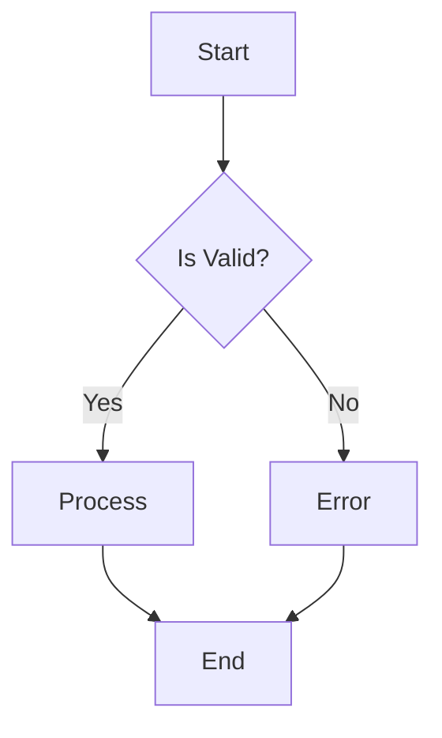
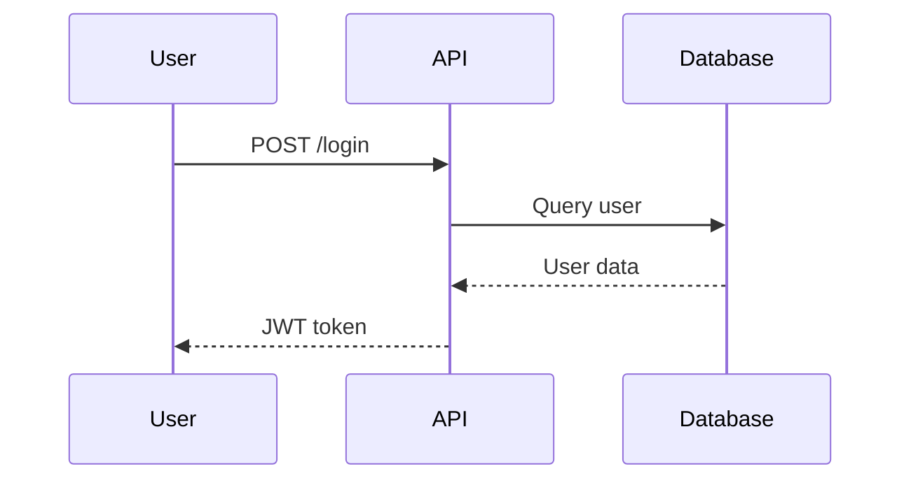
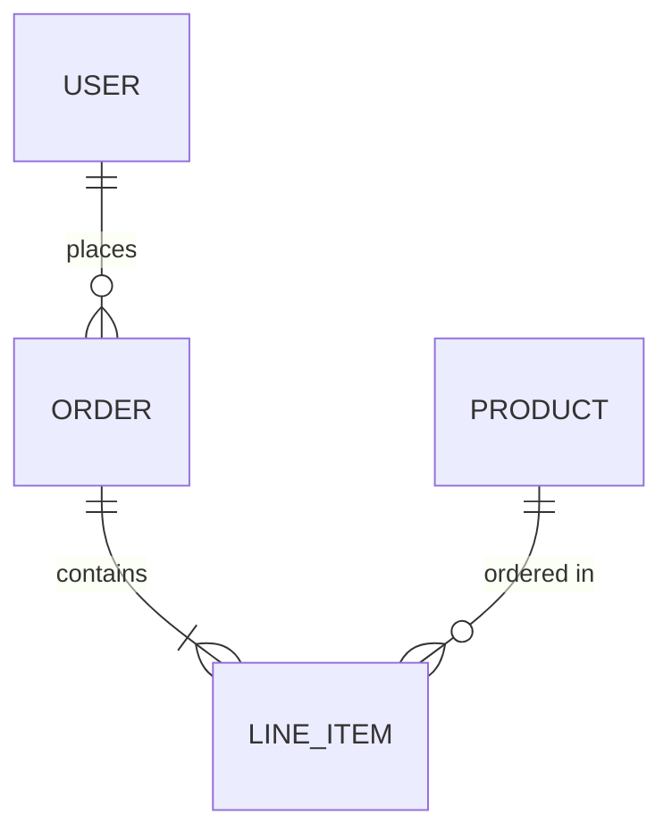

# User Stories

| Key | Value |
| --- | --- |
| Date | 2026-02-04T16:27:05.950Z |
| Version | 1.0.0 |
| Git SHA | 73f2377 |

#### ✅ doc.note() demonstration

> This is a simple note about the story
> Notes can span multiple lines
and include line breaks
- **Given** a precondition with a note
    > Notes can appear between steps
- **When** an action occurs
    > Final note before assertion
- **Then** verification passes

#### ✅ doc.tag() demonstration

`smoke`
`regression` `critical`
`api`
`doc-api`
- **Given** tags are added
- **Then** story has multiple tags for filtering

#### ✅ doc.kv() demonstration

- **Environment:** test
- **Version:** 1.0.0
- **Author:** Test Team
- **Priority:** high
- **Numeric Value:** 42
- **Boolean Value:** true
- **Given** key-value pairs are defined
    - **Step-specific Key:** value after step
- **Then** all key-value pairs appear in documentation

#### ✅ doc.code() demonstration

**TypeScript Example**

```typescript
const greeting: string = "Hello, World!";
console.log(greeting);

function add(a: number, b: number): number {
  return a + b;
}
```

**JavaScript Example**

```javascript
const data = { name: "test", value: 42 };
console.log(JSON.stringify(data));
```

**SQL Query**

```sql
SELECT users.name, orders.total
FROM users
INNER JOIN orders ON users.id = orders.user_id
WHERE orders.total > 100
ORDER BY orders.total DESC;
```

**Shell Command**

```bash
#!/bin/bash
npm install
npm run build
npm test
```

- **Given** code blocks with different languages
- **Then** code is syntax highlighted in docs

#### ✅ doc.json() demonstration

**Simple Object**

```json
{
  "name": "test",
  "value": 42,
  "active": true
}
```

**Nested Configuration**

```json
{
  "database": {
    "host": "localhost",
    "port": 5432,
    "credentials": {
      "username": "admin",
      "password": "****"
    }
  },
  "features": [
    "auth",
    "cache",
    "logging"
  ],
  "settings": {
    "maxConnections": 100,
    "timeout": 30000
  }
}
```

**Array of Items**

```json
[
  {
    "id": 1,
    "name": "Item 1"
  },
  {
    "id": 2,
    "name": "Item 2"
  },
  {
    "id": 3,
    "name": "Item 3"
  }
]
```

- **Given** JSON objects are documented
- **Then** JSON is formatted and displayed

#### ✅ doc.table() demonstration

**Test Results Summary**

| Test Suite | Status | Duration | Coverage |
| --- | --- | --- | --- |
| Unit Tests | Passed | 2.3s | 95% |
| Integration Tests | Passed | 5.1s | 87% |
| E2E Tests | Failed | 12.4s | 72% |
| Performance Tests | Skipped | - | - |

**Feature Matrix**

| Feature | Chrome | Firefox | Safari |
| --- | --- | --- | --- |
| WebGL | Yes | Yes | Partial |
| WebRTC | Yes | Yes | Yes |
| Service Workers | Yes | Yes | Yes |

- **Given** tables are defined
- **Then** tables render as markdown

#### ✅ doc.link() demonstration

[Project Documentation](https://example.com/docs)
[API Reference](https://example.com/api)
[Issue Tracker](https://github.com/example/project/issues)
[CI/CD Pipeline](https://ci.example.com/pipeline/123)
- **Given** links to external resources
- **Then** links are clickable in docs

#### ✅ doc.section() demonstration

**Prerequisites**

Before running this test, ensure:

- Node.js 18+ is installed
- Database is running
- Environment variables are set

```bash
export API_KEY=your-key-here
```

**Expected Behavior**

The system should:

1. Validate user input
2. Process the request
3. Return appropriate response

> **Note:** Error handling is tested separately.

- **Given** sections with rich markdown
- **Then** sections appear as collapsible or titled blocks

#### ✅ doc.mermaid() demonstration

**Flow Diagram**

**Sequence Diagram**

**Entity Relationship**

- **Given** mermaid diagrams are defined
- **Then** diagrams render in documentation

#### ✅ doc.screenshot() demonstration


- **Given** screenshot paths are recorded
- **Then** screenshots appear in documentation

#### ✅ doc.custom() demonstration

**[undefined]**

```json
null
```

**[undefined]**

```json
null
```

**[undefined]**

```json
null
```

- **Given** custom content types are added
- **Then** custom renderers can process them

#### ✅ Runtime doc.* demonstration

> Static doc added at registration time
- **Given** setup with runtime values
- **When** action produces runtime data
- **Then** runtime values appear in docs

#### ✅ Complete doc API demonstration

> This story demonstrates all doc API methods in one place
`comprehensive` `documentation` `example`
- **Author:** Documentation Team
- **Version:** 2.0
[Full Documentation](https://example.com/docs/complete)
- **Given** all documentation methods are available
    **Test Configuration**
    
    ```json
    {
      "environment": "test",
      "features": [
        "all"
      ]
    }
    ```
    
- **When** documentation is generated
    **API Coverage**
    
    | Method | Supported | Example |
    | --- | --- | --- |
    | note() | Yes | Free text notes |
    | tag() | Yes | Categorization |
    | kv() | Yes | Key-value pairs |
    | code() | Yes | Syntax highlighted code |
    | json() | Yes | JSON objects |
    | table() | Yes | Markdown tables |
    | link() | Yes | Hyperlinks |
    | section() | Yes | Markdown sections |
    | mermaid() | Yes | Diagrams |
    | screenshot() | Yes | Images |
    | custom() | Yes | Custom types |
    | runtime.* | Yes | Runtime values |
    
    **Documentation Flow**
    ```mermaid
    graph LR
        A[Doc API] --> B[Static Docs]
        A --> C[Runtime Docs]
        B --> D[Generated MD]
        C --> D
    ```
- **Then** all methods work together
