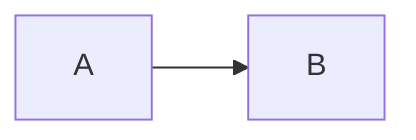

# User Stories

| Key | Value |
| --- | --- |
| Date | 2026-02-04T20:55:29.252Z |
| Version | 1.0.0 |
| Git SHA | 3149bef |

## src/kitchen-sink.story.test.ts

#### ✅ Kitchen sink – every story API method
Tags: `kitchen-sink` | Tickets: `KS-001`

> This test exercises every story.* method so generated docs include all of them.
`smoke`
- **Framework:** Jest
- **API Version:** 1.0
**Config**

```json
{
  "reporter": true
}
```

**Snippet**

```typescript
const x = 1;
const y = 2;
```

**Method checklist**

| Method | Used |
| --- | --- |
| story.note | Yes |
| story.tag | Yes |
| story.kv | Yes |
| story.json | Yes |
| story.code | Yes |
| story.table | Yes |
| story.link | Yes |
| story.section | Yes |
| story.mermaid | Yes |
| story.screenshot | Yes |
| story.custom | Yes |

[Docs](https://example.com/docs)
**Section title**

Section **markdown** content.

**Simple diagram**


**[sink-meta]**

```json
{
  "version": 2,
  "methods": 11
}
```

- **Given** all doc methods were called
- **When** steps are recorded
- **Then** generated doc contains note, table, kv, json, code, link, section, mermaid, screenshot, custom
- **And** step keywords given/when/then/and appear
- **Given** arrange alias works
- **When** act alias works
- **Then** assert alias works