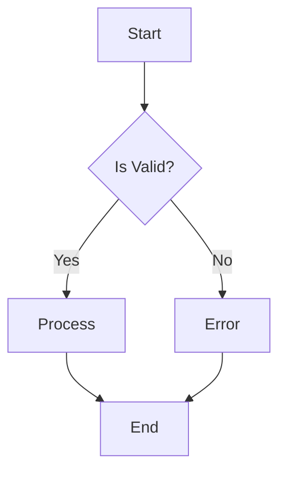
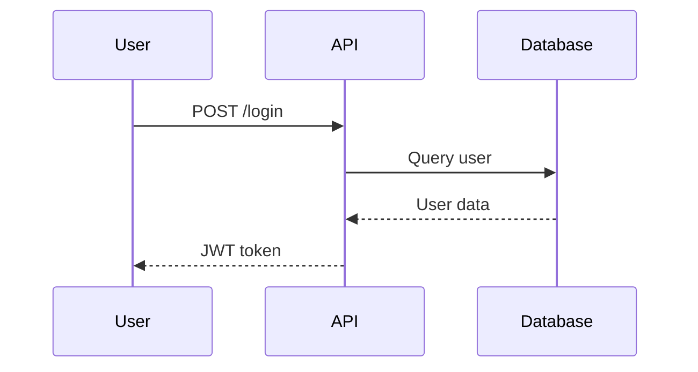
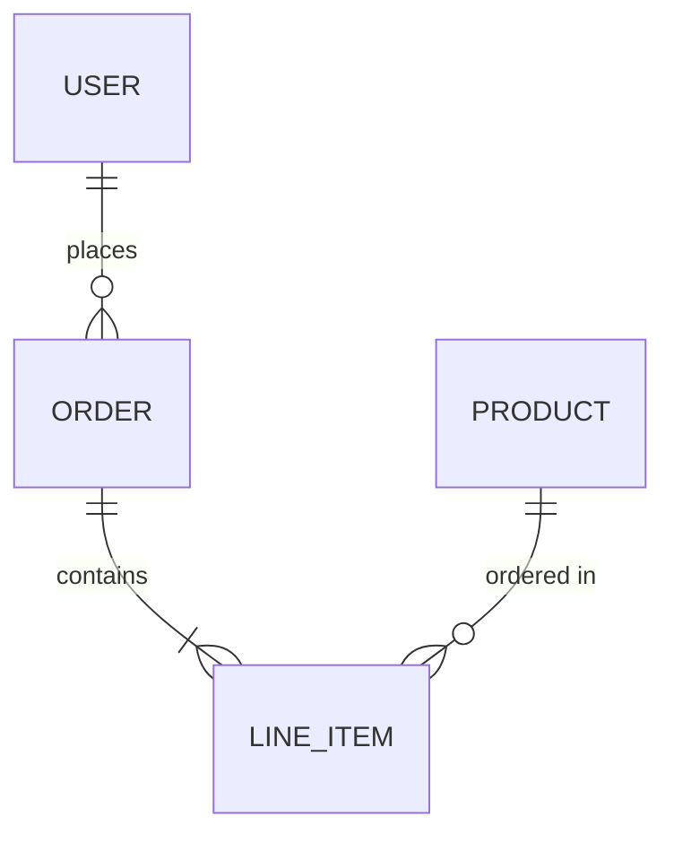
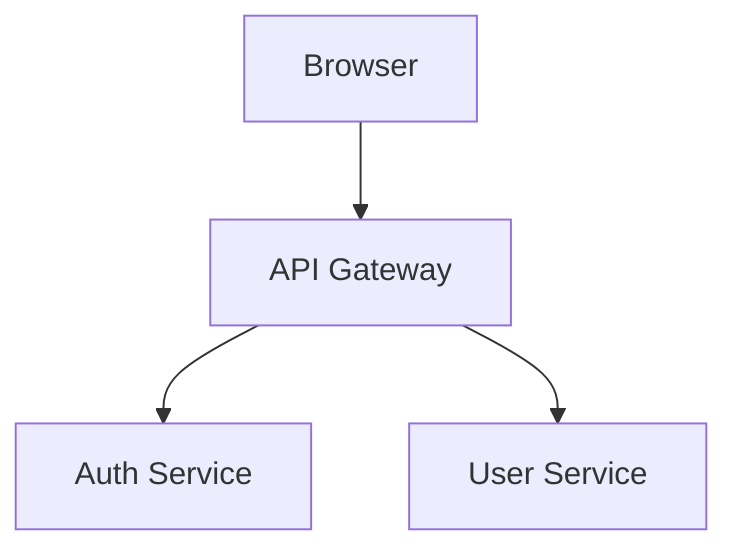
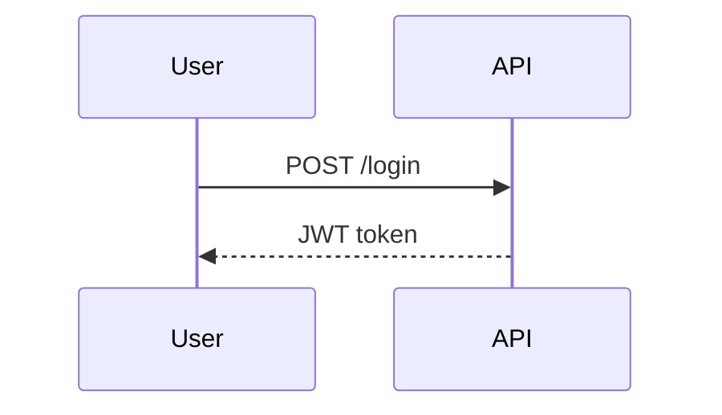
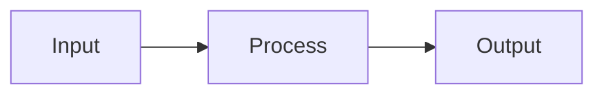

# User Stories

| Key | Value |
| --- | --- |
| Date | 2026-07-27T22:01:03.537Z |
| Version | 1.0.0 |
| Git SHA | 3989ba1 |

## src/all-doc-api.story.spec.ts

### ✅ doc.note() demonstration

> This is a simple note about the story
> Notes can span multiple lines
and include line breaks
- **Given** a precondition with a note
    > Notes can appear between steps
- **When** an action occurs
    > Final note before assertion
- **Then** verification passes

### ✅ doc.tag() demonstration

`smoke`
`regression` `critical`
`api`
`doc-api`
- **Given** tags are added
- **Then** story has multiple tags for filtering

### ✅ doc.kv() demonstration

- **Environment:** test
- **Version:** 1.0.0
- **Author:** Test Team
- **Priority:** high
- **Numeric Value:** 42
- **Boolean Value:** true
- **Given** key-value pairs are defined
    - **Step-specific Key:** value after step
- **Then** all key-value pairs appear in documentation

### ✅ doc.code() demonstration

**TypeScript Example**

```typescript
const greeting: string = "Hello, World!";
console.log(greeting);

function add(a: number, b: number): number {
  return a + b;
}
```

**JavaScript Example**

```javascript
const data = { name: "test", value: 42 };
console.log(JSON.stringify(data));
```

**SQL Query**

```sql
SELECT users.name, orders.total
FROM users
INNER JOIN orders ON users.id = orders.user_id
WHERE orders.total > 100
ORDER BY orders.total DESC;
```

**Shell Command**

```bash
#!/bin/bash
npm install
npm run build
npm test
```

- **Given** code blocks with different languages
- **Then** code is syntax highlighted in docs

### ✅ doc.json() demonstration

**Simple Object**

```json
{
  "name": "test",
  "value": 42,
  "active": true
}
```

**Nested Configuration**

```json
{
  "database": {
    "host": "localhost",
    "port": 5432,
    "credentials": {
      "username": "admin",
      "password": "****"
    }
  },
  "features": [
    "auth",
    "cache",
    "logging"
  ],
  "settings": {
    "maxConnections": 100,
    "timeout": 30000
  }
}
```

**Array of Items**

```json
[
  {
    "id": 1,
    "name": "Item 1"
  },
  {
    "id": 2,
    "name": "Item 2"
  },
  {
    "id": 3,
    "name": "Item 3"
  }
]
```

- **Given** JSON objects are documented
- **Then** JSON is formatted and displayed

### ✅ doc.table() demonstration

**Test Results Summary**

| Test Suite | Status | Duration | Coverage |
| --- | --- | --- | --- |
| Unit Tests | Passed | 2.3s | 95% |
| Integration Tests | Passed | 5.1s | 87% |
| E2E Tests | Failed | 12.4s | 72% |
| Performance Tests | Skipped | - | - |

**Feature Matrix**

| Feature | Chrome | Firefox | Safari |
| --- | --- | --- | --- |
| WebGL | Yes | Yes | Partial |
| WebRTC | Yes | Yes | Yes |
| Service Workers | Yes | Yes | Yes |

- **Given** tables are defined
- **Then** tables render as markdown

### ✅ doc.link() demonstration

[Project Documentation](https://example.com/docs)
[API Reference](https://example.com/api)
[Issue Tracker](https://github.com/example/project/issues)
[CI/CD Pipeline](https://ci.example.com/pipeline/123)
- **Given** links to external resources
- **Then** links are clickable in docs

### ✅ doc.section() demonstration

**Prerequisites**

Before running this test, ensure:

- Node.js 18+ is installed
- Database is running
- Environment variables are set

```bash
export API_KEY=your-key-here
```

**Expected Behavior**

The system should:

1. Validate user input
2. Process the request
3. Return appropriate response

> **Note:** Error handling is tested separately.

- **Given** sections with rich markdown
- **Then** sections appear as collapsible or titled blocks

### ✅ doc.mermaid() demonstration

**Flow Diagram**

**Sequence Diagram**

**Entity Relationship**

- **Given** mermaid diagrams are defined
- **Then** diagrams render in documentation

### ✅ doc.screenshot() demonstration


- **Given** screenshot paths are recorded
- **Then** screenshots appear in documentation

### ✅ doc.custom() demonstration

**[chart]**

```json
{
  "type": "bar",
  "data": [
    10,
    20,
    30,
    40
  ],
  "labels": [
    "Q1",
    "Q2",
    "Q3",
    "Q4"
  ]
}
```

**[metric]**

```json
{
  "name": "Response Time",
  "value": 145,
  "unit": "ms",
  "threshold": 200
}
```

**[badge]**

```json
{
  "label": "Coverage",
  "value": "95%",
  "color": "green"
}
```

- **Given** custom content types are added
- **Then** custom renderers can process them

### ✅ Runtime doc.* demonstration

> Static doc added at registration time
- **Given** setup with runtime values
- **When** action produces runtime data
- **Then** runtime values appear in docs

### ✅ Complete doc API demonstration

> This story demonstrates all doc API methods in one place
`comprehensive` `documentation` `example`
- **Author:** Documentation Team
- **Version:** 2.0
[Full Documentation](https://example.com/docs/complete)
- **Given** all documentation methods are available
    **Test Configuration**
    
    ```json
    {
      "environment": "test",
      "features": [
        "all"
      ]
    }
    ```
    
- **When** documentation is generated
    **API Coverage**
    
    | Method | Supported | Example |
    | --- | --- | --- |
    | note() | Yes | Free text notes |
    | tag() | Yes | Categorization |
    | kv() | Yes | Key-value pairs |
    | code() | Yes | Syntax highlighted code |
    | json() | Yes | JSON objects |
    | table() | Yes | Markdown tables |
    | link() | Yes | Hyperlinks |
    | section() | Yes | Markdown sections |
    | mermaid() | Yes | Diagrams |
    | screenshot() | Yes | Images |
    | custom() | Yes | Custom types |
    | runtime.* | Yes | Runtime values |
    
    **Documentation Flow**
    ```mermaid
    graph LR
        A[Doc API] --> B[Static Docs]
        A --> C[Runtime Docs]
        B --> D[Generated MD]
        C --> D
    ```
- **Then** all methods work together

## src/api-variations.story.spec.ts

### ✅ Framework native with doc.story


### ✅ Optional callbacks for all step keywords

- **Given** given context without callback
- **When** when action without callback
- **Then** then assertion without callback
- **And** and additional step without callback
- **And** arrange context without callback
- **And** act action without callback
- **And** assert with callback
- **And** setup context without callback
- **And** context setup without callback
- **And** execute action without callback
- **And** action execute without callback
- **And** verify with callback

### ✅ Multiple steps become And

- **Given** first given
- **And** second given becomes And
- **When** first when
- **And** second when becomes And
- **Then** first then
- **And** second then becomes And

### ✅ Story with metadata
Tags: `api`, `smoke` | Tickets: `JIRA-123`

- **Given** context
- **Then** assertion

### ✅ Story with notes and tags

> This is a note about the story
`smoke`
`api` `important`
- **Given** context
    - **key:** value
- **Then** assertion

## src/async-patterns.story.spec.ts

### ✅ Basic async/await in steps

> Steps can be async functions using async/await syntax
- **Given** user ID is known
- **When** user data is fetched
- **Then** user data is available

### ✅ Parallel async operations with Promise.all

> Multiple async operations can run in parallel using Promise.all
- **Given** user is authenticated
- **When** user data and orders are fetched in parallel
- **Then** all data is available
- **And** total order value is calculated

### ✅ Sequential async operations

> Some operations must be sequential due to dependencies
- **Given** nothing is loaded yet
- **When** user is fetched first
- **And** then orders are fetched using user ID
- **Then** both user and orders are available

### ✅ Async setup and teardown pattern

> Setup and teardown can be async for database connections, etc.
- **Given** database connection is established
- **And** transaction is started
- **When** data is saved
- **Then** transaction can be committed
- **And** connection is still open for cleanup

### ✅ Error handling in async steps

> Async errors should be properly caught and handled
- **Given** an async operation that might fail
- **When** the operation fails
- **Then** error is caught and can be asserted

### ✅ Working with timeouts and delays

> Async operations can include deliberate delays for timing
- **Given** timer starts
- **When** operation with delay completes
- **Then** elapsed time is measurable

### ✅ Async iteration over collections

> Processing collections asynchronously
- **Given** a collection of items
- **When** items are processed asynchronously
- **Then** all items are processed

### ✅ Parallel iteration with Promise.all and map

> Processing all items in parallel for better performance
- **Given** a collection of numbers
- **When** items are processed in parallel
- **Then** all items are doubled

### ✅ Real-world async API test pattern

> Simulates a complete async API test scenario
`async`
- **Given** API client is configured
- **When** GET request is made
- **And** POST request is made
- **Then** GET response is valid
- **And** POST response is valid
- **And** both responses have timestamps

### ✅ Async steps with runtime documentation

> Runtime docs capture async operation results
- **Given** async operation is prepared
- **When** async data is fetched
- **Then** runtime docs contain async results

## src/calculator.story.spec.ts

### Calculator

### ✅ Calculator adds two numbers

- **Given** two numbers 5 and 3
- **When** the numbers are added
- **Then** the result is 8

### ✅ Calculator subtracts two numbers

- **Given** two numbers 10 and 4
- **When** the second is subtracted from the first
- **Then** the result is 6

### ✅ Calculator multiplies two numbers

- **Given** two numbers 7 and 6
    > This is a note3
- **When** the numbers are multiplied
- **Then** the result is 42

### ✅ Calculator divides two numbers

- **Given** two numbers 20 and 4
- **When** the first is divided by the second
- **Then** the result is 5

### ✅ Calculator throws error on division by zero

> Division by zero should throw an error
- **Given** a number 10 and zero
- **When** division is attempted
- **Then** an error is thrown

## src/complex-data.story.spec.ts

### ✅ Deeply nested JSON structures

> Demonstrating complex nested JSON in documentation
**Application Configuration**

```json
{
  "app": {
    "name": "MyApplication",
    "version": "2.1.0",
    "environment": "production"
  },
  "server": {
    "host": "api.example.com",
    "port": 443,
    "ssl": {
      "enabled": true,
      "certificate": "/path/to/cert.pem",
      "key": "/path/to/key.pem",
      "protocols": [
        "TLSv1.2",
        "TLSv1.3"
      ]
    },
    "timeouts": {
      "connection": 30000,
      "read": 60000,
      "write": 60000
    }
  },
  "database": {
    "primary": {
      "host": "db-primary.example.com",
      "port": 5432,
      "name": "app_production",
      "pool": {
        "min": 5,
        "max": 20,
        "idle": 10000
      }
    },
    "replica": {
      "hosts": [
        "db-replica-1.example.com",
        "db-replica-2.example.com"
      ],
      "loadBalancing": "round-robin"
    }
  },
  "cache": {
    "provider": "redis",
    "cluster": {
      "nodes": [
        {
          "host": "redis-1.example.com",
          "port": 6379
        },
        {
          "host": "redis-2.example.com",
          "port": 6379
        },
        {
          "host": "redis-3.example.com",
          "port": 6379
        }
      ]
    },
    "ttl": {
      "default": 3600,
      "session": 86400,
      "static": 604800
    }
  },
  "features": {
    "flags": {
      "newUI": true,
      "betaFeatures": false,
      "experimentalAPI": {
        "enabled": true,
        "allowedUsers": [
          "admin",
          "beta-tester"
        ]
      }
    }
  }
}
```

- **Given** complex configuration is loaded
- **Then** nested structures are documented

### ✅ Arrays of complex objects

> Documenting arrays with complex nested structures
**User Profiles**

```json
[
  {
    "id": "user-001",
    "profile": {
      "name": "Alice Johnson",
      "email": "alice@example.com",
      "avatar": "https://example.com/avatars/alice.jpg"
    },
    "permissions": {
      "roles": [
        "admin",
        "editor"
      ],
      "resources": {
        "documents": [
          "read",
          "write",
          "delete"
        ],
        "users": [
          "read",
          "write"
        ],
        "settings": [
          "read",
          "write",
          "admin"
        ]
      }
    },
    "preferences": {
      "theme": "dark",
      "notifications": {
        "email": true,
        "push": true,
        "sms": false
      },
      "language": "en-US"
    }
  },
  {
    "id": "user-002",
    "profile": {
      "name": "Bob Smith",
      "email": "bob@example.com",
      "avatar": "https://example.com/avatars/bob.jpg"
    },
    "permissions": {
      "roles": [
        "viewer"
      ],
      "resources": {
        "documents": [
          "read"
        ],
        "users": [
          "read"
        ],
        "settings": []
      }
    },
    "preferences": {
      "theme": "light",
      "notifications": {
        "email": true,
        "push": false,
        "sms": false
      },
      "language": "en-GB"
    }
  }
]
```

- **Given** user profiles are loaded
- **Then** complex arrays are documented

### ✅ Large data tables

> Tables with many rows and columns
**API Endpoints Reference**

| Method | Endpoint | Auth | Rate Limit | Description |
| --- | --- | --- | --- | --- |
| GET | /api/v1/users | Bearer | 100/min | List all users |
| GET | /api/v1/users/:id | Bearer | 200/min | Get user by ID |
| POST | /api/v1/users | Bearer | 50/min | Create new user |
| PUT | /api/v1/users/:id | Bearer | 50/min | Update user |
| DELETE | /api/v1/users/:id | Bearer | 20/min | Delete user |
| GET | /api/v1/orders | Bearer | 100/min | List all orders |
| GET | /api/v1/orders/:id | Bearer | 200/min | Get order by ID |
| POST | /api/v1/orders | Bearer | 30/min | Create new order |
| PUT | /api/v1/orders/:id | Bearer | 30/min | Update order |
| DELETE | /api/v1/orders/:id | Bearer | 10/min | Cancel order |
| GET | /api/v1/products | None | 500/min | List products |
| GET | /api/v1/products/:id | None | 1000/min | Get product |
| POST | /api/v1/products | Admin | 20/min | Create product |
| PUT | /api/v1/products/:id | Admin | 20/min | Update product |
| DELETE | /api/v1/products/:id | Admin | 5/min | Delete product |

**HTTP Status Codes Reference**

| Code | Status | Category | Common Use |
| --- | --- | --- | --- |
| 200 | OK | Success | Successful GET/PUT |
| 201 | Created | Success | Successful POST |
| 204 | No Content | Success | Successful DELETE |
| 400 | Bad Request | Client Error | Invalid input |
| 401 | Unauthorized | Client Error | Auth required |
| 403 | Forbidden | Client Error | Access denied |
| 404 | Not Found | Client Error | Resource missing |
| 500 | Internal Error | Server Error | Server failure |

- **Given** API documentation is needed
- **Then** large tables provide comprehensive reference

### ✅ SQL code examples

> SQL queries in documentation
**Complex SELECT Query**

```sql
SELECT u.id, u.name, u.email, COUNT(o.id) as order_count
FROM users u
LEFT JOIN orders o ON u.id = o.user_id
WHERE u.status = 'active'
GROUP BY u.id, u.name, u.email;
```

- **Given** SQL examples are documented
- **Then** SQL syntax is highlighted

### ✅ YAML configuration examples

> YAML configuration files in documentation
**Docker Compose Configuration**

```yaml
version: '3.8'
services:
  app:
    build: { context: . }
    ports: ["3000:3000"]
  db:
    image: postgres:15
```

- **Given** YAML configs are documented
- **Then** YAML syntax is highlighted

### ✅ Shell script examples

> Bash scripts and commands in documentation
**Deployment Script**

```bash
#!/bin/bash
set -euo pipefail
echo "Deploying..."
npm ci && npm run build && npm test
```

- **Given** shell scripts are documented
- **Then** bash syntax is highlighted

### ✅ Various Mermaid diagram types

> Different types of Mermaid diagrams
**System Architecture**

**Authentication Flow**

- **Given** various diagram types are documented
- **Then** all Mermaid diagram types render

### ✅ Story with complex metadata structure
Tags: `complex-data`, `comprehensive`, `documentation` | Tickets: `DOCS-001`, `TECH-456`

> This story demonstrates complex metadata in story options
- **Given** story has rich metadata
- **When** documentation is generated
- **Then** metadata is preserved in output

### ✅ All complex data types in one story

> Comprehensive example combining all complex data documentation
`comprehensive` `all-in-one`
- **Documentation Version:** 2.0
- **Completeness:** 100%
[Full Documentation](https://docs.example.com)
**Sample API Response**

```json
{
  "data": {
    "users": [
      {
        "id": 1,
        "name": "Test"
      }
    ],
    "pagination": {
      "page": 1,
      "total": 100
    }
  },
  "meta": {
    "version": "1.0"
  }
}
```

**Quick Reference**

| Type | Example | Support |
| --- | --- | --- |
| JSON | Nested objects | Full |
| Tables | Multi-column | Full |
| Code | Multiple langs | Full |
| Diagrams | Mermaid | Full |

**Quick Start**

```typescript
import { story } from 'executable-stories-jest';
test("My Test", async ({}, testInfo) => {
  story.init(testInfo);
  story.json({ label: 'Data', value: { key: 'value' } });
});
```

**Simple Flow**

**Additional Notes**

This story demonstrates:
- Nested JSON structures
- Large tables
- Multiple code formats
- Various Mermaid diagrams
- Complex metadata

- **Given** all documentation types are used
- **Then** comprehensive documentation is generated

## src/error-scenarios.story.spec.ts

### Error Scenarios

### ✅ Testing thrown errors with try/catch

> Traditional try/catch pattern for error testing
- **Given** a function that will throw
- **When** the function is called in try/catch
- **Then** error is caught
- **And** error message is correct
- **And** error is an instance of Error

### ✅ Testing errors with Jest toThrow

> Using Jest's toThrow matcher for clean error assertions
- **Given** functions that throw different errors
- **Then** toThrow matches any error
- **And** toThrow matches specific message
- **And** toThrow matches error type
- **And** toThrow matches with regex

### ✅ Documenting error scenarios

> Error scenarios should be well documented
`error-documentation`
- **Given** a validation function
    **Validation Rules**
    
    ```markdown
    - Input is required
    - Minimum length: 3
    - Maximum length: 100
    ```
    
- **When** empty input is validated
- **And** short input is validated
- **And** valid input is validated
- **Then** all error cases are documented
    **Error Scenarios**
    
    | Input | Expected Errors |
    | --- | --- |
    | (empty) | Input is required, Input too short |
    | ab | Input too short |
    | valid input | None |
    

### ✅ Async error handling patterns

> Testing errors in async operations
- **Given** an async function that can fail
- **When** async error is caught with try/catch
- **And** async error is caught with rejects
- **Then** successful async operation works

### ✅ Testing custom error types

> Testing application-specific error classes
- **Given** custom error classes exist
    **Error Classes**
    
    ```typescript
    class ValidationError extends Error {
      field: string;
      code: string;
    }
    
    class NetworkError extends Error {
      statusCode: number;
    }
    ```
    
- **When** validation error is thrown
- **And** network error is thrown
- **Then** custom errors are properly typed

### ✅ Error recovery and fallback patterns

> Testing graceful degradation and recovery
- **Given** a safe wrapper function
- **When** successful operation is wrapped
- **And** failing operation is wrapped
- **Then** errors are handled gracefully
    **Error Handling Patterns**
    
    | Pattern | Use Case |
    | --- | --- |
    | try/catch | Runtime error capture |
    | toThrow | Error assertion |
    | Result type | Graceful degradation |
    

## src/framework-native.story.spec.ts

### ✅ Framework-native test with doc.story()


### ✅ Another framework-native test


### ✅ Framework-native test with multiple operations


### ✅ doc.story() used as story() replacement

- **Given** numbers are ready
- **When** addition is performed
- **Then** result is correct

### ✅ Using story object from module

> Module-level story object for global access
- **Given** count starts at zero
- **When** count is incremented
- **Then** count equals one

### ✅ Optional step callbacks for documentation-only steps

> Steps without callbacks are valid for documentation purposes
- **Given** user is logged in
- **And** user has admin role
- **When** admin panel is accessed
- **Then** admin features are visible
- **And** audit log is updated

### ✅ Using Playwright expect in story steps

> All Playwright expect work normally in story steps
- **Given** a user object
- **Then** toBe works
- **And** toEqual works for objects
- **And** toContain works for arrays
- **And** toMatch works for strings
- **And** toHaveLength works
- **And** toHaveProperty works
- **And** toBeDefined and toBeTruthy work

### ✅ Framework-native test with full doc API

> This test uses doc API methods in a framework-native test
`framework-native` `comprehensive`
- **Test Type:** Native
**Test Configuration**

```json
{
  "framework": "playwright",
  "pattern": "native",
  "hasStory": true
}
```

**Supported Patterns**

| Pattern | Supported |
| --- | --- |
| doc.story() | Yes |
| doc.note() | Yes |
| doc.kv() | Yes |
| doc.json() | Yes |
| doc.table() | Yes |


### Calculator operations - mixed patterns

### ✅ simple addition check


### ✅ Addition with story pattern

- **Given** two positive numbers
- **When** they are added
- **Then** the sum is returned

### ✅ multiplication check


### Stories with Playwright hooks

### ✅ Story demonstrating hook behavior

- **Given** state starts at zero
- **When** state is modified
- **Then** state reflects changes

### ✅ Another story with independent state

- **Given** state starts fresh for each story
- **Then** each story has its own state

## src/gherkin-patterns.story.spec.ts

### ✅ User logs in successfully

- **Given** the user account exists
- **And** the user is on the login page
- **And** the account is active
- **When** the user submits valid credentials
- **Then** the user should see the dashboard

### ✅ User updates profile settings

- **Given** the user is logged in
- **When** the user navigates to settings
- **And** the user changes their display name
- **Then** the changes should be saved

### ✅ Successful order confirmation

- **Given** the user has items in cart
- **When** the user completes checkout
- **Then** the order should be created
- **And** a confirmation email should be sent
- **And** the inventory should be updated

### ✅ Complex user journey

- **Given** the user account exists
- **And** the user has admin privileges
- **When** the user logs in
- **And** the user navigates to admin panel
- **Then** the admin dashboard should load
- **And** the user count should be displayed

### ✅ Login blocked for suspended user

- **Given** the user account exists
- **And** the account is suspended
- **When** the user submits valid credentials
- **Then** the user should see an error message
- **But** the user should not be logged in
- **But** the session should not be created

### ✅ Bulk user creation

- **Given** the following users exist
    **Users**
    
    | email | role | status |
    | --- | --- | --- |
    | alice@example.com | admin | active |
    | bob@example.com | user | active |
    | carol@example.com | user | pending |
    
- **When** the admin opens the user list
- **Then** the user list should include all users

### ✅ Form submission with multiple fields

- **Given** the user is on the registration form
- **When** the user fills in the form
    **Form Data**
    
    | field | value |
    | --- | --- |
    | name | John Doe |
    | email | john@example.com |
    | password | securepass123 |
    
- **Then** the form should be submitted successfully

### ✅ API accepts a JSON payload

- **Given** the client has the following JSON payload
    **Payload**
    
    ```json
    {
      "email": "user@example.com",
      "password": "secret",
      "rememberMe": true
    }
    ```
    
- **When** the client sends the request
- **Then** the response status should be 200

### ✅ System parses XML configuration

- **Given** the following XML configuration
    **Configuration**
    
    ```xml
    <config>
      <server>localhost</server>
      <port>8080</port>
      <debug>true</debug>
    </config>
    ```
    
- **When** the system loads the configuration
- **Then** the settings should be applied

### ✅ Change email address

- **Given** the user account exists
- **And** the user is logged in
- **When** the user updates their email to 'new@example.com'
- **Then** a verification email should be sent

### ✅ Change password

- **Given** the user account exists
- **And** the user is logged in
- **When** the user updates their password
- **Then** the old sessions should be invalidated
- **And** a confirmation email should be sent

### ✅ Login error: Invalid credentials

- **Given** the user is on the login page
- **When** the user logs in with "user@example.com" and "wrong"
- **Then** the error message should be "Invalid credentials"

### ✅ Login error: Account is locked

- **Given** the user is on the login page
- **When** the user logs in with "locked@example.com" and "secret"
- **Then** the error message should be "Account is locked"

### ✅ Login error: Please verify your email

- **Given** the user is on the login page
- **When** the user logs in with "unverified@example.com" and "pass123"
- **Then** the error message should be "Please verify your email"

### ✅ Shipping for 1kg order

- **Given** an order weighing 1 kg
- **When** the shipping cost is calculated
- **Then** the shipping cost should be $5

### ✅ Shipping for 5kg order

- **Given** an order weighing 5 kg
- **When** the shipping cost is calculated
- **Then** the shipping cost should be $10

### ✅ Shipping for 10kg order

- **Given** an order weighing 10 kg
- **When** the shipping cost is calculated
- **Then** the shipping cost should be $15

### ✅ Shipping for 25kg order

- **Given** an order weighing 25 kg
- **When** the shipping cost is calculated
- **Then** the shipping cost should be $25

### ✅ admin can delete users

- **Given** a user with role "admin"
- **When** the user attempts to "delete users"
- **Then** the action should succeed

### ✅ admin can view reports

- **Given** a user with role "admin"
- **When** the user attempts to "view reports"
- **Then** the action should succeed

### ✅ user cannot delete users

- **Given** a user with role "user"
- **When** the user attempts to "delete users"
- **Then** the action should be denied
- **But** the user should see a permission error

### ✅ user can view reports

- **Given** a user with role "user"
- **When** the user attempts to "view reports"
- **Then** the action should succeed

### ✅ guest cannot view reports

- **Given** a user with role "guest"
- **When** the user attempts to "view reports"
- **Then** the action should be denied
- **But** the user should see a permission error

### ✅ Order with explicit And steps

- **Given** the user is logged in
- **And** the user has a valid payment method
- **And** the user has items in cart
- **When** the user clicks checkout
- **And** confirms the order
- **Then** the order should be created
- **And** the payment should be processed
- **And** a confirmation should be displayed

### ✅ Partial success scenario

- **Given** the user has multiple items in cart
- **And** one item is out of stock
- **When** the user attempts to checkout
- **Then** the available items should be ordered
- **But** the out of stock item should be removed
- **And** the user should be notified
- **But** the order should not be cancelled

### ✅ Premium user gets early access
Tags: `feature-flag`, `premium` | Tickets: `JIRA-456`

- **Given** the user has a premium subscription
- **And** the early access feature is enabled
- **When** the user logs in
- **Then** the user should see early access features

### ✅ Order summary displays correct items

- **Given** the user has completed an order
- **When** the user views the order summary
- **Then** the order should display the following items
    **Order Items**
    
    | product | quantity | price |
    | --- | --- | --- |
    | Widget A | 2 | $20.00 |
    | Widget B | 1 | $15.00 |
    | Shipping | 1 | $5.00 |
    

### ✅ Data transformation pipeline

- **Given** the following input data
    **Input**
    
    | id | name | value |
    | --- | --- | --- |
    | 1 | item-a | 100 |
    | 2 | item-b | 200 |
    
- **When** the transformation is applied
- **Then** the output should be
    **Output**
    
    | id | name | processedValue |
    | --- | --- | --- |
    | 1 | ITEM-A | 110 |
    | 2 | ITEM-B | 220 |
    

### ✅ Failed login attempt

- **Given** the user account exists
- **When** the user enters an incorrect password
- **But** the user should not be logged in
- **And** an error message should be displayed
- **And** the failed attempt should be logged

### ✅ Complete e-commerce checkout flow

- **Given** the user is logged in
- **And** the user has items in cart
- **And** the user has a saved address
- **And** the user has a valid payment method
- **When** the user proceeds to checkout
- **And** the user confirms the shipping address
- **And** the user selects standard shipping
- **And** the user confirms the payment method
- **And** the user places the order
- **Then** the order should be created
- **And** the payment should be authorized
- **And** the inventory should be reserved
- **And** a confirmation email should be sent
- **And** the order should appear in order history

### ✅ API endpoint documentation

- **Given** the API server is running
    **Endpoint Details**
    
    This endpoint handles user authentication and returns a JWT token.
    
- **When** a POST request is made to /api/login
    **Request Headers**
    
    ```json
    {
      "Content-Type": "application/json",
      "Accept": "application/json"
    }
    ```
    
- **Then** the response should include a token
    **Response**
    
    ```json
    {
      "token": "eyJhbGciOiJIUzI1NiIs...",
      "expiresIn": 3600,
      "user": {
        "id": 1,
        "email": "user@example.com"
      }
    }
    ```
    

### ✅ Free User features

- **Given** a user with free plan
- **When** the user views available features
- **Then** the user should have access to 1 features
    **Available Features**
    
    ```json
    [
      "basic"
    ]
    ```
    

### ✅ Pro User features

- **Given** a user with pro plan
- **When** the user views available features
- **Then** the user should have access to 2 features
    **Available Features**
    
    ```json
    [
      "basic",
      "advanced"
    ]
    ```
    

### ✅ Enterprise User features

- **Given** a user with enterprise plan
- **When** the user views available features
- **Then** the user should have access to 3 features
    **Available Features**
    
    ```json
    [
      "basic",
      "advanced",
      "custom"
    ]
    ```
    

### ✅ Log file format validation

- **Given** the application has processed requests
- **When** the log file is generated
- **Then** the log should match the expected format
    **Expected Log Format**
    
    ```text
    [2024-01-15 10:30:00] INFO  - Request received
    [2024-01-15 10:30:01] DEBUG - Processing started
    [2024-01-15 10:30:02] INFO  - Request completed
    ```
    

### ✅ Multi-step process

- **Given** step one is complete
- **And** step two is complete
- **And** step three is complete
- **When** the process continues
- **And** additional processing occurs
- **Then** result one is correct
- **And** result two is correct
- **And** result three is correct

### ✅ User registration flow

- **Given** the registration form is displayed
    **Registration Flow**
    ```mermaid
    graph LR
        A[Form Displayed] --> B[User Fills Form]
        B --> C{Valid?}
        C -->|Yes| D[Create Account]
        C -->|No| E[Show Errors]
        D --> F[Send Email]
        F --> G[Success Page]
    ```
- **When** the user submits valid information
- **Then** the account should be created
- **And** a verification email should be sent

### ✅ Complete keyword demonstration

- **Given** a given step
- **And** another given step
- **And** an explicit and step
- **When** a when step
- **And** another when step
- **Then** a then step
- **And** another then step
- **But** a but step
- **And** a final and step

### ✅ Standard order

- **Given** the following items in cart
    **Cart Items**
    
    | product | quantity | price |
    | --- | --- | --- |
    | A | 2 | $10 |
    | B | 1 | $20 |
    
- **When** the total is calculated
- **Then** the total should be $40

### ✅ Order with discount

- **Given** the following items in cart
    **Cart Items**
    
    | product | quantity | price |
    | --- | --- | --- |
    | A | 2 | $10 |
    | B | 1 | $20 |
    
- **And** a 10% discount is applied
- **When** the total is calculated
- **Then** the total should be $36

### Rule: Discounts apply only to eligible customers

### ✅ Eligible customer gets discount

- **Given** the customer is eligible for discounts
- **And** the customer has items worth $100
- **When** the customer checks out
- **Then** a 10% discount should be applied
- **And** the total should be $90

### ✅ Ineligible customer does not get discount

- **Given** the customer is not eligible for discounts
- **And** the customer has items worth $100
- **When** the customer checks out
- **Then** no discount should be applied
- **And** the total should be $100

### Rule: Authenticated users can manage their data

### ✅ User can view their profile

- **Given** the user is authenticated
- **And** the user session is valid
- **When** the user navigates to profile page
- **Then** the profile information should be displayed

### ✅ User can update their profile

- **Given** the user is authenticated
- **And** the user session is valid
- **When** the user updates their profile
- **Then** the changes should be saved
- **And** a success message should be shown

## src/kitchen-sink.story.spec.ts

### ✅ Kitchen sink – every story API method
Tags: `kitchen-sink` | Tickets: `KS-001`

> This test exercises every story.* method so generated docs include all of them.
`smoke`
- **Framework:** Playwright
- **API Version:** 1.0
**Config**

```json
{
  "reporter": true,
  "colocatedDocs": true
}
```

**Snippet**

```typescript
const x = 1;
const y = 2;
```

**Method checklist**

| Method | Used |
| --- | --- |
| story.note | Yes |
| story.tag | Yes |
| story.kv | Yes |
| story.json | Yes |
| story.code | Yes |
| story.table | Yes |
| story.link | Yes |
| story.section | Yes |
| story.mermaid | Yes |
| story.screenshot | Yes |
| story.custom | Yes |

[Docs](https://example.com/docs)
**Section title**

Section **markdown** content.

**Simple diagram**


**[sink-meta]**

```json
{
  "version": 2,
  "methods": 11
}
```

- **Given** all doc methods were called
- **When** steps are recorded
- **Then** generated doc contains note, table, kv, json, code, link, section, mermaid, screenshot, custom
- **And** step keywords given/when/then/and appear
- **And** arrange alias works
- **And** act alias works
- **And** assert alias works

## src/new-apis.story.spec.ts

### ✅ Calculator sum (framework native)


### ✅ Optional step callback demo

- **Given** two numbers 1 and 2
- **And** we are about to add
- **When** add is called
- **Then** the result is 3

## src/playwright-native-features.story.spec.ts

### Tag sync (Playwright v1.43)

### ✅ story.tag() options appear as native Playwright annotations
Tags: `@regression`, `@smoke`

- **Given** story tags are declared at init time
- **Then** they appear in Playwright testInfo.annotations
- **And** the story meta retains the tags for report generation
    > Tags synced via testInfo.annotations({ type: "tag" }) so they appear in UI Mode filters.

### ✅ story with no tags produces no extra tag annotations

- **Given** no tags are declared
- **Then** no tag annotations are added

### Console capture (Playwright v1.56)

### ✅ story.console() captures page console messages as a doc entry

- **Given** a page with two console messages
- **When** story.console() is called
    **App output**
    
    ```log
    [log] App initialised
    [warn] Deprecated API used
    ```
    
- **Then** a code doc entry is created with the console content

### ✅ story.console() gracefully handles missing consoleMessages API

- **Given** a page without the consoleMessages() API
- **When** story.console() is called
    **Legacy output**
    
    ```log
    (no console output)
    ```
    
- **Then** an empty doc entry is produced without throwing

### ✅ story.console() does NOT include page errors by default

- **Given** a page with console output and a page error
- **When** story.console() is called without includeErrors
    **Default output**
    
    ```log
    [log] hello
    ```
    
- **Then** page errors are not included in the output

### ✅ story.console() includes page errors when includeErrors is true

- **Given** a page with a console message and an uncaught error
- **When** story.console() is called with includeErrors: true
    **Full output**
    
    ```log
    [log] hello
    [error] Uncaught TypeError: cannot read property
    ```
    
- **Then** both the console message and the error appear in the doc entry

### Async step callback integrations (v1.49–v1.59)

### ✅ async step callbacks receive TestStepInfo as second argument

- **Given** an async step callback that captures its TestStepInfo
- **When** the async step runs
- **Then** TestStepInfo was injected
    > TestStepInfo is injected via test.step() – same object Playwright provides in test.step(label, async (step) => …). Use step.attach() to attach files to the step, or step.skip() to conditionally skip it.

### ✅ async step callbacks work without fixtures (no runStep path)

- **Given** no fixtures are provided to story.init
- **When** an async step still executes correctly
- **Then** the result is returned correctly

### ✅ screencast showChapter is called for each async step when available

- **Given** a page with screencast support
- **When** the first async step runs
- **Then** the second async step runs
- **And** chapter markers were shown for each step
    **Screencast integration**
    
    Each `async` step callback automatically calls `page.screencast.showChapter(label)`
    so the video recording is narrated with the BDD step title.
    
    **Chapter label format:** `<Keyword>: <step text>`
    
    e.g. `When: the user submits the form`
    

### ✅ graceful degradation: sync callbacks skip runStep entirely

- **Given** a page with screencast support
- **When** a sync step runs
- **Then** the sync result is returned correctly
- **And** no chapter was shown for the sync step

### ✅ tracing.group is called for async steps when context is available

- **Given** a context with tracing active
- **When** the async step runs
- **Then** tracing.group was called with the step label
    > tracing.group() groups child actions under the BDD step label in the Playwright trace viewer.

## src/refactor-guide.story.spec.ts

### Part 2: Introduce story (test + story.init(testInfo))

### ✅ Calculator adds two numbers

- **Given** two numbers 2 and 3
- **When** they are added
- **Then** the result is 5

### Part 3: Framework-native with story.init(testInfo)

### ✅ Step 2 — Keep test(), add story.init(): existing test appears in docs


### Part 4: Full patterns

### ✅ Calculator multiplies two numbers

- **Given** two numbers 7 and 6
- **When** they are multiplied
- **Then** the result is 42

### ✅ Step 3b — Framework-native test with story.init() in the same describe


### ✅ Calculator adds with a note

> Using small numbers; the note appears in the generated Markdown.
- **Given** two numbers 1 and 2
- **When** they are added
- **Then** the result is 3

## src/replicate.story.spec.ts

### ✅ User logs in successfully

- **Given** the user account exists
- **And** the user is on the login page
- **And** the account is active
- **When** the user submits valid credentials
- **Then** the user should see the dashboard

### ✅ User updates profile details

- **Given** the user is logged in
- **When** the user changes their display name
- **And** the user changes their time zone
- **And** the user saves the profile
- **Then** the profile should show the updated details

### ✅ Checkout calculates totals

- **Given** the cart has 2 items
- **When** the user proceeds to checkout
- **Then** the subtotal should be $40.00
- **And** the tax should be $4.00
- **And** the total should be $44.00

### ✅ Password reset flow

- **Given** the user account exists
- **And** the user has a verified email
- **When** the user requests a password reset
- **And** the user opens the reset email link
- **And** the user sets a new password
- **Then** the user should be able to log in with the new password
- **And** the old password should no longer work

### ✅ Login blocked for suspended user

- **Given** the user account exists
- **And** the account is suspended
- **When** the user submits valid credentials
- **Then** the user should see an error message
- **But** the user should not be logged in

### ✅ Bulk user creation

- **Given** the following users exist
    **Users**
    
    | email | role | status |
    | --- | --- | --- |
    | alice@example.com | admin | active |
    | bob@example.com | user | active |
    | eve@example.com | user | locked |
    
- **When** the admin opens the user list
- **Then** the user list should include
    **Expected**
    
    | email | role | status |
    | --- | --- | --- |
    | alice@example.com | admin | active |
    | bob@example.com | user | active |
    | eve@example.com | user | locked |
    

### ✅ Calculate shipping options

- **Given** the user has entered the shipping address
    **Address**
    
    | country | state | zip |
    | --- | --- | --- |
    | US | CA | 94107 |
    
- **When** shipping options are calculated
- **Then** the available options should include "Standard"
- **And** the available options should include "Express"
- **And** the estimated delivery date should be shown

### ✅ API accepts a JSON payload

- **Given** the client has the following JSON payload
    **Payload**
    
    ```json
    {
      "email": "user@example.com",
      "password": "secret",
      "rememberMe": true
    }
    ```
    
- **When** the client sends the request
- **Then** the response status should be 200
- **And** the response body should include "token"

### ✅ Import XML invoice

- **Given** the invoice XML is
    **Invoice**
    
    ```xml
    <invoice>
      <id>INV-100</id>
      <amount>42.50</amount>
      <currency>USD</currency>
    </invoice>
    ```
    
- **When** the user imports the invoice
- **Then** the invoice should be saved
- **And** the invoice total should be 42.50 USD

### ✅ Login errors: Invalid credentials (user@example.com)

- **Given** the user is on the login page
- **When** the user logs in with "user@example.com" and "wrong"
- **Then** the error message should be "Invalid credentials"

### ✅ Login errors: Account is locked (locked@example.com)

- **Given** the user is on the login page
- **When** the user logs in with "locked@example.com" and "secret"
- **Then** the error message should be "Account is locked"

### ✅ Login errors: Invalid credentials (unknown@example.com)

- **Given** the user is on the login page
- **When** the user logs in with "unknown@example.com" and "secret"
- **Then** the error message should be "Invalid credentials"

### ✅ Tax calculation by region: CA

- **Given** the cart subtotal is 100.00
- **And** the shipping region is "CA"
- **When** taxes are calculated
- **Then** the tax should be 8.25
- **And** the total should be 108.25

### ✅ Tax calculation by region: NY

- **Given** the cart subtotal is 100.00
- **And** the shipping region is "NY"
- **When** taxes are calculated
- **Then** the tax should be 8.00
- **And** the total should be 108.00

### ✅ Create users from table input: a@example.com

- **Given** the admin is on the create user page
- **When** the admin submits the following user details
    **Details**
    
    | email | role |
    | --- | --- |
    | a@example.com | user |
    
- **Then** the user "a@example.com" should exist with role "user"

### ✅ Create users from table input: admin@example.com

- **Given** the admin is on the create user page
- **When** the admin submits the following user details
    **Details**
    
    | email | role |
    | --- | --- |
    | admin@example.com | admin |
    
- **Then** the user "admin@example.com" should exist with role "admin"

### ✅ Two step checkout

- **Given** the user has items in the cart
- **When** the user enters shipping information
- **And** the user selects a delivery option
- **And** the user enters payment information
- **And** the user confirms the order
- **Then** the order should be created
- **And** a confirmation email should be sent

### ✅ Payment declined

- **Given** the user is on the checkout page
- **When** the user submits a declined card
- **Then** the payment should be declined
- **And** the user should see "Payment failed"
- **But** the order should not be created

### ✅ Login works
Tags: `auth`, `smoke`

- **Given** the user is on the login page
- **When** the user logs in with valid credentials
- **Then** the user should be logged in

### ✅ Update preferences

- **Given** the user has the following preferences
    **Preferences**
    
    | key | value |
    | --- | --- |
    | email_opt_in | true |
    | theme | dark |
    | timezone | UTC |
    
- **When** the user saves preferences
- **Then** the preferences should be persisted

### ✅ Configure feature flags

- **Given** the following feature flags are set
    **Feature flags**
    
    | service | flag | enabled |
    | --- | --- | --- |
    | web | new_checkout_ui | true |
    | api | strict_rate_limiting | false |
    
- **When** the system starts
- **Then** the flag "new_checkout_ui" should be enabled for "web"
- **And** the flag "strict_rate_limiting" should be disabled for "api"

### ✅ Guest checkout allowed

- **Given** the user is on the checkout page
- **And** the user is not logged in
    > But guest checkout is enabled
- **When** the user submits an order as a guest
- **Then** the order should be created

### ✅ Logout clears session

- **Given** the user is logged in
- **When** the user logs out
- **Then** the session cookie should be cleared
- **And** the auth token should be revoked
- **And** the user should be redirected to the login page

### ✅ Document status changes

- **Given** a document exists with status "draft"
- **When** the user submits the document
- **Then** the document status should change to "submitted"
- **And** an audit log entry should be created

### ✅ Shipping eligibility: US -> yes

- **Given** the cart total is 10
- **And** the destination country is "US"
- **When** shipping eligibility is checked
- **Then** shipping should be "yes"

### ✅ Shipping eligibility: CA -> yes

- **Given** the cart total is 10
- **And** the destination country is "CA"
- **When** shipping eligibility is checked
- **Then** shipping should be "yes"

### ✅ Shipping eligibility: CU -> no

- **Given** the cart total is 10
- **And** the destination country is "CU"
- **When** shipping eligibility is checked
- **Then** shipping should be "no"

### ✅ Render markdown

- **Given** the markdown input is
    **Markdown**
    
    ```markdown
    # Title
    - Item 1
    - Item 2
    ```
    
- **When** the user previews the markdown
- **Then** the preview should show a heading "Title"
- **And** the preview should show a list with 2 items

### ✅ Search results show highlights

- **Given** the search index contains "hello world"
- **When** the user searches for "hello"
- **Then** results should include "hello world"
- **And** the matching text should be highlighted

### ✅ Post JSON payload: 123 -> 200

- **Given** the payload is
    **Payload**
    
    ```json
    {
      "id": "123",
      "status": "active"
    }
    ```
    
- **When** the client posts the payload
- **Then** the response status should be 200

### ✅ Post JSON payload: 456 -> 400

- **Given** the payload is
    **Payload**
    
    ```json
    {
      "id": "456",
      "status": "invalid"
    }
    ```
    
- **When** the client posts the payload
- **Then** the response status should be 400

### ✅ Many login attempts: u1@example.com -> success

- **Given** the user is on the login page
- **When** the user logs in with "u1@example.com" and "secret"
- **Then** the login result should be "success"

### ✅ Many login attempts: u2@example.com -> fail

- **Given** the user is on the login page
- **When** the user logs in with "u2@example.com" and "wrong"
- **Then** the login result should be "fail"

### ✅ Many login attempts: u3@example.com -> success

- **Given** the user is on the login page
- **When** the user logs in with "u3@example.com" and "secret"
- **Then** the login result should be "success"

### ✅ Many login attempts: u4@example.com -> fail

- **Given** the user is on the login page
- **When** the user logs in with "u4@example.com" and "wrong"
- **Then** the login result should be "fail"

### ✅ Report shows fields in order

- **Given** a report exists for account "A1"
- **When** the user downloads the report
- **Then** the report header should be "Account Report"
- **And** the first column should be "Date"
- **And** the second column should be "Amount"

### ✅ Import users and send welcome email

- **Given** the following users are to be imported
    **Users**
    
    | email | name |
    | --- | --- |
    | a@example.com | Alice |
    | b@example.com | Bob |
    
- **And** the email template is
    **Template**
    
    ```
    Welcome {{name}}!
    Thanks for joining.
    ```
    
- **When** the import job runs
- **Then** the users should exist
- **And** welcome emails should be sent

### Feature: Account settings

### ✅ Change email address

- **Given** the user account exists
- **And** the user is logged in
- **When** the user updates their email to "new@example.com"
- **Then** a verification email should be sent
- **And** the email status should be "pending verification"

### ✅ Change password

- **Given** the user account exists
- **And** the user is logged in
- **When** the user changes their password
- **Then** the user should be able to log in with the new password

### Feature: Discounts - Rule: Discounts apply only to eligible customers

### ✅ Eligible customer gets discount

- **Given** the customer is eligible for discounts
- **When** the customer checks out
- **Then** a discount should be applied

### ✅ Ineligible customer does not get discount

- **Given** the customer is not eligible for discounts
- **When** the customer checks out
- **Then** no discount should be applied

### Feature: Orders

### ✅ Create order
Tags: `db`, `smoke`

- **Given** the database is seeded
- **And** the API is running
- **When** the client creates an order
- **Then** the response status should be 201
- **And** the order should exist in the database

## src/screenshot-in-report.story.spec.ts

### ✅ Screenshot appears in generated report

- **Given** user is on a page
- **When** user sees the content
    
- **Then** the screenshot is in the story report

### ✅ Video is recorded and linked in report

- **Given** user is on a page
- **When** the step runs
- **Then** video path is in the story report
    > Videos are under test-results/; run `pnpm test:ui` or open playwright-report/ to watch.

## src/step-aliases.story.spec.ts

### Step Aliases

### ✅ AAA Pattern: Arrange-Act-Assert

> Classic testing pattern using arrange/act/assert aliases
`aaa-pattern`
- **Given** calculator is initialized
- **And** input values are prepared
- **When** addition is performed
- **Then** result equals expected value
- **And** result is a number

### ✅ Setup-Execute-Verify Pattern

> Alternative naming using setup/execute/verify
`sev-pattern`
- **Given** service is configured
- **And** dependencies are mocked
- **When** service processes input
- **Then** output is transformed correctly
- **And** output is not empty

### ✅ Context-Action Pattern

> Using context to establish state and action for operations
`context-action`
- **Given** user context is established
- **And** permissions are set
- **When** user performs privileged operation
- **Then** operation succeeds

### ✅ Mixed pattern usage

> Different aliases can be combined in the same story
`mixed`
- **Given** initial data exists
- **And** data is validated
- **And** sum accumulator is initialized
- **When** sum is calculated
- **Then** sum is correct
- **And** sum is positive

### ✅ User registration flow using aliases

> Realistic example using arrange/act/assert pattern
`user-flow` `registration`
- **Given** valid user data is prepared
- **And** email is unique in the system
- **When** registration is submitted
- **Then** registration succeeds
- **And** user ID is generated
- **And** no error is returned

### ✅ All alias styles comparison

> Comparison of all available step function aliases
**Step Function Aliases**

| Purpose | BDD Style | AAA Pattern | Alternative 1 | Alternative 2 |
| --- | --- | --- | --- | --- |
| Setup/Context | given | arrange | setup | context |
| Action/Execute | when | act | execute | action |
| Verify/Assert | then | assert | verify | - |
| Continue | and | - | - | - |
| Negative | but | - | - | - |

- **Given** BDD given step
- **When** BDD when step
- **Then** BDD then step
- **And** AAA arrange step
- **And** AAA act step
- **And** AAA assert step
- **And** alternative setup step
- **And** alternative execute step
- **And** alternative verify step
- **And** alternative context step
- **And** alternative action step
- **And** continuation step
- **But** negative case step

## src/step-callbacks.story.spec.ts

### Step Callbacks

### ✅ Calculator adds two numbers using step callbacks

- **Given** number a is 5
- **And** number b is 3
- **When** the numbers are added
- **Then** the result is 8

### ✅ Mixed markers and step callbacks

- **Given** the calculator is ready
- **When** we multiply 7 by 6
- **Then** the result is 42
- **And** the result is a positive number

### ✅ Async step callbacks with timing

- **Given** data fetched asynchronously
- **When** async addition is performed
- **Then** the async result is 8

### ✅ Step callbacks with inline docs still use marker-only

- **Given** valid credentials
    **Credentials**
    
    ```json
    {
      "email": "user@example.com"
    }
    ```
    
- **When** login is attempted
- **Then** user is authenticated
- **But** rate limit is not exceeded

## src/story-options.story.spec.ts

### ✅ Story with single tag
Tags: `smoke`

> Single tag for basic categorization
- **Given** a tagged story
- **When** tests are filtered
- **Then** this story matches the 'smoke' tag

### ✅ Story with multiple tags
Tags: `critical`, `regression`, `smoke`

> Multiple tags for flexible filtering
- **Given** a story with multiple tags
- **When** tests are filtered by any tag
- **Then** this story matches multiple filters

### ✅ Story with feature tags
Tags: `feature:auth`, `feature:login`

> Tags can use prefixes for organization
- **Given** a story tagged by feature
- **Then** feature filtering is possible

### ✅ Story with single ticket
Tickets: `JIRA-123`

> Links story to a single issue tracker ticket
- **Given** a story linked to JIRA-123
- **When** documentation is generated
- **Then** ticket reference appears in docs

### ✅ Story with multiple tickets
Tickets: `JIRA-123`, `JIRA-456`, `JIRA-789`

> Story can be linked to multiple tickets
- **Given** a story linked to multiple tickets
- **When** requirements are tracked
- **Then** all ticket references are documented

### ✅ Story with different ticket formats
Tickets: `JIRA-123`, `GH-456`, `BUG-789`

> Different ticket systems can be referenced
- **Given** tickets from JIRA, GitHub, and bug tracker
- **Then** all formats are supported

### ✅ Story with simple metadata

> Custom metadata attached to story
- **Given** a story with custom metadata
- **Then** metadata is available in reports

### ✅ Story with complex metadata

> Metadata can contain nested structures and arrays
- **Given** a story with rich metadata
- **When** reports are generated
- **Then** all metadata is preserved

### ✅ Story with all options combined
Tags: `critical`, `feature:checkout`, `smoke` | Tickets: `PROJ-456`

> All story options used together
- **Given** a fully configured story
- **When** documentation is generated
- **Then** all options appear in output

### ✅ Complete story configuration example
Tags: `api`, `feature:user-management` | Tickets: `EPIC-100`, `STORY-201`, `TASK-302`

> Comprehensive example with realistic metadata
`documentation-example`
- **Given** complete story configuration
- **When** documentation is generated
- **Then** rich metadata enables advanced reporting

### ✅ Story options combined with doc API
Tags: `api`, `comprehensive` | Tickets: `DOC-789`

> Story options and doc API complement each other
`additional-tag`
- **Additional Key:** Additional Value
**Options vs Doc API**

| Aspect | Story Options | Doc API |
| --- | --- | --- |
| When Set | Declaration time | Anytime |
| Structure | Fixed schema | Flexible |
| Use Case | Filtering/Reporting | Rich docs |

- **Given** story with options and doc methods
- **When** both are used
- **Then** they work together seamlessly

### ✅ Login feature - happy path
Tags: `auth`, `login`, `smoke` | Tickets: `AUTH-001`

- **Given** user is on login page
- **When** user enters valid credentials
- **Then** user is logged in successfully

### ✅ Login feature - invalid password
Tags: `auth`, `login`, `negative`, `regression` | Tickets: `AUTH-001`, `AUTH-015`

- **Given** user is on login page
- **When** user enters invalid password
- **Then** error message is displayed

### ✅ Payment processing
Tags: `checkout`, `critical`, `payment` | Tickets: `PAY-100`

> Payment tests require special handling
- **Given** user has items in cart
- **When** user completes payment
- **Then** payment is processed successfully

### ✅ Story with empty tags array

- **Given** story with empty tags
- **Then** story still works

### ✅ Story with empty meta object

- **Given** story with empty meta
- **Then** story still works

### ✅ Story with only tags
Tags: `minimal`

- **Given** story with only tags option
- **Then** other options are optional

### ✅ Story with only ticket
Tickets: `MIN-001`

- **Given** story with only ticket option
- **Then** other options are optional

### ✅ Story with only meta

- **Given** story with only meta option
- **Then** other options are optional

## src/storyboard.story.spec.ts

### ✅ Browse the catalog
Tags: `audience:stakeholder`, `journey:guest-checkout:1`, `state:catalog`, `storyboard`, `viewport:desktop`

- **Given** the catalog lists products
    ![Catalog with 3 products](data:image/png;base64,iVBORw0KGgoAAAANSUhEUgAABQAAAALQCAIAAABAH0oBAAAQAElEQVR4nOzdabxVddnA/c2gOSJqoYmzAqYliUPOqeBApqGmJsagUM7eJibcmZpkIUppKqG3qZBIIgWRI+KACkjiiKggIWLigCbIpAzCcz1nPe1nd+AcjkUBXd/vi/1Z+7/XWmedw6sf19p7N1y2bFkJAAAA/tvVLwEAAEACAhgAAIAUBDAAAAApCGAAAABSEMAAAACkIIABAABIQQADAACQggAGAAAgBQEMAABACgIYAACAFAQwAAAAKQhgAAAAUhDAAAAApCCAAQAASEEAAwAAkIIABgAAIAUBDAAAQAoCGAAAgBQEMAAAACkIYAAAAFIQwAAAAKQggAEAAEhBAAMAAJCCAAYAACAFAQwAAEAKAhgAAIAUBDAAAAApCGAAAABSEMAAAACkIIABAABIQQADAACQggAGAAAgBQEMAABACgIYAACAFAQwAAAAKQhgAAAAUhDAAAAApCCAAQAASEEAAwAAkIIABgAAIAUBDAAAQAoCGAAAgBQEMAAAACkIYAAAAFIQwAAAAKQggAEAAEhBAAMAAJCCAAYAACAFAQwAAEAKAhgAAIAUBDAAAAApCGAAAABSEMAAAACkIIABAABIQQADAACQggAGAAAgBQEMAABACgIYAACAFAQwAAAAKQhgAAAAUhDAAAAApCCAAQAASEEAAwAAkIIABgAAIAUBDAAAQAoCGAAAgBQaltYkc+bMef755ydOnDihSqx88YtfbNq06de//vU2bdo0bty4tGZ75JFHZsyYUWzXr1//lFNOadCgQQkAAIA1QL1ly5aV1gzDhw///ve/P3PmzJp2OO+883r27LkmZ3Dr1q0fffTR8tPo+Y033rgEAADAGmCNuAX6b3/7W4cOHdq1a1dL/YYbbrihRYsWxWT4X3fjjTfWq/D444+XAAAA+O+1+gN43rx5Bx988MCBA+uycxTy4Ycf/pe//KX0L1u0aFHl08WLF5cAAAD477X6A/iMM8545ZVXll/fd999o3WbNGlSbT0auHPnziUAAAD4LFZzAI8dO3bQoEHVFq+55poFCxY89dRTDz300HvvvTdy5MhqGTxmzJj77ruvBAAAAHW2mj8F+qqrrqq2ctddd5188smVK23atHn++ed32WWXuXPnlhf79et39NFHV+4Wr44aNeq1116bPHnypEmTNthgg6233nr77beP3fbYY4/KPSdOnDhv3rwpU6ZULr744osbbbRRvXr19tlnn3isXI+fHud89dVXP/jgg6222ipOu+eeex5zzDGNGjUqfXZxnQ8++GBcQ5z52WefjZU4W1zhbrvt1rZt2w033LCmA+Oan3zyyWeeeebPf/7zokWLdt9994MPPvjYY4+N/yMYMWJEebeDDjpohx12KAEAAPCPVuenQM+aNWuzzTarXIlYvffee1e4c+/evXv06FF+uvHGG3/00UflUh03btypp576+uuvr/DY5s2bDxkyJIqxeNqiRYvo5FINyh/d/PHHH19yySXXXnttTXtefPHFvXr1ql///5+ir/RToCdMmHDiiSfW9NN33XXXuM54XP6l+NUij5c/MP5iXbt2Pe6448orAwYM6NixYwkAAIB/tDonwFGt1VYuvPDCmnb+7ne/WzmzbdCgQUxBP/e5z8X2bbfd1qVLl1LNohsPPPDAxx9/vNoouBbRrvvtt98K35xcdvXVV//tb3/7v//7v8oGrkX//v1PO+20WnaIHxdz4EGDBp1yyimV6zHyPfzwwysH4GX33XffE088UQIAAGBlVmcAjx8/vvJpkyZNDj300Jp2btq06W9+85vl12OMfMEFF5RWJurxqquuGjx4cKlurrvuutrrt3Drrbf+4Ac/iGpd6Z6TJ0+uvX7L2rdvv++++5ZvY/70009jorvC+i3U8hIAAABlq/NDsN57773Kp82aNat8820dDR8+vLIAo6Jjgvrcc8/F+umnn16556hRo4qNO+64Y+TIkdU+SvqnP/1pLD7yyCPFu3D79u1b+WpMmEePHj1mzJiY91b7RK74WaU6uOSSS6qtdO/efViV888/v9pLl112WXk7dqh25/PGG2/coUOHbt26rfBmaQAAAFZodU6AP/jgg8qn2223Xemze/755yuf3nzzze3atYuNPfbY44gjjhgyZEg5j2fOnPnhhx9uttlm++yzT6nq7biVB8bQtU2bNsV2lHnsXH4pOrM8fN5///0XLFhQOXN+8cUXI0dLtXr66af/8Ic/VK6MGDEiLq/YjguO037nO98pvzpw4MCLLrqoZcuWpaoyrzywefPmzzzzTPHW4l69ekU833TTTSUAAABWZnUG8Pz58yufLv+Vv3XRtm3bbbfdttiOAXL5o6GXLVsWoVjt9uBFixbV5Zzrrbdenz59yk+LYC7ECasld13OWe1tuscdd1y5fgsnn3xyzJyffPLJ8koMnCOAI7arhXokffmDtdZZZ51f/OIXQ4cOrcx1AAAAVmh1BvA222xT+fSfq7ijqpSqinf8+PG33HLLX6qMGjXqn35z7CabbNKtW7diO4bGjzzySM+ePadNmxYtWscbnquZNGlS5dNqd18XTj/99MoALg6ZPn165T7xfwTlz7IubLDBBqeddlrv3r1LAAAA1Gp1BvDOO+9c+bRa7NXdnDlzrrrqqjvuuOOtt94qrToPP/zwddddd99995X+ZS+//HLl0xXe7F2eYxcmTpwYj2+88Ubl4p577rn8gTvuuGMJAACAlVmdAbzTTjtVPq38lqPlLV68uGjCQoMGDYpZ6Pvvv3/ggQfW8r2+/5y+ffuee+65pVWkWplX+3LgQqNGjSqfvv3226Wq+XPl4uc///nlD4whcAkAAICVWZ0BXG10OXPmzAcffLC4n3l5Dz300De/+c3y02jI2bNn169f/+KLL17+Q5KPPvror33ta/vvv//Pf/7z4cOHlz6jyZMnL1+/0dtt27aNGeymm256+OGHlz6L3XbbrbKB4zddfmxb7TOxv/SlL5WWu0u82iS5MGPGjBIAAAArswYFcLjiiitqCuB+/fpVPv3ud78b9bt06dL+/ftXrt9+++3t27dfd911i6fFHPWzig6vfHrAAQcMGjSofItypHjpM9p1111HjBhRfhqj7H333bfaPpXz7dLfA7j8bcCF55577uOPP15//fUrFyvfOQwAAEBNVuf3AG+00UY9evSoXBk3btzll1/+6aefVtvz1ltvrfZe3OOPPz4ep02bVrkYg9/OnTuX63fJkiXjx48vfXYvvPBC5dNf/vKXlW/QrfaxzHXRvHnzyqfXXHNNpHvlysKFC+OnVK60aNEiHrfaaqtqp4qJd+XTqN9V8i5lAACA/3qrM4BD9+7dq70htmfPnscdd9zYsWPnz5+/aNGimIueddZZXbt2rdynSZMmBx98cGm5bxKu9i7iXr16Vftxy5YtK9Wg8hblancjV3461zvvvBP5Wsdzlh177LGVT1977bXzzjtv8eLFxdMY6n7ve9+r9iHY3/jGN0pVb3WOWXfl+o033njRRRfF32fq1Kk333xz8XcAAABgpVbnLdChcePG0ZNnnnlm5eI9VWo5atiwYcWYt1mzZpXrEZYxQP72t789d+7cW265pdrd0aFytlyvXr3Kl6KWIyk32WSTCy64YNddd33ggQfKL1155ZUbbLDBjjvuGAPqyy67rFqpxpy5tDIxyP1JlfLKr3/96wcffPCQQw6JUfDDDz9c7VOy4mLK34p8xRVXDBw4sPLVX1QpAQAA8FnUq8sA898qAvL444+vvXgrXXfddf/zP/9TfrrTTju9/vrrdTx2woQJX/nKV4rt3/3ud+3bt19+nzlz5kSannTSSaW6OfHEE+++++5iu3Xr1o8++mjlqcrz7WjynXfeuS7fdRzpO23atMrPdu7Ro0fdv+l3wIABHTt2LAEAAPCPVvMt0KFhw4bDhw+PiWhddr7qqqvOP//8ypXlx7xlEZ+HHXZY5cqgQYPK2wcddFBNB55wwglHHnlkTa926tSp8mnUcl2+wTguZsyYMa1atap9t3333ffPf/5ztW82+vnPf96nT5+aTvvjH/+4BAAAwMqs/gAuVd2NfNZZZ7388ssHHHBATfscd9xxb7zxRvfu3avduhwd+8c//nHrrbeutv/hhx/+yiuv/O///m/lYvTz/Pnzi+045Omnn47TLv+z6tevf+edd55++unV1qM2+/XrF8ld+RnOMdq97bbbiu111lmn2nkqn8YEeOzYsd26dSvVIK72iSee2H777Ze/njjqqaeeOvPMM8sJHYPi+KO99NJLW265ZeXO1T4jGgAAgMLqvwW6mo8//vi1116bOHFi9PDSpUujBltUWf7zkCstWLBg3LhxceCsWbOaNm269957F18jVBczZ85899134+euu+66UY/Nmzcvh+vkyZMnTJgwderUjTbaaIcddoh58irJy4ULF06ZMuXVV18tvsE4fru42mbNmpU/v3qlh8e/2nrrrVc8vfDCC6+99tryq48//rhPxgIAAFjeGhfAVHPddddF3pefxsi6su2j26PYKz9DK7p6l112KQEAAPCPBPCabr/99ovhdvnpQQcd9Pvf/774jOgYXHfu3HnEiBHlV2N9xowZDRuu5g/3BgAAWAMppTVdjHwrA/jJJ5/cYostYuo7e/bs5T9T+pxzzlG/AAAAK2QCvKabNWtWmzZtnnvuuZXuufvuu48aNWrTTTctAQAAsJw14lOgqUUE7ciRI2v5WqbCiSee+NBDD6lfAACAmpgArzVeffXVAQMGTJgwYfr06X/9619j5Ytf/OJ222339a9/vW3btiv9hmEAAIDkBDAAAAApuAUaAACAFAQwAAAAKQhgAAAAUhDAAAAApCCAAQAASEEAAwAAkIIABgAAIAUBDAAAQAoCGAAAgBQEMAAAACkIYAAAAFIQwAAAAKQggAEAAEhBAAMAAJCCAAYAACAFAQwAAEAKAhgAAIAUBDAAAAApCGAAAABSEMAAAACkIIABAABIQQADAACQggD+L7Fo0aIlS5aUAAAAqEHGAG7Xrl29Fdlzzz1La61tttnmvPPOK/23mDVrVrdu3Vq0aBH/Li1btvzVr35VLe9nzpzZsWPHKVOmVC7OnTu3X79+p5122sknn3zllVd++OGHJQAAgL9rWMpn6dKl8fj973+/2no0ZIk1wOLFi4888sjx48e3atXqrLPOGjhw4AUXXLBs2bJ4LO9zyy233HHHHWeeeWazZs2KlXnz5rVt23bMmDEbb7xxPL377rtvuOGGiRMnfuELXygBAADkDODCzTffXGKN9PDDD0f9Rvr++te/jqd9+vTZcsstf/GLX0QARxtfc801o0ePfuCBB6odNXTo0Kjfn/70p5dccsnHH398xRVXXH311b/85S979epVAgAA8B7gFXr88cejvho1arTbbrtFTS1atKhUVWXHH398vNSxY8cttthiv/32u+eee4r977zz5aTOfQAAEABJREFUzqOOOuqll1466aSTTjnllGJxyJAhRxxxROx57LHHDh8+vPaT17I+a9asGFbHdDpeihM+88wzNV12HHLZZZfttNNO8UNPO+20v/3tb+WXarqYBQsWRFi2bt06XoqLv+mmmz799NNYj/6M/Z9++umuXbvGj27ZsmWU5Ep/hVXl9ddfj8e41OLpBhtscMwxx7z11ltxtfGz+vXrF3/qYsxb6c9//nM8/vCHP6xXr14c8oMf/CCeRhKXAAAAqgjg6saNG3fIIYc8++yzMW+Mxvv5z39+6aWXxvqbb745bNiweOmNN944+eSTo8ei0O677754adq0aSNGjGjTpk10ZtOmTWPl2muvjZ588cUX43HGjBnt2rUrBs41nbym9U8++WTfffe95ZZb4gznnHPOq6++uvfee0edrvDKb7vttph/RqzGqfr373/YYYcVNVvTxYTu3btfdNFFCxcuPOOMM95+++3I2uuvvz7WI55Hjhz5ta997cknn4zsnzdvXrdu3f70pz/Vcqmr0Pbbb1+qivDySvwXw9KlSyNrN9xww79WqQzyQrNmzXr27Pm5z32ueDpz5sx4bNy4cQkAAKDKWh/AkydPPvLII6PEDj300Niu+4GNlvPYY4/FeqRsqeoG6aipp556KqavTzzxRPmoo48+OuafUYnFe01j4lp+KXIx8rJPnz7vvvvuhRdeGOEazXzDDTfEnlGtMZlcsmRJTSevaf3WW2997bXXBgwYEOfp1avX6NGjY/Hiiy+u6ZeK0ejQoUMHDx4c888JEybce++9tVxM7H/jjTd26NAhThs/t7ipOH56+WwHHXTQCy+88Ktf/aq4vKJIa//7rBJbb711PF5zzTWR2fFbTJ8+PZ7GXLf2oyLIyykeY/PirxTNXwIAAKiy1r8HuEuXLsVtrqNGjerUqVPMJ+t44KmnnlptpUmTJuXHmIhGJcaos9pbhWO9KLFtt902Yviuu+5avHhx8VLMSLfaaqvYGDt2bDweddRRMVMtXoqSjHqM+W1NJ69p/ZFHHilVVXfxdLvttou57qOPPrps2bLlg/CEE0748pe/XGzHdDoGvxMnTiyGwCu8mK985Ssx2m3YsGF0e0Rm1Gap6j7q8gnPPvvs9ddfPzZ23nnnqP2//OUvK/37VIr/UCh+ei1atGix/GePXXLJJbvuuusrr7wS/6kRc90jjjjiM72PN8byZ555Zozo4wqX/1cGAADSWusDuPI9sTGurPNxpX79+q1wvWvXrpFeMRothocHHHDAT37ykzZt2hSv7rDDDuU9mzdvHo/vv/9+8bRly5bFxtSpU+PxJ1Uqz/zRRx/VdPKa1mOmHT9l8803r/yhEcCzZ8/edNNNq115cfd15cXE+Hfdddet6WLiMaa+55xzTnG38PLvqq38/OQo4eLTs2v/+1SKVi+tTN++fSOzqy3G4DoG1Ouss07nzp2LW7Lr6JNPPon/EBk0aNCOO+4Yf6Xo5xIAAMDfrfW3QJdnnqWqQWXpXxbddcMNN0QfRoZFm8V4+fDDDy9/oFQkVnnPqNB43GijjYqn5ZFsUZLFALZSq1atajp5TeuNGjV65513KueoL730UqmGt7b+9a9/LW8XX5AbE+laLua999478cQT4/qHDRv2xhtvxK9T3Htc1qBBg8/696k0Z86c2Svzve99r7Qis2bNiseYUZfqbO7cuTH3jvrt2bNnMT0uAQAAVFjrA7hXr14HH3xwZN7+++8fmVf6l8VE9Jvf/GaU59FHHx3zySuvvDIWi7ehlireIhsjyqFDh+6+++6xZ7UztGjRolT1oVm7/d0f/vCH448/ftGiRTWdvKb1ODa6Lnq1OPPHH38cwRlD1xW+ITZemjdvXuV1xuXVcjH3339/vHT55Ze3a9duu+22i9J+6623Sv/a36dS/KNssjKR0yv8KbfddluTJk2OOeaYUp316dNn5MiRAwYMuPTSS8sfhQUAAFC21t8CfXiV0mfXo0ePaivrr79+1GDk9He+850LL7zw1FNPjXlvTBSbN2/+1a9+tbi/+vzzz4/pa7NmzWIKGrm4/ElCnGHvvfeOGl933XWPPPLI6OQbb7wxZq1xYE0nr2k9avPWW2+NMen111/fsGHDq6++Os5/0UUXrfA3mjlzZpwkrvDDDz+MCIwzHHXUUbFe08UcdNBB8ervf//7mKJHwRa/y9tvvx0lXKpZTZdaWnVuueWWuJi47Jjobr/99nvttVf8wSNu47eopWyL90tPmzYtJsDlxW233bZz584lAACAUqnesmXLSsnEwLPyu3DLYmI5Z86cmLKefvrpd911V3lx8ODBbdu2jZlkly5djjvuuGHDhhXrZ599dsyfYxj7s5/97Mc//vFHH31UngZHhrVv3778iVxx+B133LH55pvXdPKa1mN74MCBHTp0KF9klPB55523/MUXX0380ksvFV+iG1F63333FfeE13Qxpar/Bejdu3ex/sMf/nCDDTa44oor4tc86aSTopZHjRr19a9/vXz+Qw45JK6qlktdVaJgY5wb/0wLFy4cO3ZsMZeOHzR69OiYaRf7xP8LdO3aNYbeMfkvVX121wrb+LDDDivCGAAAIGMA10VE16RJkzbZZJNddtmleBttEcCxuNVWW02ePLlly5Y13b5bWLp0abTou+++u/XWWxdfbFvLyWtfnz9//iuvvFK/fv0vfelL0ailWsW1NWjQYKeddqq8TbqWi5k7d24cEkPg9dZbL57OmDFjww03XOnX59Z0qavEkiVLYrZcfnN1XFLMpXfbbbeV/u4AAAC1EMB1VQ7g4l21AAAArF3W+g/BAgAAgLowAa6r6dOnT5gw4bDDDttwww1LAAAArG0EMAAAACm4BRoAAIAUMgZwu3bt6q3I7bff/tBDD8XGww8/HLu1bt16n332KQ6ZPHnyq6++WqJms2bN6tatW4sWLeIP2LJly1/96ldLlixZfp/44/fv378EAADwH9ewlM/SpUvjsUuXLg0aNKhcb9asWf369XfffffiC3hit08//bR46Xvf+978+fOfffbZEiuyePHiI488cvz48a1atTrrrLMGDhx4wQUXLFu2LB4rdzv33HOHDx++6667lgAAAP7jMgZw4eabb64WwIUXX3yxxGcUM/Oo30jfX//61/G0T58+W2655S9+8YvKAB48ePCgQYNKAAAAq4n3AP+D559//vjjj4/HysVTTjnlhRdeeO6554444oi33367VBXJsds222xz4IEHRuaVB8UXX3zxj370o3vvvXe//fYrUrAsDoxD/vSnP3Xr1m2nnXZq0aJF7969ywcuWLAgztO6destttjipJNOuummm4qXIizjqMcff7xjx47xUpz2nnvuKZ9zyZIlP/vZz/bZZ5+4ks6dO7/00kvF+p133nnUUUfF0zhVXHysTJky5bLLLoufG3ueeuqp7733XmmVev311+Px2GOPLZ5usMEGxxxzzFtvvRW/V7ES2zFF79SpUwkAAGA1EcD/IMpw2LBh77//fuXijjvuuP7662+88cZRreuss87YsWO/+tWvxm5t2rRp3LjxRRdd1L59+2LPmILeeOON0X4vv/zyZpttVnmSuXPnxiHf+ta3/vjHP0YobrTRRj169LjkkkuKV7t37x7nWbhw4RlnnBGpHKPU66+/PtbffPPNOOqQQw554403Tj755MjIOPa+++4rjoo2/vGPfxxHtWvX7oEHHth9993jAmJ92rRpI0aMiMsbMmRI06ZNP/roowj122+/PXp4zz33jDHsN77xjdIqtf322xe/fnklInzp0qVRwqWqm8lPP/30L3zhC9H8JQAAgNVkrQ/gyZMnH3nkkY0aNTr00ENju+4Hbrrppo0qXHjhhTXtGVPWSN9mzZrdcMMNUXHFbb0zZsyIpIxh7/nnn3/33XeXp68RujFrfffdd7/zne8sf6omTZo888wz11577bhx4/bee+8IwiK2I5s7dOgwevTonj17RsrGylNPPVU+6uijj44hcCTxmDFjosPj/LEYu8U0+Ic//GFMp+PCnn766Vi85pprykd97Wtfi4vs06fPs88+O3PmzJhO9+rVK/I7LjtCuhhlrypbb7118dPjZ02YMGH69OnxtF69esWrMQwfOXJkJHHx5moAAIDVYq1/D3CXLl0iC2Nj1KhRnTp1irCs44ExjC0XWqjjJzPFiDjmnJHcMXeNQWus7L///pGm0a5f+cpXin0iSovJ5/KiciO8YyMmyV27do1TTZo0KaJ63rx5DRs2jF6NdCw+amvRokXlo2IsXFzqtttuGzF81113LV68+MEHH4yVGPPGcLjYbd999y0WC926ddtqq61iI84fj1deeWWDBg2OOOKIzlVWeHmPPfZY+a7smsT/BWyzzTbVFmOUHX/AV155Jf4bIv6nIH5KxHbxUiyed955l156aVze/PnzSwAAAKvJWh/AMVAtb8cstM7Hlfr377/CD8GqXRG9I0aM2HHHHSvXZ82aVWy0atWqljnnzjvvXN4uzhCz4lLVOPecc86JOW1sx4y32lE77LBDebt58+bxGHPjKVOmxEakeLWdy18+1LJly2Ijyvymm26KLI8fUZwhptbFdjWHHXZYaWX69u179tlnV1uMSXj83Kj6SOvi5u2yWInfKJI4ar8I4Jg/x/Zuu+1W038TAAAA/Dus9QH85S9/ufztRJV5+W9SxG379u1/9KMfVa43adKkLod//PHH5e05c+aUqnI3psonnnhi9PDNN9+8xx57xHx1u+22qzzqk08+KW/Pnj27uIyik2Py3Lhx4/KrMSiOSXJ5u7weM+TTTz89snPkyJG/+c1vzj333Phxbdu2rXZ5cUnFd0TVoqZqLf4LoDwGL4sR99y5cw866KDyyh1V4n8ryokOAADwH7DWvwe4V69eBx98cNTg/vvvf+2115b+zYqxbcTbbn/35ptvHn/88RMnTqzL4Y8//nh5u/g857333vv++++Pjcsvv7xdu3aRvu+8807MSCuPKr8fOKasQ4cO3X333Rs1ahQ/ulQ1Ci4u40tf+lLMeKtleSFqs0WLFhG38SeKn1J8F9Frr722/J7xZ9xkZWLMW1qR2267Lf4X4Jhjjqm2PmbMmOf+rrhBvVOnTrFdjLIBAAD+Y9b6CfDhVUr/ZpttttmTTz45fPjwI4444uKLL7766qtPOeWULl26xEw1CjyycJ999qnLeeIMl1122dFHH/3YY4/179//uOOO23zzzYvp6O9///uYZk+fPr1Hjx6lqq9NihIujjr//PNjzFt8Cle0cbFD165do2ZjtDtjxoztt9++X79+DzzwQN++fZf/oYccckjHjh0jO2Pwu9VWWxXfzxQ/urTq3HLLLXFVEfPHHntsXMxee+0VVxvT5vgvicqZcPHG5riGGHSXAAAA/rPW+gD+J9SvX7/2l8qP5TcJd+jQ4dFHH40JbfGFuh988EEMPO+66z7gPdIAABAASURBVK5S1Vtqf/e732244YbVDlmhtm3b/rRKbJ944ok33XRTqerO7e7du/fu3buYCRefoXXFFVdceumlMbMtVcVqFGypakIbexZvwY2MfOSRR6LDI2uLk1944YVnnnlm6e83P5dvgd5mm22uvPLKOH/5+5N69uy57bbblladaPW4tl122WXhwoVjx44dMmRIcbVxPTGvrrZz5b3ZAAAA/zH1li1bVqIOPvnkk48++miLLbYonr777rtTp05t1KhRjG3rUnSTJ0+OPrz11lsjZSdMmLDjjjtWvne3VPX9SbFPnG299dYrVX3NUkT10KFDY848adKkyN14tWXLltXuQI6Zary6YMGCmLjGMLmWC4jzP/3003HynXbaacsttyytUkuWLIm/T/nTv+LiY4LtY64AAIA1SsYJ8D9nvSrlp1tWKX12DRs2bNWq1fLrMS/da6+9yk+bNm1ay6tl66677vIj1hWKM7Ru3br07xG/VOVnXzetUgIAAFiTrPUfggUAAAB14Rbo/5D58+c/+uijMa2t9hVHtZs+ffqECRMOO+yw4j3GAAAA/NMEMAAAACm4BRoAAIAUMgbwFltsUa9evc6dO1dbHzVqVL0qTz75ZGkNsGTJkr59++65556NGjXaaaedzj///NmzZ5dfvffee2OlY8eO/fv3f//990sAAADUKu8EeMCAAZ988knlytChQ4uNNeS28O7du5977rlvvfVWp06dGjZseMMNNxTfBlyq+iLfY445Jlb++Mc/nnbaaYcccsiCBQtKAAAA1Cz1LdCPPPJIefvTTz8dPHhwaY3x0Ucf/fKXv2zevPnbb78doTtp0qSjjz76nnvumVbl8ssvb9Wq1csvv/zhhx/+9re/feWVVy655JISAAAANUsawDEy3Xjjjcsj3zBu3LiZM2d+61vfKq+cddZZF110Ufnp7373uyOOOGL+/PnF0z/84Q+tW7du2bJljx49HnjggQ4dOsThpVXnjTfeiMcTTjihQYMGsVGvXr127drFxtSpU0ePHh0bZ5999q677hqT4e9+97tbb731/fffXwIAAKBmSQP4c5/7XLTlkCFDFi5cWKwUMfyNb3yjvM8TTzzx9NNPl5/G3HXkyJGLFi2K7f79+3/729+ORt1ll1169+4dRw0cOHDu3LmlVWebbbaJx6eeeqq80rVr16VLl7Zp0+bdd9+Np1/+8peL9Wjj/fff/7XXXqt2RzcAAACV1voAnjx58pFHHtmoUaNDDz00tut4VJRkFGwk62OPPVY8jYI96aST6vJ1uwsWLOjevXvz5s0nTJgwePDgyNHYLq1qMWpu1arVqFGjYtQcP+jll18uVbVuPO64446lqj4v9ozufeaZZ2Lj9ddfLwEAAFCDhqW1XJcuXcaMGVOq+gznTp06jRs3ro4Htm7dulQ1+D3qqKPGjx8/c+bMSOJiwFu7KVOmxM49evQoanmLLbY444wzunXrtsKdX3zxxZV+RHOTJk123333aou33357sRFXFSXcuHHj8juW44LjkIsvvjiKN+bAAwYMKNI3/hegBAAAQA3W+gAuhp+FF154oc7HldZbb70I5rvuuqtv377Dhg0rVYXln/70p5r2X7x4cbHx5ptvlv4+hi1EA9d01BVXXFGcvBYnnnji3XffXW3xsirHHntsjLWfffbZypcivCOG4+JvuummeBrxHLPrOEPTpk1LAAAA1GCtD+AYgZb7cOedd/4sh/6/w9UYnz722GN33nnnCSecsPHGG9ey89SpU4uNjTbaKB5nzJhRfmn69Ok1HTVw4MByOddknXXWqemlOPNee+21/HrxW8+ePXvp0qWbbbZZdPIBBxxQ3CANAADACq317wHu1avXwQcfHO26//77X3vttZ/p2OIu6B/84AdvvfVWxHC1VzfddNNp06YV2wsXLixutA7bb799PD788MPF0yVLltxzzz01/YgNNthgk5WJfVZ47NixYydMmNC1a9dq6w8++GCjRo369evXuHHjqN+4+LiAffbZpwQAAEDN1voJ8OFVSv+U9ddfv0OHDnfccUdst23bttqrkZQRvSeddNIpp5wSI+LyR0ztsMMO3/rWt4YNG3bqqae2a9du8ODBdX/jcd2NHz8+hrpNmjS5/PLLe/fuvffee++xxx6jR48+66yzYvw7d+7c7t27R/PH1Pfss8+O3X70ox+VAAAAqFnSr0GqX///+8WLwW8EbUxiy+vFvcQxGW7evPmQIUOOP/74WbNmnXvuueWXfvOb37Rv337QoEGRx1OmTIk9S1XD3tKqM2/evHjcb7/9mjVr9te//vXKK6884YQTYsT91FNPbb311r/97W+jgb/61a+2bNnynXfeiT7//Oc/XwIAAKBm9ZYtW1aiZm+++eZ6660XI9byytKlS6dPn964ceONNtpoyZIlMUbu2bNnnz595syZU1qloro33XTTYnv27NmTJk2KGN58880rV+Iayl8IDAAAQC0E8Ge2ePHiddddd++9977nnnu22GKLmAAfeOCBe+655/33318CAABgTZX0Fuh/xTrrrHP99dePHz9+yy23jABu3rx59HC/fv1KAAAArMFMgP9JH3zwwRNPPDF16tSWLVvus88+jRs3LgEAALAGE8AAAACk4BZoAAAAUhDAAAAApCCAAQAASEEAAwAAkIIABgAAIAUBDAAAQAoCGAAAgBQEMAAAACkIYAAAAFIQwAAAAKQggAEAAEhBAAMAAJCCAAYAACAFAQwAAEAKAhgAAIAUBDAAAAApCGAAAABSEMAAAACkIIABAABIQQADAACQggAGAAAgBQEMAABACgIYAACAFAQwAAAAKQhgAAAAUhDAAAAApCCAAQAASEEAAwAAkIIABgAAIAUBDAAAQAoCGAAAgBQEMAAAACkIYAAAAFIQwAAAAKQggAEAAEhBAAMAAJCCAAYAACAFAQwAAEAKAhgAAIAUBDAAAAApCGAAAABSEMAAAACkIIABAABIQQADAACQggAGAAAgBQEMAABACgIYAACAFAQwAAAAKQhgAAAAUhDAAAAApCCAAQAASEEAAwAAkIIABgAAIAUBDAAAQAoCGAAAgBQEMAAAACkIYAAAAFIQwAAAAKQggAEAAEhBAAMAAJCCAAYAACAFAQwAAEAKAhgAAIAUBDAAAAApCGAAAABSEMAAAACkIIABAABIQQADAACQggAGAAAgBQEMAABACgIYAACAFAQwAAAAKQhgAAAAUhDAAAAApCCAAQAASEEAAwAAkIIABgAAIAUBDAAAQAoCGAAAgBQEMAAAACkIYAAAAFIQwAAAAKQggAEAAEhBAAMAAJCCAAYAACAFAQwAAEAKAhgAAIAUBDAAAAApCGAAAABSEMAAAACkIIABAABIQQADAACQggAGAAAgBQEMAABACgIYAACAFAQwAAAAKQhgAAAAUhDAAAAApCCAAQAASEEAAwAAkIIABgAAIAUBDAAAQAoCGAAAgBQEMAAAACkIYAAAAFIQwAAAAKQggAEAAEhBAAMAAJCCAAYAACAFAQwAAEAKAhgAAIAUBDAAAAApCGAAAABSEMAAAACkIIABAABIQQADAACQggAGAAAgBQEMAABACgIYAACAFAQwAAAAKQhgAAAAUhDAAAAApCCAAQAASEEAAwAAkIIABgAAIAUBDAAAQAoCGAAAgBQEMAAAACkIYAAAAFIQwAAAAKQggAEAAEhBAAMAAJCCAAYAACAFAQwAAEAKAhgAAIAUBDAAAAApCGAAAABSEMAAAACkIIABAABIQQADAACQggAGAAAgBQEMAABACgIYAACAFAQwAAAAKQhgAAAAUhDAAAAApCCAAQAASEEAAwAAkIIABgAAIAUBDAAAQAoCGAAAgBQEMAAAACkIYAAAAFIQwAAAAKQggAEAAEhBAAMAAJCCAAYAACAFAQwAAEAKAhgAAIAUBDAAAAApCGAAAABSEMAAAACkIIABAABIQQADAACQggAGAAAgBQEMAABACgIYAACAFAQwAAAAKQhgAAAAUhDAAAAApCCAAQAASEEAAwAAkIIABgAAIAUBDAAAQAoCGAAAgBQEMAAAACkIYAAAAFIQwAAAAKQggAEAAEhBAAMAAJCCAAYAACAFAQwAAEAKAhgAAIAUBDAAAAApCGAAAABSEMAAAACkIIABAABIQQADAACQggAGAAAgBQEMAABACgIYAACAFAQwAAAAKQhgAAAAUhDAAAAApCCAAQAASEEAAwAAkIIABgAAIAUBDAAAQAoCGAAAgBQEMAAAACkIYAAAAFIQwAAAAKQggAEAAEhBAAMAAJCCAAYAACAFAQwAAEAKAhgAAIAUBDAAAAApCGAAAABSEMAAAACkIIABAABIQQADAACQggAGAAAgBQEMAABACgIYAACAFAQwAAAAKQhgAAAAUhDAAAAApCCAAQAASEEAAwAAkIIABgAAIAUBDAAAQAoCGAAAgBQEMAAAACkIYAAAAFIQwAAAAKQggAEAAEhBAAMAAJCCAAYAACAFAQwAAEAKAhgAAIAUBDAAAAApCGAAAABSEMAAAACkIIABAABIQQADAACQggAGAAAgBQEMAABACgIYAACAFAQwAAAAKQhgAAAAUhDAAAAApCCAAQAASEEAAwAAkIIABgAAIAUBDAAAQAoCGAAAgBQEMAAAACkIYAAAAFIQwAAAAKQggAEAAEhBAAMAAJCCAAYAACAFAQwAAEAKAhgAAIAUBDAAAAApCGAAAABSEMAAAACkIIABAABIQQADAACQggAGAAAgBQEMAABACgIYAACAFAQwAAAAKQhgAAAAUhDAAAAApCCAAQAASEEAAwAAkIIABgAAIAUBDAAAQAoCGAAAgBQEMAAAACkIYAAAAFIQwAAAAKQggAEAAEhBAAMAAJCCAAYAACAFAQwAAEAKAhgAAIAUBDAAAAApCGAAAABSEMAAAACkIIABAABIQQADAACQggAGAAAgBQEMAABACgIYAACAFAQwAAAAKQhgAAAAUhDAAAAApCCAAQAASEEAAwAAkIIABgAAIAUBDAAAQAoCGAAAgBQEMAAAACkIYAAAAFIQwAAAAKQggAEAAEhBAAMAAJCCAAYAACAFAQwAAEAKAhgAAIAUBDAAAAApCGAAAABSEMAAAACkIIABAABIQQADAACQggAGAAAgBQEMAABACgIYAACAFAQwAAAAKQhgAAAAUhDAAAAApCCAAQAASEEAAwAAkIIABgAAIAUBDAAAQAoCGAAAgBQEMAAAACkIYAAAAFIQwAAAAKQggAEAAEhBAAMAAJCCAAYAACAFAQwAAEAKAhgAAIAUBDAAAAApCGCAEgAAGQhgAAAAUhDAAAAApCCAAQAASEEAAwAAkIIABgAAIAUBDAAAQAoCGAAAgBQEMAAAACkIYAAAAFIQwAAAAKQggAEAAEhBAAMAAJCCAAYAACAFAQwAAEAKAhgAAIAUBDAAAAApCGAAAAAJAS0KAAAEy0lEQVRSEMAAAACkIIABAABIQQADAACQggAGAAAgBQEMAABACgIYAACAFAQwAAAAKQhgAAAAUhDAAAAApCCAAQAASEEAAwAAkIIABgAAIAUBDAAAQAoCGAAAgBQEMAAAACkIYAAAAFIQwAAAAKQggAEAAEhBAAMAAJCCAAYAACAFAQwAAEAKAhgAAIAUBDAAAAApCGAAAABSEMAAAACkIIABAABIQQADAACQggAGAAAgBQEMAABACgIYAACAFAQwAAAAKQhgAAAAUhDAAAAApCCAAQAASEEAAwAAkIIABgAAIAUBDAAAQAoCGAAAgBQEMAAAACkIYAAAAFIQwAAAAKQggAEAAEhBAAMAAJCCAAYAACAFAQwAAEAKAhgAAIAUBDAAAAApCGAAAABSEMAAAACkIIABAABIQQADAACQggAGAAAgBQEMAABACgIYAACAFAQwAAAAKQhgAAAAUhDAAAAApCCAAQAASEEAAwAAkIIABgAAIAUBDAAAQAoCGAAAgBQEMAAAACkIYAAAAFIQwAAAAKQggAEAAEhBAAMAAJCCAAYAACAFAQwAAEAKAhgAAIAUBDAAAAApCGAAAABSEMAAAACkIIABAABIQQADAACQggAGAAAgBQEMAABACgIYAACAFAQwAAAAKQhgAAAAUhDAAAAApCCAAQAASEEAAwAAkIIABgAAIAUBDAAAQAoCGAAAgBQEMAAAACkIYAAAAFIQwAAAAKQggAEAAEhBAAMAAJCCAAYAACAFAQwAAEAKAhgAAIAUBDAAAAApCGAAAABSEMAAAACkIIABAABIQQADAACQggAGAAAgBQEMAABACgIYAACAFAQwAAAAKQhgAAAAUhDAAAAApCCAAQAASEEAAwAAkIIABgAAIAUBDAAAQAoCGAAAgBQEMAAAACkIYAAAAFIQwAAAAKQggAEAAEhBAAMAAJCCAAYAACAFAQwAAEAKAhgAAIAUBDAAAAApCGAAAABSEMAAAACkIIABAABIQQADAACQggAGAAAgBQEMAABACgIYAACAFAQwAAAAKQhgAAAAUhDAAAAApCCAAQAASEEAAwAAkIIABgAAIAUBDAAAQAoCGAAAgBQEMAAAACkIYAAAAFIQwAAAAKQggAEAAEhBAAMAAJCCAAYAACAFAQwAAEAKAhgAAIAUBDAAAAApCGAAAABSEMAAAACkIIABAABIQQADAACQggAGAAAgBQEMAABACgIYAACAFAQwAAAAKQhgAAAAUhDAAAAApCCAAQAASEEAAwAAkIIABgAAIAUBDAAAQAoCGAAAgBQEMAAAACkIYAAAAFIQwAAAAKQggAEAAEhBAAMAAJCCAAYAACAFAQwAAEAKAhgAAIAUBDAAAAApCGAAAABSEMAAAACkIIABAABIQQADAACQggAGAAAgBQEMAABACgIYAACAFAQwAAAAKQhgAAAAUhDAAAAApCCAAQAASEEAAwAAkIIABgAAIAUBDAAAQAoCGAAAgBQEMAAAACkIYAAAAFIQwAAAAKQggAEAAEhBAAMAAJCCAAYAACAFAQwAAEAKAhgAAIAUBDAAAAApCGAAAABSEMAAAACkIIABAABIQQADAACQggAGAAAgBQEMAABACgIYAACAFAQwAAAAKfw/AAAA//+KyGmLAAAABklEQVQDAO2cZcN8mb/3AAAAAElFTkSuQmCC)
- **When** the shopper opens a product
    ![Product page](data:image/png;base64,iVBORw0KGgoAAAANSUhEUgAABQAAAALQCAIAAABAH0oBAAAQAElEQVR4nOzdZ7hUhbn47VGxYu9HRcUCCooKYu81CkZsWFGjibEQT+x6jDX2EjuJihWVYg9ixYICoqhBBAWkWADFA1IUBUF4n3fPdeaa/2z2FkjZW5/7/rCvmTVrzcxa8OU3z5o1DebOnVsAAACAX7pFCwAAAJCAAAYAACAFAQwAAEAKAhgAAIAUBDAAAAApCGAAAABSEMAAAACkIIABAABIQQADAACQggAGAAAgBQEMAABACgIYAACAFAQwAAAAKQhgAAAAUhDAAAAApCCAAQAASEEAAwAAkIIABgAAIAUBDAAAQAoCGAAAgBQEMAAAACkIYAAAAFIQwAAAAKQggAEAAEhBAAMAAJCCAAYAACAFAQwAAEAKAhgAAIAUBDAAAAApCGAAAABSEMAAAACkIIABAABIQQADAACQggAGAAAgBQEMAABACgIYAACAFAQwAAAAKQhgAAAAUhDAAAAApCCAAQAASEEAAwAAkIIABgAAIAUBDAAAQAoCGAAAgBQEMAAAACkIYAAAAFIQwAAAAKQggAEAAEhBAAMAAJCCAAYAACAFAQwAAEAKAhgAAIAUBDAAAAApCGAAAABSEMAAAACkIIABAABIQQADAACQggAGAAAgBQEMAABACgIYAACAFAQwAAAAKQhgAAAAUhDAAAAApCCAAQAASEEAAwAAkIIABgAAIIUGhTr1zjvvfPjhhwu0SZMmTbbbbrsC9cnkyZNffPHF0t3NN9+8WbNmBQAAgPqkjgP4wQcfvO222xZok+OPP14A1zdDhw494ogjSncvvvjiyy67rAAAAFCfOAUaAACAFAQwAAAAKdTxKdALYbHFFisAAADAAqpfAXzttdd27Nix9nWWWGKJAgAAACyg+hXASy+99DLLLFNYQHPnzn3mmWf69u07fPjwjz76aKmlllpvvfUaNWq0zz77tGnTpkGDyn3s1q3bDz/8ULxdvKb0tGnTHnjggUGDBn3++ecbbbTR1ltvvfPOO2+88cYVG44ZM+aNN94o3f31r3+94oorDhw4sEuXLiNGjFhppZW6du1avv7HH3/cp0+fwYMHv/fee3F3m222ad269VZbbdW0adNFFllknvvy/fffP/TQQ7FJ7MuoUaNWWWWV9ddfv3HjxoccckhsXqjBF198Ee9heJW4vfbaa8cR2GSTTY455pi4UdNWc+bMefHFF+O13n///XfeeWfKlClbbLFFixYtNttss7322mudddYp/HPGjx/fr1+/V155JY7blltu2apVqx133HGttdaqaf1Jkya99NJL8X7iH2LChAlxoGKXW7Zsufnmmy+55JKFGnbhtddei70eNmxY/J05c2a87dj9PapU/NPPnj37ySefjE2KdzfddNPY2XHjxt1zzz1DhgyJdxsbxj/N/vvvX8tV1hbuUAMAAPXBIlGPhbpz+umnl18F+tZbb/3DH/5QWBDRSzE0Lu/Scquvvvpdd9114IEHli8sj8/jjz/+yCOPPPTQQ7/55puKba+//vozzjij/IzrBx988Ljjjivdfffdd7t3737dddcV70ZLRxQVb0dr/eUvfznvvPPm+a723nvvO++8M7K2YvnTTz8d+zJ27Nh5bhUp+Mgjj0ShlS+s/YXCYYcddt999zVs2LBiedTmb37zm549e85zq+WWWy4yr+K41SI+fYiPDEp3L7744vho4Mwzz6y+5lNPPTXPp+3Vq9cJJ5zw1VdfVX9ogw02uPfee3fdddeK5dGusQvRzIUadiEOcvzjlpZMnjx55ZVXLt2Nf9z4POKoo46qvu1BBx0Urxi7UL5woQ81AABQT/y8L4L12Wef7bTTTjXVb4igateuXQwJa1rh9ddf33fffavXbzjnnHMi1UoDw+ruuOOOUv2Wmz59+m677VZLKUWzxaz1008/LV8Yw9h4qzXVb4gxcgxmY1BZvvCyyy6r5YXCo48+evjhh8+aNat8YUytmzVrVlP9hjgg8WaiYGvZ/Vpcfvnl86zfEE977bXXViyMldu2bTvP+g2jR4+O4xmFXL4wjkaMcGuq30LVLkTc3n///TWtEE84z/oNMSiOPK5YuHCHGgAAqD/q1wQ4gnP//fevZf1onvJJ4y677FJRvzH3q16zMQf+8ssvS4Pfmk4/nqeHHnro6KOPLt6umABXKE2AL7300vn5FdwWLVoMGjSo+GYmTpwYc86Kdz7PfenQoUO8jeLtPn36RBlWrDDPre65556YrxZv//DDD3EYoyoL86Fr167lP/Bbk4oJ8E8aNmxYaZT98ssvR9jPz1bxeUejRo2Kt3ffffdaPtcoiaMxderU4kGumAD/pDfffLN0LvTCHWoAAKBeqV8T4Keffvr3tbr33ntLK8cstLx+11lnnY8//njatGkxgnvhhRciTkoPxWhxyJAhtb90zIH/8Ic/tG7dumJ5DCdjoluYbxGWFfXbvn37Z599Nt7SSSedVL588ODB/fv3L96OHSlPqQMOOODrr7+OfYmXLv+AoFB1CvGPP/5Yul3+ULzuzJkzY6sJEyYcf/zx5Q89//zzpdt33313Rf0ecsghPXr0+Pvf/159Nhtj8BkzZhQWSvwTHFWl/N+iKEbExRvxj3XqqaeWPxSfC8Sbibi96qqrKraKDyOKN0aOHFlRv/HO33777d69e1999dXly+OojhkzplCzPfbY49Zbb73rrrsOOuigiof+8Y9/lG4v3KEGAADqlZ/xKdBvvfVW+d3NN998o402ihsNGjTYZ599zj///PJHazlNOvIsRovRLRFCEVExvy1/NOI58rVQs2i5mGFGUvbr169Q9c3h8kejLbt3777ffvvFW7rzzjsrCrNUdAMHDixfHtPUlVZaKW4ss8wyHTt2jEgrPRRFN3To0OLt4iuWtGnTpniJ7Jh433777eUPxd4VR/1R1BdccEH5QxdddNGjjz562GGHRXWfe+65H374YXmvjh07NkaahQUX89JJkyY9XCVu7LjjjuWPPvLII59//nncePzxx0eMGFFaHu98wIAB8WZ23XXXeJ8VO9i5c+fiXsRnB+XLzzjjjHjn8eHFnnvuGf/uFd8xLh2u6mKXX3zxxfjg43e/+10chLhb/mj5G1uIQw0AANQ3P7/fAS6p+EHg5557LmatET9Rj+uuu+4f//jHww8/vPRohEpNzxMxVjqxNlxyySW9evUqL9IYLNe0bc+ePdu2bVu+ZNCgQeV3K8abMU++4oorSsPeiMMbb7wxKjfGieWrRc5Fk//qV7/aYYcdooRjIjplypTSo6WrDVds1a5duwi5iMBWrVo1bNgwCrO0QnwoUDwNOCbh5aPmOCzRmeXnhG+66aZnn312HITSksj70047rbAgIqG7du26+OKLF+/GjW7dupUf5DB8+PBYUlGncbiWXnrp0t3Y/RjMPvnkk8W78SlDfOqx3XbbNW3a9IYbbiitdvDBB5duf/LJJxUj39IVv6vr1KlT6X9R3IgALv9e9Lhx40q3F+JQAwAA9U29C+Dqp8uWK85Fi5o0aVLx6KNVClWnQ+++++4Rw9GQP3lV3linYsnJJ59cHsCjRo2a54Z77713Rf0Wqs0bI6ieeeaZ8iXl/Rm3owO32mqryM6K57m9Stxo1qxZhFZ0YIR9xe/6bLbZZuWz0JjWXlKlUDVDjq1i/hzrlG9SEfPHHHNMeXAWHXXUUeUBXMsEtSYRrmuuuWb5kvgXiTn2K6+8UlpSzNTyKWuh6sLaFVfPqnj1d955JwK4eZXikpEjR/bp0+euu+6KPI5H5/O7zYWq/2kVP/W0ySab1LTyQhxqAACgvqlfAbxAP4MUY8D99tsvBr/VH4o+6VKlUPV1zfPPP794wmp1kZfVfyg4FpbfLf24UYXqvxY7adKkiqsi3XzzzYVaTZ48uVA1w7zwwgvneRnkD6vcdtttMa2N41M+1o7BbIyv5/m0b1S59NJLW7Zs2blz52jsee7LBhtsUH3btddeu/xuNGqMN2v6Jd55qjiApYXlAVz8WGHYsGHl69RyYeqiOMLFG3PmzInovfvuu4u/sbwQttxyy4olSy21VE0rL8ShBgAA6puf8XeAF1lkkfvuu699+/a1rxZjul133bWm82A33njj6gsrYq+mbcvH0UUTJkwoLKDZs2fH35VXXjlKPgqqljUjj4844ohzzz23tCQGrV27dq3l7O5C1c8FxdM+/fTTpScpf3T55Zevvkn1mXD5Cdjzo3SSdrk11lij/G7x54Jqv0JVdcXDFfUbh+KUU05Z6Pot1LDvNVmIQw0AANQ3P+PvABeqmqp79+5nnHHGHXfcEeExz5/zDQMGDLjuuuv+9Kc/VX9o4sSJ1RdOnTq1/O6GG25YmJfqQ9G11lqrYknFBZmqK41bo50GDhzYo0eP+++//4UXXqhp/euvv75t27a77LJL8W50YNz961//2q1bt1pqsEOHDpGaq6yySsXI94svvqi+cnEoXa728Kvu66+/rr6w4mu0jRs3LlR9AFH+tn/ycLVo0aJQ9XtUxXPdy+29995xWLbZZptBgwbV/oO9C2dBD3UBAACoZ37eAVy0XZWY00aWvPHGGy9VqVgnemmeAVxxPeGiiryZ53nC87TiiitGK5amrOuss07Fz+fUbtFFFz2iShT4W2+91adPn+eff756a/39738vBXBYdtllz6kyfvz4fv36vfrqqz179hw7dmz5JvHRQP/+/Q844IDSr+8Wvf/++9XfxkcffVR+t3Xr1gt6Vad33323+sKK1ypOiZs3b16+gzfffPP6669f+CkVR7Vjx45//vOf4+AX78ZxK/x7LNChLgAAAPXMz/gU6KOPPnqbMjG3jAyOOHnxxRenTJlS8TNIEbrz/HGayJWKWeLs2bNvuumm8iXFWeV8Kr8SUqRRxUWn4j08+eST3f/PY489NmfOnHi35Tty8MEHr7DCCvvss8+VV14ZJfnpp5/uu+++5U/y4YcfFqoyr3yrq6++OubPhx12WKdOnT777LN33nmnYmxb/LZt8ZeiSko/R1TulltuKb87zy/01q5Xr14VOz569OiK7/cWA7giyCMpK56qb9++3csUJ/Zvvvlm+Trx71Wq38L/+/u9/xILd6gBAID6pn5NgKORajqNudzvfve71VZbbfr06eXXau7Ro0fpAloRkCeffPI111xTvlVNY8wTTzwxemb77bePAezMmTOPP/74iplePFSYb1tssUX5pZ7atWsXtVb8umm07q233nrGGWeUHo1wOuigg+LR8h2J25FwpWsprbvuujETLj8peplllilUfYW1fKuIrnjm4mWcYk9btWq1//7733///RVbRc22bNmyfOh65JFHPv7446Uv6N52221xJMv36KijjiosuNjxeM/FyyxHtcYulD/apEmT4icFFVdOPuGEE7beeuvNN9+8eDdGqTvvvHP5CkOHDl1llVUqvskcd0snn0dCV1wX7Z//Vd6FO9QAAEB9U78CeJ5nBx7lfAAAEABJREFUL1e33377RQC3bt26/IJDp59+epTJbrvtFvUb48eHHnqofJOKACsXyb3TTjtFi0ZzRnFVFHiHDh1Kv7gzP2IE3blz59KTxLQ23k9MCyMFY9RckdYR28Xfoa34iaBdd931vPPOiw6MRz/44IOKiXQMhwvVBrPxitHeEWYxWf32228jccuTLOy+++6FqrOsr7/++j333LO0vF+/fhtvvHEc0gjLt956q+KM6xg+F19uQcWON2rUKPYrdmHAgAEVR/Xiiy+OdxI32rZtu+OOO8Z7KD3UokWL+Efcdttt44CUZ2eh6mvSxb2OdcrPXf9jlYYNG8b/h/IfcCoqXjfrn7FwhxoAAKhvFvnn52P/jKjWGDkWFlAkR8TqhAkTIoTm+dNB1UVX77XXXsXbC/SN1mjp0mnDDz744HHHHVd66I477jj11FOrb9K9e/daertkgw02iIor/kxxnz59ovoK82G55ZYbMWJE8Vd2r7jiiosuumh+torI7Nu3b+luZGevXr3mZ8NBgwZF7P3kavHkFaPaWsSOx0cViy++ePHuyJEj53kt7uricBWHw6eddlqnTp0K8yfWPOWUUwpVF/daeeWVS8vbtGlT8RPN0dvbbLNN6W58bFEahi/0oQYAAOqPn/F3gNdYY41u3brNz5qXX355qX4rxOC3eJruPMXMtuJLs/Pj8MMPv+CCC2pfJ3Lx1VdfLdZvoWrkG4lVmA8x5CzWb4hX2XvvvX9yk9jHirOau3btWl7yNW0V73B+6re6WmK4SZMmL7/8cql+C1VfS37sscci7Au1vpnXX3+9dGr0pZdeWsuFqSNcy+/Gvn/33XeFf85CH2oAAKD+qOMAbtBgYc7BLp42XKg61/TDDz/cb7/9alozxnEx+61ldhezx1deeSVWq1jesmXLmFIeeuih83zdolre/FVXXfXBBx/sscceNT0aL7ruuuuWL7zwwgufe+656MOanrNDhw7xlspPr433E4Pc22+/vZZ6vPjiiz/66KOK32eK9e+///4YaNe04QEHHDBkyJD5HEoXqh2KGIA/9dRT1Rv1wAMPHDBgQPXrPB9yyCGjR48uzmmrO+qoo2LHy6N6tdVW6927d/V/tZgtv/HGG507dy5f+Nprr/Xv378wH/98FUvK11/oQw0AANQfdXwK9L/KhAkT/vGPfwwePHjKlCmRMWuvvXbMdddbb72KaywVlZ8CXTph9b333hs+fPikSZMiQbfccssF/eXbmnz++ecRRVHp06ZN23TTTZs1axbJvcQSS9S0fvxzRAoW38y3334bI+JGjRrFvjRt2jRu1LTVrFmz4lXefffdzz777Pvvv1955ZWjrmOr5s2br7TSSrW8vR9//PHTTz+NbYcOHTpjxozYKjbZZJNNap/HzqfZs2dH7o4dOzZuxFFt0aJF8cJRtYjjH60bhyu2aty4cbyZOGjLLrvsPFeOY/X222/HgYqDHP9eseYOO+xQ/Grxv89CH2oAAKDO/UICeIHMM4ABAAD4ZfsZfwcYAAAA5p8ABgAAIAUBDAAAQAoCGAAAgBQW5leIfu6OOeaYmTNnFm83a9asAAAAQAIZrwINAABAQk6BBgAAIAUBDAAAQAoCGAAAgBQEMAAAACkIYAAAAFIQwAAAAKQggAEAAEhBAAMAAJCCAAYAACAFAQwAAEAKAhgAAIAUBDAAAAApCGAAAABSEMAAAACkIIABAABIQQADAACQggAGAAAgBQEMAABACgIYAACAFAQwAAAAKQhgAAAAUhDAAAAApCCAC7Nnz/7hhx8KAAAA/KLVZQBHed5xxx2tWrVafvnlN9xww9NPP33KlCkV69x9993XXXdd+ZK5c+c++uij//3f/92uXbvzzz9/yJAhhX/Oueeeu+qqqxYW0BZbbHHkkUcW6k4ch3fffXfs2LEFAAAA5kNdBvB5553XsWPHSLjjjjuuQYMGt91227HHHlu+wsSJE88666zevXuXL4wl7du3v/XWW998881rr7128803f+211wr/cVHvc+bMKdSdWbNmbb311nHQCgAAAMyHOgvgqVOn/uUvf2nSpMn48eOj4oYNG9amTZuePXuOGTMmHu3bt2/MeJs3b/7NN9+UbzVq1Kibbrppv/32mzFjxhdffBGj4ELVCLcAAAAAtaqzAP7kk0/i7yGHHLLYYovFjUUWWaRdu3aFqsSNv/3793/iiSeWWGKJiq3ee++9+Ps///M/Sy655KKLLnrooYdGQg8cODB6uDDfYnj75z//efvtt99mm20uv/zymTNnlh767rvvbrzxxj333HONNdaIOfPf/va3H3/8MZYPHjx4n332ef31188888x4qOIJ49Ff/epXv/3tb4srlzz88MOx/IMPPoinKp4vHStcffXVEfaxv61atYoVyg/IhRdeuMUWW2y44YYnnXTSc889V3qoT58+p5xyyvLLLx8bxjo//PBDfGoQnwLEQ/fff3/dnokNAADwc1FnAdyoUaP4++abb5aWREDOmTNnr732KlQNdT+vstxyy5Vvtcwyy3Ts2LFFixbFu9Guxa8NL7744oX5dsIJJ1x88cUR3uuss84ll1zSqVOn0kPnnXfe2WefHU/7+9//PiIzsvPWW2+N5fEqL730Utu2bWP+HFuVP9uQIUN22mmnoUOHRpoWY74kptkvvPBC7FFMqtdee+1YEmUb9d60adPLLrssVj7mmGNuueWWWB5Ne+CBB1511VWbbLJJVP3LL7+8//77R9jHQwMGDNhtt93efffdP/7xj9HAsc5FF10U+xvlH4+uuuqqG2ywQQEAAICfUmcBPH369JYtW7722muPP/54TFAjIAtVc+Dat2rTps1tt90WHVioGuReeumlX3311YknnlhRnoWqqWn06ocfflixPF6rS5cuhx122BtvvBFD5vfff7/80dtvv71Dhw59+/aNyXBxBlue6CussEKsHy1aWhLPv8MOO8TyGA43btx4nu952223HTdu3A033BDb3nvvvccff3y8bhR4bNK6devI2mnTpsXuxxuLR7t3737ttdfGXDc2LAZwJHT8vfPOO+MtxZuJhI4NV1tttWI5xz5eeeWVBQAAAH5Kg0Idue+++4o3YuAZJbziiivG2HP+N4/yPPnkkyNi99577+uvv776Cj179uzVq1f0YbNmzcqXF3vykEMOKcZ2DJMjhp9//vnio99++22DBg2iVz/99NNi6Jb/QlLEZ2n4HAYNGrTddtt98803/fv3r6l+C1VX7VprrbXiRrzb+HvwwQcXly+11FLt2rWLyv3444+32mqreJ546ZEjR3722WdPPvlkoep86fi7+uqrx9+YSJ9zzjkxCo4SLgAAALDg6mwCHCPQKMwDDjigSZMmcWOB6vemm25q3rx59GSnTp2iXVdaaaXq61x44YUxW664rHTh/757vOOOO5aWlJ/SHFPfddddN5bECvEMFdtGqJffHTFiRPEaXV27di3UbIsttijeGD16dPyNqW/poeLZy1988UX8vfHGG5deeumNN954zz33fOCBB0rr/Pa3v+3YsWN0cvv27SOGd9ppp4rLYgMAADA/6vJnkEIMWrfeeuv5X3/u3LkXXHDBmWeeGWPbL7/88pRTTll00XnvQlRxzFqXWWaZiuXFLxXHtqUl77zzTvHGhAkT4mmXXXbZGMBGJ0+ZMqXi674VrxWPjho1KoL2qquuGjx4cKEGpfO645nj71dffVV6aNiwYfF3zTXXjPC+9NJL27Rp8+qrr8bbKH+2xRdf/Lbbbps6deozzzxz6qmn9uvXL4bekyZNKgAAALAg6jKA+/fvH6UXE8753yQGxddcc83xxx/fo0eP6ldjnh+bbLJJoepnlop3p0+fXjwzOTz77LPx95JLLmnXrt16660Xg9mxY8fW8lQ77LBDjHD/+te/FqpOUa64BHR1xctWlV6udHujjTbq3r173Ljjjjt22223GPO+9dZbpXVOO+20tm3bLr/88pHHscIVV1xRqPrgoAAAAMCCqLPvAA8cOHDHHXeM2IvgvPbaa2OOutVWW0WXxlB34403rmmrmH8Wqq4Fffnll5cv/9Of/lTTKLhCzHjPO++8iy++uFGjRpGvN9xwQ+mhnXfeOf4+9thjm222WRTm+eefH3fHjx9fPEW5Jq1aterYsePtt99+5513xoS2ljVjIn3WWWfFBLv40jFnfuWVV84444wVV1xxr7326tKly1133dW+ffsBAwacfPLJsf7IkSNj8LvLLrscccQRMfQ++uijZ8yY8cgjj0RIb7nllsXn7N27d58+fXbdddcCAAAAtVpk7ty5hbrw6quv7rHHHgceeOAqq6wSyVe6XPMDDzxQ/sXdmHzGoLV0kap99tnnpZdeqv5ss2bNatBgfmP+7bffPuCAA4qnIkdM7rnnng899NC0adPibkRv1HhxtXPOOSdK+7LLLjvxxBOPO+64CNEYERd/fbdQ9c3eGCYXJ7eTJ0+OifE333wTqbzmmmuWXujKK6+MMo+ILV62ulB1uvVBBx1UGizH03bq1Cle5bvvvjv00EOL151ebrnloqU7d+4ceRxVfMghh5xwwgndunUrbhKPxosW30a0dMzD40OECRMmFAAAAKhVnQVwoaobS9evmjJlyrBhw2L2Gz1c+PebOXNmJPdSSy3VtGnTitFxdOzw4cNjCByPxt1x48Y1bNgwhrSFf5HZs2ePGDEi9j36uWJn47Vi+aabbrrYYovFv8vo0aPXWWedJZdcMh6KZo7js8IKK8RW5b+NHHUda/4L3x4AAMAvVV0GMAAAAPzH1PFVoAEAAOA/QwADAACQggAGAAAgBQEMAABACgIYAACAFAQwAAAAKQhgAAAAUhDAAAAApCCAAQAASEEAAwAAkIIABgAAIAUBDAAAQAoCGAAAgBQEMAAAACkIYAAAAFIQwAAAAKQggAEAAEhBAAMAAJBCg0Ld6dKly/Tp08eMGVP45WrcuHHDhg07dOhQAAAAoE4tMnfu3EJdiPpdeuml99prr8IvXe/evb///nsNDAAAULfq7BTomP1mqN8Quxk7WwAAAKBO1dkp0L/sM58rpNpZAACA+slFsAAAAEih/gZwjx49fvOb34wePbqmFa688sqnnnqqYuHjjz9+zTXXVCycO3fuW2+9Vfg3GzRo0MyZMwsAAADUS/U0gOfMmXP55ZdH33bp0qWmdfr27TtixIiKhR9//PHrr79esfC+++4766yzCv9OQ4cO3X333X3XFwAAoN6qpwH85ptvjhs37qKLLrrnnnu+//778odiyhqVO3v27PKFMeONhd999131p4o1J0+eHFt98803pYVjxoyZNGlSoWZjx46dMmVK+ZJ4G8OHDy9/6WnTpsXtmFHPmDGj+GxTp06teGMAAADUE/U0gB9++OGddtrp2GOPjWrt2bNnafn999+/5pprbrPNNs2aNRs1alRx4Xvvvde0adNYuPbaayj1rt0AABAASURBVD/zzDMVT/Xyyy9fccUVI0eOXHfddX/88ccePXrEM7ds2XKjjTY64YQTvv3224r1o41bt269+eabN27cuH379sX8vuyyy9Zaa63tttsuXmX77bcfP358LFxvvfV+/etft2rVaq+99jrwwANjSTztwIEDCwAAANQ/9TGAY47atWvXo48+etVVV43C7Ny5c3H50KFDzzjjjEsvvfSTTz459dRT//d//7dQNRA+4ogjomljNhtxG+tUPNu+++4bAdy8efOYAw8ZMuT3v/99LIlnePTRR3v37n3jjTeWrxyT5IjeKNv3338/Vh40aNDdd989ePDgm2+++b777ps4cWLfvn2jpZ944oni+vEenn/++TvuuCMyO+5Gk0ceFwAAAKh/6mMAP/300/F3xx13jBJu06ZNzFSjRQtV50XH3yjYFVZYIQK4uHJ0b1ToSSedFLW8995777nnnrU880svvRR/zzzzzHiGGNvuv//+FZfRGjt2bPTtiSeeGOPimCf36tXroIMOivHy22+/vc8++3z00UcffPDBaqutNm3atOL6MaPedtttt9hiiwIAAAD1W30M4AceeCD+tmjRYv3114/cLVSd+Rx/Y2wbg9yllloqbi+xxBLbbbdd3Pj888/j7yabbFLctnXr1rU881dffRXP0LBhw+LdVq1axXOWr/Dpp5/G31ineHfjjTdu1KjRjz/+eN1110UP77zzzjGanjFjRgyKiyustdZaBQAAAH4O6l0ADx069L333rvvvvs++j8x7L3nnnti6NqkSZN4tDh9nTVrVvFs5w033LBQ9RNExc1LN+YpIrb0DIWqkXKxoktWX331+Btj3uLdHj16dOrU6eGHH37sscdefPHFiRMnxnR6+eWXjyQurrDYYosVAAAA+DmodwEczbnaaqu1bdt2zf9z7LHHxvInnnhip512ihsxjB0/fvytt95avKpzBPBGG20Ud0eNGvXss88+//zz1Z9z2WWX/eyzzyJ9991330LVDwiPGzfuqaeeevLJJytOmd5ggw1imPy3v/1t+PDhQ4YMOfvss1dcccVFF/3/j9Kqq646c+bMW265Jbat/nu/xanywIED53klagAAAOpc/Qrg2bNnx+z3yCOPbNCgQWlh06ZNW7du3blz56jTbt26Rbg2b978oYceilKNNI0ZbDTz119/vfXWWx999NG777579als8bzo6Oflllsunr9r166bbbbZ6aefHrPlM888s3zNeN1YYfLkyTEZ3n///Y844oj27dsfeuih0cktW7aMAXK/fv0izmNGXVy/2MahUaNG8X5i/eeee64AAABA/bNI6eus/2HnnXfeBRdcUFhw8YYnTJiwxhprLLLIIuXLJ06cGNPa8nIuN2vWrBkzZkQAF5/hyy+/jDlzTSuHSZMmxdx4ySWXLC2ZMmVKrB8La3ljU6dOXWGFFSreWLj66quvvfbaAgAAAHWnQeHnJvJyzTXXrL581VVXrWWrxauUnuG//uu/CrVaZZVVKpZEXRd+6o395DoAAADUlfp4FWgAAAD4l6uzCXDjxo0LaaTaWQAAgPqpzibADRs27N27dyGB2M3SLw8DAABQV+rsIlihS5cu06dPHzNmTOGXK2a/Ub8dOnQoAAAAUKfqMoABAADgP8ZFsAAAAEhBAAMAAJCCAAYAACAFAQwAAEAKAhgAAIAUBDAAAAApCGAAAABSEMAAAACkIIABAABIQQADAACQggAGAAAgBQEMAABACgIYAACAFAQwAAAAKQhgAAAAUhDAAAAApCCAAQAASEEAAwAAkIIABgAAIAUBDAAAQAoCGAAAgBQEMAAAACkIYAAAAFIQwAAAAKQggAEAAEhBAAMAAJCCAAYAACAFAQwAAEAKAhgAAIAUBDAAAAApCGAAAABSEMAAAACkIIABAABIQQADAACQggAGAAAgBQEMAABACgIYAACAFAQwAAAAKQhgAAAAUhDAAAAApCCAAQAASEEAAwAAkIIABgAAIAUBDAAAQAoCGAAAgBQEMAAAACkIYAAAAFIQwAAAAKQggAEAAEhBAAMAAJCCAAYAACAFAQwAAEAKAhgAAIAUBDAAAAApCGAAAABSEMAAAACkIIABAABIQQADAACQggAGAAAgBQEMAABACgIYAACAFAQwAAAAKQhgAAAAUhDAAAAApCCAAQAASEEAAwAAkIIABgAAIAUBDAAAQAoCGAAAgBQEMAAAACkIYAAAAFIQwAAAAKQggAEAAEhBAAMAAJCCAAYAACAFAQwAAEAKAhgAAIAUBDAAAAApCGAAAABSEMAAAACkIIABAABIQQADAACQggAGAAAgBQEMAABACgIYAACAFAQwAAAAKQhgAAAAUhDAAAAApCCAAQAASEEAAwAAkIIABgAAIAUBDAAAQAoCGAAAgBQEMAAAACkIYAAAAFIQwAAAAKQggAEAAEhBAAMAAJCCAAYAACAFAQwAAEAKAhgAAIAUBDAAAAApCGAAAABSEMAAAACkIIABAABIQQADAACQggAGAAAgBQEMAABACgIYAACAFAQwAAAAKQhgAAAAUhDAAAAApCCAAQAASEEAAwAAkIIABgAAIAUBDAAAQAoCGAAAgBQEMAAAACkIYAAAAFIQwAAAAKQggAEAAEhBAAMAAJCCAAYAACAFAQwAAEAKAhgAAIAUBDAAAAApCGAAAABSEMAAAACkIIABAABIQQADAACQggAGAAAgBQEMAABACgIYAACAFAQwAAAAKQhgAAAAUhDAAAAApCCAAQAASEEAAwAAkIIABgAAIAUBDAAAQAoCGAAAgBQEMAAAACkIYAAAAFIQwAAAAKQggAEAAEhBAAMAAJCCAAYAACAFAQwAAEAKAhgAAIAUBDAAAAApCGAAAABSEMAAAACkIIABAABIQQADAACQggAGAAAgBQEMAABACgIYAACAFAQwAAAAKQhgAAAAUhDAAAAApCCAAQAASEEAAwAAkIIABgAAIAUBDAAAQAoCGAAAgBQEMAAAACkIYAAAAFIQwAAAAKQggAEAAEhBAAMAAJCCAAYAACAFAQwAAEAKAhgAAIAUBDAAAAApCGAAAABSEMAAAACkIIABAABIQQADAACQggAGAAAgBQEMAABACgIYAACAFAQwAAAAKQhgAAAAUhDAAAAApCCAAQAASEEAAwAAkIIABgAAIAUBDAAAQAoCGAAAgBQEMAAAACkIYAAAAFIQwAAAAKQggAEAAEhBAAMAAJCCAAYAACAFAQwAAEAKAhgAAIAUBDAAAAApCGAAAABSEMAAAACkIIABAABIQQADAACQggAGAAAgBQEMAABACgIYAACAFAQwAAAAKQhgAAAAUhDAAAAApCCAAQAASEEAAwAAkIIABgAAIAUBDAAAQAoCGAAAgBQEMAAAACkIYAAAAFIQwAAAAKQggAEAAEhBAAMAAJCCAAYAACAFAQwAAEAKAhgAAIAUBDAAAAApCGAAAABSEMAAAACkIIABAABIQQADAACQggAGAAAgBQEMAABACgIYAACAFAQwAAAAKQhgAAAAUhDAAAAApCCAAQAASEEAAwAAkIIABgAAIAUBDAAAQAoCGAAAgBQEMAAAACkIYAAAAFIQwAAAAKQggAEAAEhBAAMAAJCCAAYAACAFAQwAAEAKAhgAAIAUBDAAAAApCGAAAABSEMAAAACkIIABAABIQQADAACQggAGAAAgBQEMAABACgIYAACAFAQwAAAAKQhgAAAAUhDAAAAApCCAAQAASEEAAwAAkIIABgAAIAUBDAAAQAoCGAAAgBQEMAAAACkIYAAAAFIQwAAAAKQggAEAAEhBAAMAAJCCAAYAACAFAQwAAEAKAhgAAIAUBDAAAAApCGAAAABSEMAAAACkIIABAABIQQADAACQggAGAAAgBQEMAABACgIYAACAFAQwAAAAKQhgAAAAUhDAAAAApCCAAQAASEEAAwAAkIIABgAAIAUBDAAAQAoCGAAAgBQEMAAAACkIYAAAAFIQwAAAAKQggAEAAEhBAAMAAJCCAAYAACAFAQwAAEAKAhgAAIAUBDAAAAApCGAAAABSEMAAAACkIIABAABIQQADAACQggAGAAAgBQEMAABACgIYAACAFAQwAAAAKQhgAAAAUhDAAAAApCCAAQAASEEAAwAAkIIABgAAIAUBDAAAQAoCGAAAgBQEMAAAACkIYAAAAFIQwAAAAKQggAEAAEhBAAMAAJCCAAYAACAFAQwAAEAKAhgAAIAUBDAAAAApCGAAAABSEMAAAACkIIABAABIQQADAACQggAGAAAgBQEMAABACgIYAACAFAQwAAAAKQhgAAAAUhDAAAUAADIQwAAAAKQggAEAAEhBAAMAAJCCAAYAACAFAQwAAEAKAhgAAIAUBDAAAAApCGAAAABSEMAAAACkIIABAABIQQADAACQggAGAAAgBQEMAABACgIYAACAFAQwAAAAKQhgAAAAUhDAAAAApCCAAQAASEEAAwAAkIIABgAAIAUBDAAAQAoCGAAAgBQEMAAAACkIYAAAAFIQwAAAAKQggAEAAEhBAAMAAJCCAAYAACAFAQwAAEAKAhgAAIAUBDAAAAApCGAAAABSEMAAAACkIIABAABIQQADAACQggAGAAAgBQEMAABACgIYAACAFAQwAAAAKQhgAAAAUhDAAAAApCCAAQAASEEAAwAAkIIABgAAIAUBDAAAQAoCGAAAgBQEMAAAACkIYAAAAFIQwAAAAKQggAEAAEhBAAMAAJCCAAYAACAFAQwAAEAKAhgAAIAUBDAAAAApCGAAAABSEMAAAACkIIABAABIQQADAACQggAGAAAgBQEMAABACgIYAACAFAQwAAAAKQhgAAAAUhDAAAAApCCAAQAASEEAAwAAkIIABgAAIAUBDAAAQAoCGAAAgBQEMAAAACkIYAAAAFIQwAAAAKQggAEAAEhBAAMAAJCCAAYAACAFAQwAAEAKAhgAAIAUBDAAAAApCGAAAABSEMAAAACkIIABAABIQQADAACQggAGAAAgBQEMAABACgIYAACAFAQwAAAAKQhgAAAAUhDAAAAApCCAAQAASEEAAwAAkIIABgAAIAUBDAAAQAoCGAAAgBQEMAAAACkIYAAAAFIQwAAAAKQggAEAAEhBAAMAAJCCAAYAACAFAQwAAEAKAhgAAIAUBDAAAAApCGAAAABSEMAAAACkIIABAABIQQADAACQggAGAAAgBQEMAABACgIYAACAFAQwAAAAKQhgAAAAUhDAAAAApCCAAQAASEEAAwAAkIIABgAAIAUBDAAAQAoCGAAAgBQEMAAAACkIYAAAAFIQwAAAAKQggAEAAEhBAAMAAJCCAAYAACAFAQwAAEAKAhgAAIAUBDAAAAApCGAAAABSEMAAAACkIIABAABIQQADAACQggAGAAAgBQEMAABACgIYAACAFAQwAAAAKQhgAAAAUhDAAAAApCCAAQAASEEAAwAAkIJj0MpLAAAB3klEQVQABgAAIAUBDAAAQAoCGAAAgBQEMAAAACkIYAAAAFIQwAAAAKQggAEAAEhBAAMAAJCCAAYAACAFAQwAAEAKAhgAAIAUBDAAAAApCGAAAABSEMAAAACkIIABAABIQQADAACQggAGAAAgBQEMAABACgIYAACAFAQwAAAAKQhgAAAAUhDAAAAApCCAAQAASEEAAwAAkIIABgAAIAUBDAAAQAoCGAAAgBQEMAAAACkIYAAAAFIQwAAAAKQggAEAAEhBAAMAAJCCAAYAACAFAQwAAEAKAhgAAIAUBDAAAAApCGAAAABSEMAAAACkIIABAABIQQADAACQggAGAAAgBQEMAABACgIYAACAFAQwAAAAKQhgAAAAUhDAAAAApCCAAQAASEEAAwAAkIIABgAAIAUBDAAAQAoCGAAAgBQEMAAAACkIYAAAAFIQwAAAAKQggAEAAEhBAAMAAJCCAAYAACAFAQwAAEAKAhgAAIAUBDAAAAApCGAAAABSEMAAAACkIIABAABIQQADAACQggAGAAAgBQEMAABACgIYAACAFAQwAAAAKQhgAAAAUhDAAAAApCCAAQAASEEAAwAAkIIABgAAIAUBDAAAQAoCGAAAgBQEMAAAACkIYAAAAFL4/wAAAP//A2KrJQAAAAZJREFUAwDl+/V7QE77GQAAAABJRU5ErkJggg==)
- **Then** the product can be added to the cart

### ✅ Browse the catalog on mobile
Tags: `state:catalog`, `storyboard`, `viewport:mobile`

- **Given** the catalog lists products
    ![Catalog (mobile)](data:image/png;base64,iVBORw0KGgoAAAANSUhEUgAAAYYAAANMCAIAAADXDp1JAAAQAElEQVR4nOzdebxV88LH8XVLqcgtQ6IIiYRCN5RZAxmSCJUUMoS6JNW9qFsiZbqXiEuUEhWS4ZYSKSoZC40yliE0qm4Sz/e1fy/rWc8+Z+9z4njOd3c+7z/Oa+919t5nFetzfr/f2nu1zS+//BIBgIdSEQDYIEkAjJAkAEZIEgAjJAmAEZIEwAhJAmCEJAEwQpIAGCFJAIyQJABGSBIAIyQJgBGSBMAISQJghCQBMEKSABghSQCMkCQARkgSACMkCYARkgTACEkCYIQkATBCkgAYIUkAjJAkAEZIEgAjJAmAEZIEwAhJAmCEJAEwQpIAGCFJAIyQJABGSBIAIyQJgBGSBMAISQJghCQBMEKSABghSQCMkCQARkgSACMkCYARkgTACEkCYIQkATBCkgAYIUkAjJAkAEZIEgAjJAmAEZIEwAhJAmCEJAEwQpIAGCFJAIyQJABGSBIAIyQJgBGSBMAISQJghCQBMEKSABghSQCMbBM5WbNmzbvvvvvBBx/MTdGW3XbbrVq1ascdd1yTJk0qVaoUeZsyZcqyZcvC7VKlSrVp06Z06dIRgEL70y+//BJ5GD9+/KWXXrp8+fJMD+jSpUu/fv2cw9S4ceOXX345vqvCVqxYMQJQaBYTt++//759+/YtW7bM0iO555579t9//zB6+v0GDx78p4RXX301AlDcij9JP/zww7HHHjty5MjCPFjNatq06UcffRT9bj/++GPy7qZNmyIAxa34k3TZZZfNmzcv7/YjjzxS9alSpUradlWpY8eOEYCtUTEnacaMGaNGjUrbeNttt61fv37mzJmTJk365ptvJk+enBam119//YUXXogAbHWK+YzbrbfemrbliSeeOPfcc5NbdK5Np+Fq1669du3aeOOQIUNOPfXU5MP03alTpy5atGjhwoULFiyoUKFC9erV99prLz3s0EMPTT5SZ/Q0W1y8eHFy45w5c7bffnstKh1++OH6mtyun67XnD9//nfffbf77rvrZevXr3/66afvsMMO0ZbTfk6cOFH7oFd+++23tUWvpj088MADmzdvvt1222V6ovZ5+vTpb7311htvvKFZZ926dTXhbdGihar94osvxg875phj9t577wjITcV5xm3lypU77rhjcovy8fzzz+f74IEDB/bq1Su+qzNZq1evjtsxa9asdu3affzxx/k+d7/99hs7dqyO4XBXa+QqV5RBfJpsw4YN119//V133ZXpkT169BgwYIBO9sdbCjzjprX51q1bZ/rpderU0X7qa95v6Y+mYOV9ov7GOnXqdOaZZ8Zbhg8ffsEFF0RAbirOUZI6kralW7dumR58/vnnJ8c1pUuX1khh22231e2HH3744osvjjLTkXz00UfrnFracCkL1aRhw4b5LnLFBg0apHOF//73v5NVymLYsGEXXnhhlgfox2mspJlsmzZtkts1LNKyWnKQGNMEdtq0aRGwtSjOJL355pvJu1owOuGEEzI9uFq1ag899FDe7RpqXX311VFBdDxrkjh69OiocP75z39m71EwdOjQa665Rh0p8JGa+mXvUaxt27Za2o8nX5s3b9aoJ98eBVm+BeSc4lze1iJI8m6tWrWSiziFNH78+OQxqa5plPHOO+9o+0UXXZR8pFaawo0RI0ZoyTzttN1NN92kjVOmTAmrOffee2/yuxqFvfbaa1pW15goba1dPysqBM0B07b07NlzXErXrl3TvtW7d+/4th6QNl/TZLB9+/bXXnttvlM8IKcV5yhJq8XJuzVq1Ii2nNaek3cfeOCBli1b6obmaM2aNdPSTBys5cuXr1ixQqtXWsCOUss6ySdqYKJ19HBbrUy+aVNHfjxAa9Sokc4GJsdlWqVWIKKsZs+e/dRTTyW3aEFauxdua4f1suedd1783ZEjR3bv3r1evXpRqpXJJ2pdTCvcYYlKK1nK2f333x8BW4viTNK6deuSd/O+BakwtOi75557htsaZMWn4bRsr0M3bVKT9vbITMqVK3f77bfHd0PCAr1gWgQL85ppyz1ajY57FOgko8ZlOqEWb9GgTElS/tLSqcjGS+ZlypS54447nn766ezvegdySHEmaY899kje/W3H1ckpUapBWpx68MEHP0rRNO03L7L8+c9/1rQo3NbASrO5fv36ffLJJ6pDIadpaRYsWJC8m+9bPTXNTCYpPOWzzz5LPkbVjs8bBhUqVNASlU5HRsBWoTiTtO+++ybvph1+haezY1q61grR0qVLo6Lz0ksvaZG7SN6T+eGHHybv5jtFjcd6wQcffKCvn376aXJj/fr18z5xn332iYCtRXEmqWbNmsm7ae9dTLNp06ZwlAalS5cO44Vvv/1WJ/izvM/ot9E06qqrroqKSFor8708QNobL7/88ssoNUZLbtx5553zPlEDpQjYWhRnktJ+vWviNnHixDALy2vSpEmnnXZafFdH9apVq0qVKtWjR4+8J6S0onTEEUdozfiWW27RqbdoC+mEfd4eqYBat9I4pXLlyk2bNo22xIEHHpiskv6keYc2aecfDzjggCjP3DZttBXEV2gCtgJGSZK+fftmStKQIUOSd88//3z16Oeffx42bFhy+yOPPNK2bduyZcuGu2GssaVUxuTdo446atSoUfHESnGMtpDO2SU/86Hhnk7wpT0mOQaMfk1S2kdDtJK1YcOG8uXLJzcmV6CAXFec70vafvvtk58RiVLv5+7Tp8/mzZvTHjl06NC0NZ1WrVrpq5ackxs1ONLKcdyjn376Ke3dmIX03nvvJe/eeeedyYWe33DBJp25T9697bbbFNPklo0bN+qnJLfsv//++rr77runvZRGhcm76hGfQMbWpJivBNCzZ8+0hRWd29I58hkzZqxbt07n1zV26Ny5c6dOnZKP0YmnY489Nsrzzqa01agBAwak/bgsH+hLTqzS5lDJdfevvvpKQSnka8ZatGiRvKuZZpcuXeIrNGngc8kll6SdcDzllFOi1JKZxoPJ7YMHD+7evbv+fpYsWfLAAw+Evwdgq1HMVwKoVKmSjvDLL788ufG5lCzPGjduXBgK1apVK7ldh7oGWWeffbZO/z/44INpc7oo9eGM+HbaO8XVLx3kOv1/9dVXa541YcKE+Fv9+/fXErKmmRrE9e7dO60dGotFBdFg5x8p8Zb77rtP08Pjjz9ewyWd2ktb/9bOxO/S0mQ27fp2d6REwNao+K+9rUNas7DsDUrSifm//vWv8V2dtst0AYC8NOc6+OCDw+3HH39cq055H7NmzRrF4pxzzokKp3Xr1mPGjAm3s1wJQJXcd999C/PeK8VIE9LkeTRNbwv/ziOuBICcVvxXldxmm210UkyjhsI8+NZbb037RFjeoVBMOTjxxBOTW5KXizvmmGMyPfGss8466aSTMn23Q4cOybvqV2HeUaWdef311w877LDsD9Oy9xtvvJF2Xl/nDZPvJk972RtuuCECthYW/xyA5lBaMNIZbp3byvQYLTB9+umnWntKm3CpLM8880z16tXTHq/z9PPmzfvb3/6W3KiixZ9i0VNmz56dvNJQTOfyHnvssbRP7Uap418n/hTB5PkyDX8efvjhcLtMmTJpr5O8q1GS1oDi94Xnpb2dNm3aXnvtlXd/9KyZM2dqhhtHTYMp/aW9//77VatWTT447XwckFuM/tGkQGu9WhLSqrYKpXUWHZ/7p+Q995S0fv16LfToiStXrqxWrVqDBg3CSfTC0GTq66+/1s/V+pSOZ50di1OycOFCzfW0xqSTgzofrzFXkRzwOr+mlfj58+eHd1TpT6e91bpYfK6wwKfrv1q5cuXC3W7duiWvM/fqq6+y5o3cZZckpNHamYIb39WwLllblVQNTa6Oq3S1a9eOgNxEktw1bNgweflNTVSffPLJcD5Og7uOHTsm34Sp7cuWLdPyXATkJv7fdadhUTJJ06dP33XXXTUyWrVqVd7zd1deeSU9Qk5jlOROq2NNmjQpzEVR6tatO3Xq1MqVK0dAzrI444YslJjJkydneVNC0Lp160mTJtEj5DpGSTlD69bDhw/XGcDPPvvsiy++0JbddtutRo0axx13XPPmzQt8xxOQE0gSACNM3AAYIUkAjJAkAEZIEgAjJAmAEZIEwAhJAmCEJAEwQpIAGCFJAIyQJABGSBIAIyQJgBGSBMAISQJghCQBMEKSABghSQCMkCQARkgSACMkCYARkgTACEnaSvz4448//fRTBOS4kpikli1b/ik/9evXj3LWHnvs0aVLl2hrsXLlymuvvXb//ffXf5d69er961//Sgvu8uXLL7jggsWLFyc3rl27dsiQIRdeeOG5557bv3//FStWRMg120Qlz88//6yvl156adp2HdURDGzatOmkk0568803DzvssM6dO48cOfLqq6/+5Zdf9DV+zIMPPjhixIjLL7+8Vq1aYcsPP/zQvHnz119/vWLFiro7ZsyYe+6554MPPthll10i5I6SmKTggQceiGDppZdeUo8Uo/vuu093b7/99qpVq95xxx1Kkmp12223vfbaaxMmTEh71tNPP60e3XTTTddff/2GDRv69u07aNCgO++8c8CAARFyB2tJ+Xj11Vd1POywww4HHnig/v/WMk2UOk5atWqlb2m+sOuuuzZs2PC5554Lj3/sscdOPvnk999//5xzzmnTpk3YOHbs2GbNmumRLVq0GD9+fPYXz7JdUxgN6DSC07f0gm+99Vam3dZTevfuXbNmTf1QTV6+//77+FuZdmb9+vU61Bs3bqxvaefvv//+zZs3a7uKoMfPnj27U6dO+tGaOunYLvCPUFQ+/vhjfdWuhrsVKlQ4/fTTly5dqr3Vz9LUTH/VYSiU9MYbb+jrddddp7mennLNNdforiIVIaeQpHSzZs06/vjj3377bf1O1lF3yy233Hjjjdr++eefjxs3Tt/69NNPtVShI0THzAsvvKBvffLJJy+++GKTJk105FerVk1b7rrrLh3hc+bM0ddly5Zp9SoMyjK9eKbt//3vf4888khNUvQKV1555fz58xs0aKBe5LvnDz/8sMYIyodeatiwYSeeeGLoS6adkZ49e3bv3n3jxo2XXXbZl19+qdDcfffd2q6cTZ48+Ygjjpg+fbpCrDmRVnaeffbZLLtahPbaa68olcV4i6Kv6bZCs912232RkkxkoBlcv379tt1223BXi036WqlSpQg5JeeTtHDhQq076Ng44YQTdLvwT9whj1deeUXbFZcoNa3T/98zZ87UCGXatGnxs0499VSNEXTchjULjUrib+kA1gGvWcbXX3/drVs3pUQV03KGHqmO6Le3FmgzvXim7UOHDl20aNHw4cP1OpqAaMKijT169Mj0h9LwQfOX0aNHa4wwd+7c559/PsvO6PGDBw9u3769XlY/N0yF9NPjVzvmmGPee+89LS2H3QuNyP73UySqV6+ur5qgKXz6U3z22We6q7FP9mcpkXEcNbQMf0uqcIScf9U+4wAAEABJREFUkvNrSRdffHEYnE+dOrVDhw76HV7IJ7Zr1y5tS5UqVeKvGjXouNVwIG3JSdvDsbHnnnsqT0888YRWN8K3NI7YfffddWPGjBn6qqmcxh3hWzq2dTxrjJPpxTNtnzJlSpTqYLhbo0YNjX1efvllrfXmPUTPOuusgw46KNzWCE6DIy3uhoFSvjtz8MEHa/izzTbbqKQ67HX8R6nZX/yCV1xxRfny5XVj3333VX8/+uijAv9+kpT48NOz0Dm1vGcVNBmsU6fOvHnz9GtGYx9NIbdoPUhDVy17axirPcz7Xxnmcj5JybUV/Uov9PMiLUnku12rJzoYNHwIv2CPOuqof/zjH5qUhe/uvffe8SP3228/ff3222/DXc2Ywo0lS5bo6z9Skq+8evXqTC+eabvGffopO+20U/KHKkmrVq2qXLly2p6HOWNyZzREKlu2bKad0VeNjDQfDHOcvKszyXNValM4U5n97ydJ9YwKcu+99yp8aRs1uNMgrkyZMh07dgwTyULSPFe/okaNGrXPPvvob0lFi5Brcn7iFo8LotQv8+h305GgCY6OWB0YOlo0BGvatGm8VKz/6eNHqgv6uv3224e78bAlHNthkJKkU9qZXjzTdk0nv/rqq+RYQ1OzKMMSiVZY4tvhDTsatWXZmW+++aZ169baf62RaYFMf5wwY4qVLl16S/9+ktasWbOqIJdcckmUH8289FXjuKjQ1q5dq7GheqQZZRhhRchBOZ8kDemPPfZYHXiNGjXSgRf9bho1nHbaaWqBpkv6Hd6/f39tDMsZUWKpRb/GtWpTt25dPTLtFTQZiVLL4Qf+6qmnntIiseZEmV4803Y9V0eaChJeWee2lQANTPJdWNG3NBFL7qd2L8vO/Oc//9G3+vTpowVvTQnVPk12ot/395Ok/yh/LogCl+9P0VK9Zog60RYVmlbxtCSvdTetKMWL3Mg5OT9xa5oSbblevXqlbdHcRMenAnfeeedpSVjLEBoT6beu5kqHHHJImBV27dpVIxQtcGikoAM474uIXkFLyOqjJk1aele5NM3ReERPzPTimbbr+NcKt4YSmr9o0WfQoEF6fZ0jy/dPpPmXXkR7uGLFCh2WegUtIWl7pp3RopK+++STT2qkqaaEP4uWnNSmKLNMuxoVHZ1h1M5otzXq0dm3v/zlL/oLV270p8jSmrDuprOfGiXFG7Xkp9lfhNzxJy2URiWMBgXJ9+bE9Ftdcw2NRC666CKtW8cbdQKrefPm+r2tdYozzzxT05ywXdMWjdE0YLn55ptvuOEGzWXiEZMOjLZt28Zr7Xr6iBEjtCSU6cUzbdftkSNH6qRYvJNqU74fHAlvldK0LrypR5nQKm+YyWbamSjV5YEDB4btWgzWWfa+ffvqj6l1IvVLZwyOO+64+PW1mK29yrKrRUVN0ZBH/5k2btyocwVh7KYfpDODGveFx6jUWtXSwFCj4yi1Kp9vrbSeFVKFXFESk1QYOgwWLFigmUXt2rXDckxIkjZqgUarzlo/zjTpCLQYrDpogVkLNOGNNllePPv2devWaXGkVKlSBxxwgKoRZaV90xpQzZo1k5O7LDujiaGeooFSuXLldFdn37bbbrsC386TaVeLhCbFGn/Fi3TaJY3dNOUs8M+OrQBJKqw4SWF1BsAfgXdvAzDCKKmwtAA8d+5crU1oXhMB+GOQJABGmLgBMMJVJf/XI488MmnSJN146aWX9LDGjRsffvjh4Sk6JzV//vwImRV4HcjwGP3lDxs2LAIyKLlXldTps7QPTNSqVUsn2uvWrRtOP+th8Sc5LrnkEp2JDx9MRV6FuQ6kXHXVVePHj69Tp04EZFCiryqZ72e45syZE2ELZbkOZPyY0aNHjxo1KgKyYi3p/3j33XdbtWqlr8mNbdq0ee+99955551mzZqFS3woW3rYHnvscfTRR+vAiwdTPXr0+Pvf//788883bNgwHJwxPVFPefbZZzW7qVmzpiY4AwcOjJ+Y6eqOWS5lGaXeUnjzzTdrdqk96dixY/hEbpTfVS4XL14cLjipR7Zr1+6bb76JilSW60CGLbqtkWaHDh0iICuS9H/oWB03blx8vZFgn332KV++fMWKFdWRMmXKzJgx45BDDtHDmjRpUqlSpe7du7dt2zY8UiOFwYMH62j88MMPd9xxx+SLrF27Vk8544wznnnmGR26mhv26tXr+uuvD9/NdHXHLJeyFNXqhhtu0LO0QDNhwgRNOcNV1tKucrl69WqlUytlKlT9+vU1VDnllFOiIpXlOpBRagp80UUX7bLLLvGHV4BMSu5VJStXrpy8pGS3bt0yPVIjEcUofNRWx1WYjCxbtkwHuQZEXbt2HTNmTDxCUXo0Hvn666/PO++8vC9VpUqVt95666677po1a1aDBg10iIb8Zb+6Y76XstTDNGK67rrrNILTjs2ePTtKXYkxflZ8lUstgS1fvlwjuAEDBiiI2m2lLb6iW5HIfh1IDRgnT56sSMWfEQEyKblXldSAJfkpsEKuuWoYpbGAIqixiQYj2tKoUSPFQjWJL+4TPr+a79PVnXDpNY22OnXqpJdasGCBMpf96o75Xspy4sSJ2qKhkAZQ4WFHHnlk2BjEV7kMV2Lr37+/1s409+yYku/u/RHXgdTGLl263Hjjjdo9nSKIgKxK7lUldSo63+Xt7EKGNC3SbC65PVxyTHTKKctYIHmRufAKGk9FBV3dMd9LWYaLtCmOaQ+OT73HV7lUK7U4pVDqR4RX0Mgu3E7zR1wHUlv0J1Kk1N+QJI3RdJuP0SJfOZ+kgw46KD43XyRXlcwu5EaLR1rGTm4PV6Qu0IYNG+Lba9asiVIBCld3VKF0EvDQQw/VGKRGjRrJZ+V7KctQLo3Okp/a12BKo634drxd4yyt5igEmkA99NBDOhmvH5f3iiLapfAOiSwydSTTdSA1DNRkNlybKRiRot8fcTSBGFeV3DJhaKPDKb5Io1agtcwcX/gxOy0JxbfDuTOtKBV4dcd8L2WpHx2lhkthNw444ACNg9JCGej412xLudFfkX5KOBO/aNGivI/8I64DqWn1O78K02rNr3U7DPeANCX3qpJbRKfPpk+fPn78eE1AtE48aNAgnVzXMpbGHWqiDtT4fd7Z6RW0OK31IK3aaOZ45pln7rTTTgVe3THfS1lqKUp90fBHK1A64TVkyBDN/jSryvtDdcLuggsuUAg0ONLqUnh3gn50VHSyXAcyOW4KC2TaBw0GIyA/JfGtkqVKlcr+rfhrvNikZemXX35Zo5jwBp/vvvtOg4JwZUX9tn/88cfD5QGST8mX5ko3pei2Jmta4olS882ePXvq7FsYN8VXd9SScLhkovKhpkSpUYweGZZydGBPmTJFZVRowovrpOHll18e/TpliydumglqbVuvH797QOf1tFIeFR3VU/tWu3btcB3IsWPHhr3V/sTXgYwV+C+yoSTjSgCFpQWd1atX77rrruGulqWXLFmiCZSGNoU5xhYuXKgjdujQoYqLTpNrAph25cZ8r+6oaVr2S1lq3KHvrl+/XqOS5L+tlJdef/bs2XrxmjVrVq1aNSpSXAcSRaXkfqBkS5VLie9WTYm2nJafdVYu73aNKTTfie8m/1G2vN+NlS1bNu8wJF96hcaNG0d/DP2hkucZq6VEwJbj3dsAjDBx+3+ybt06rUZpRJN2gj87LmWJkoYkATDCxA2AkZKYJJ010zmyvJ/zmjp1ari85PTp0yMDOo1177331q9fX+f1dJqsa9eu4a3bQfjEr87fDRs2LO3SBUDuKrmjpOHDhyc/qCE64x5umExme/bsedVVVy1durRDhw46pXXPPfeEdydFqTcWnX766dryzDPPXHjhhccff3x8ZSIgp5XoiVvyn2bevHnz6NGjIxurV6++884799tvvy+//FLpWbBgwamnnvrcc899ktKnT5/DDjvsww8/XLFixaOPPjpv3rz40ktATiuhSdKwomLFivGwSGbNmrV8+fIzzjgj3tK5c+fu3bvHdx9//PFmzZrFl9d46qmnGjduXK9evV69ek2YMKF9+/bhc/xFJVxy5KyzzgpvB9d0smXLlrqxZMmS1157TTeuuOKKOnXqaPR0/vnnV69ePXxQDsh1JTRJ2267rY72sWPHbty4MWwJeUpebnHatGnhumiBxiaTJ08On9LS8s3ZZ5+tatSuXXvgwIF61siRI9euXRsVnXBNouSF3Dp16vTzzz83adIkXM/koIMOCttVq0aNGi1atChtHgrkohJ6VUkd22qKIvLKK6+Eu2rKOeecU5i3/2jVRqs8mlLNnTtXcz0F4o/4ULuGY5qaacVdwzH9IM3Rol8/HRauRqBihkeqROGiUeEC2EBOK7lXlQyfrtDg6OSTT37zzTc17VKkktdyzGTx4sV6sOZroV86f3fZZZdde+21+T54zpw5BZ4Oq1KlSt4PhTzyyCPhhvZKbapUqVK88qUd1lN69OihBmmspHX6ECN1OQJyXMm9qmS5cuWUsCeeeEIn2seNGxelDvVnn3020+M3bdoUbnz++efRr0OVIP4sbl59+/YNL55F69atx4wZk7axd0qLFi009Ev79+OUQuVJOx8uJKCcaXynV+BjZdgKlOirSmoAoiGG5m6PPfaYlpbyXmE2SevK4Ub4fOmyZcvib4Wr3+dL88G4ZZlkuihaeOV8P20b/tSrVq3SlHPHHXdUuY466igu+oGtQIm+qmSYu11zzTVLly5VntK+W7ly5XClbdEqeJgeRr/+A0HhH+mOUm9oTP7bamkqVKhQ4HUaM13BY8aMGVpF0qp22vaJEydqjjZkyBDN5tQj7bx2oJDXkAPMleirSpYvX14n70eMGBGlLq6W9l0d5MpQ+NcZNYyKF4/33nvvM844Q9Oxdu3a6cS8VrgLv4BVeFre0sBHa0Z9+vTRSb0GDRoceuihOv3fuXNnDZG0MK8ldlVYI6MrrrhCD8v3ErdAzimhbwKILywZBkdKjEYr8fYwA9LoSafSxo4d26pVq5UrV4aLN4ZvPfTQQ23bth01apSCpdVuPTLKfJ383+aHH37Q14YNG9aqVeuLL77o37+/ppYaBs6cObN69eqPPvqoqnTIIYfUq1fvq6++UjF33nnnCMh9XAmgAFrM1kJ48h8g0fKNlng0adKikmZtGmr169fv9ttvD//iSBFSB8M/+hal/mGSBQsWJC8dGbZoH+I3KAFbAZK0xbRcXbZsWc2ktIKjc20aJR199NH169fn/dPA78fFSbaYTpDdfffdWuupWrWqkqTJnQqlxeYIwO/GKOk3+u6776ZNm7ZkyRKt5mghPO3a/gB+G5IEwAgTNwBGSBIAIyQJgBGSBMAISQJghCQBMEKSABghSQCMkCQARkgSACMkCYARkgTACEkCYIQkATBCkgAYIUkAjJAkAEZIEgAjJAmAEZIEwAhJAhD5IEkAjJAkAEZIEgAjJAmAEZIEwAhJAm100pYAAAnASURBVGCEJAEwQpIAGCFJAIyQJABGSBIAIyQJgBGSBMAISQJghCQBMEKSABghSQCMkCQARkgSACMkCYARkgTACEkCYIQkATBCkgAYIUkAjJAkAEZIEgAjJAmAEZIEwAhJAmCEJAEwQpIAGCFJAIyQJABGSBIAIyQJgBGSBMAISQJghCQBMEKSABghSQCMkCQARkgSACMkCYARkgTACEkCYIQkATBCkgAYIUkAjJAkAEZIEgAjJAmAEZIEwAhJAmCEJAEwQpIAGCFJAIyQJABGSBIAIyQJgBGSBMAISQJghCQBMEKSABghSQCMkCQARkgSACMkCYARkgTACEkCYIQkATBCkgAYIUkAjJAkAEZIEgAjJAmAEZIEwAhJAmCEJAEwQpIAGCFJAIyQJABGSBIAIyQJgBGSBMAISQJghCQBMEKSABghSQCMkCQARkgSACMkCYARkgTACEkCYIQkATBCkgAYIUkAjJAkAEZIEgAjJAmAEZIEwAhJAmCEJAEwQpIAGCFJAIyQJABGSBIAIyQJgBGSBMAISQJghCQBMEKSABghSQCMkCQARkgSACMkCYARkgTACEkCYIQkATBCkgAYIUkAjJAkAEZIEgAjJAmAEZIEwAhJAmCEJAEwQpIAGCFJAIyQJABGSBIAIyQJgBGSBMAISQJghCQBMEKSABghSQCMkCQARkgSACMkCYARkgTACEkCYIQkATBCkgAYIUkAjJAkAEZIEgAjJAmAEZIEwAhJAmCEJAEwQpIAGCFJAIyQJABGSBIAIyQJgBGSBMAISQJghCQBMEKSABghSQCMkCQARkgSACMkCYARkgTACEkCYIQkATBCkgAYIUkAjJAkAEZIEgAjJAmAEZIEwAhJAmCEJAEwQpIAGCFJAIyQJABGSBIAIyQJgBGSBMAISQJghCQBMEKSABghSQCMkCQARkgSACMkCYARkgTACEkCYIQkATBCkgAYIUkAjJAkAEZIEgAjJAmAEZIEwAhJAmCEJAEwQpIAGCFJAIyQJABGSBIAIyQJgBGSBMAISQJghCQBMEKSABghSQCMkCQARkgSACMkCYARkgTACEkCYIQkATBCkgAYIUkAjJAkAEZIEgAjJAmAEZIEwAhJAmCEJAEwQpIAGCFJAIyQJABGSBIAIyQJgBGSBMAISQJghCQBMEKSABghSQCMkCQARkgSACMkCYARkgTACEkCYIQkATBCkgAYIUkAjJAkAEZIEgAjJAmAEZIEwAhJAmCEJAEwQpIAGCFJAIyQJABGSBIAIyQJgBGSBMAISQJghCQBMEKSABghSQCMkCQARkgSACMkCYARkgTACEkCYIQkATBCkgAYIUkAjJAkAEZIEgAjJAmAEZIEwAhJAmCEJAEwQpIAGCFJAIyQJABGSBIAIyQJgBGSBMAISQJghCQBMEKSABghSQCMkCQARkgSACMkCYARkgTACEkCYIQkATBCkgAYIUkAjJAkAEZIEgAjJAmAEZIEwAhJAmCEJAEwQpIAGCFJAIyQJABGSBIAIyQJgBGSBMAISQJghCQBMEKSABghSQCMkCQARkgSACMkCYARkgTACEkCYIQkATBCkgAYIUkAjJAkAEZIEgAjJAmAEZIEwAhJAmCEJAEwQpIAGCFJAIyQJABGSBIAIyQJgBGSBMAISQJghCQBMEKSABghSQCMkCQARkgSACMkCYARkgTACEkCYIQkATBCkgAYIUkAjJAkAEZIEgAjJAmAEZIEwAhJAmCEJAEwQpIAGCFJAIyQJABGSBIAIyQJgBGSBMAISQJghCQBMEKSABghSQCMkCQARkgSACMkCYARkgTACEkCYIQkATBCkgAYIUkAjJAkAEZIEgAjJAmAEZIEwAhJAmCEJAEwQpIAGCFJAIyQJABGSBIAIyQJgBGSBMAISQJghCQBMEKSABghSQCMkCQARkgSACMkCYARkgTACEkCYIQkATBCkgAYIUkAjJAkAEZIEgAjJAmAEZIEwAhJAmCEJAEwQpIAGCFJAIyQJABGSBIAIyQJgBGSBMAISQJghCQBMEKSABghSQCMkCQARkgSACMkCYARkgTACEkCYIQkATBCkgAYIUkAjJAkAEZIEgAjJAmAEZIEwAhJAmCEJAEwQpIAGCFJAIyQJABGSBIAIyQJgBGSBMAISQJghCQBMEKSABghSQCMkCQARkgSACMkCYARkgTACEkCYIQkATBCkgAYIUkAjJAkAEZIEgAjJAmAEZIEwAhJAmCEJAEwQpIAGCFJAIyQJABGSBIAIyQJgBGSBMAISQJghCQBMEKSABghSQCMkCQARkgSACMkCYARkgTACEkCYIQkATBCkgAYIUkAjJAkAEZIEgAjJAmAEZIEwAhJAmCEJAEwQpIAGCFJAIyQJABGSBIAIyQJgBGSBMAISQJghCQBMEKSABghSQCMkCQARkgSACMkCYARkgTACEkCYIQkATBCkgAYIUkAjJAkAEZIEgAjJAmAEZIEwAhJAmCEJAEwQpIAGCFJAIyQJABGSBIAIyQJgBGSBMAISQJghCQBMEKSABghSQCMkCQARkgSACMkCYARkgTACEkCYIQkATBCkgAYIUkAjJAkAEZIEgAjJAmAEZIEwAhJAmCEJAEwQpIAGCFJAIyQJABGSBIAIyQJgBGSBMAISQJghCQBMEKSABghSQCMkCQARkgSACMkCYARkgTACEkCYIQkATBCkgAYIUkAjJAkAEZIEgAjJAmAEZIEwAhJAmCEJAEwQpIAGCFJAIyQJABGSBIAIyQJgBGSBMAISQJghCQBMEKSABghSQCMkCQARkgSACMkCYARkgTACEkCYIQkATBCkgAYIUkAjJAkAEZIEgAjJAmAEZIEwAhJAmCEJAEwQpIAGCFJAIyQJABGSBIAIyQJgBGSBMAISQJghCQBMEKSABghSQCMkCQARkgSACMkCYARkgTACEkCYIQkATBCkgAYIUkAjJAkAEZIEgAjJAmAEZIEwAhJAmCEJAEwQpIAGCFJAIyQJABGSBIAIyQJgBGSBMAISQJghCQBMEKSABghSQCMkCQARkgSACMkCYARkgTACEkCYIQkATBCkgAYIUkAjJAkAEZIEgAjJAmAEZIEwAhJAmCEJAEwQpIAGCFJAIyQJABGSBIAIyQJgBGSBMAISQJghCQBMEKSABghSQCMkCQARkgSACMkCYARkgTACEkCYIQkATBCkgAYIUkAjJAkAEZIEgAjJAmAEZIEwAhJAmCEJAEwQpIAGCFJAIyQJABGSBIAIyQJgBGSBMAISQJghCQBMEKSABghSQCMkCQARkgSACMkCYARkgTACEkCYIQkATBCkgAY+R8AAAD//3Czce0AAAAGSURBVAMAeA9mu3yhAgUAAAAASUVORK5CYII=)
- **Then** the products are readable on a phone
    ![Catalog heading (mobile)](data:image/png;base64,iVBORw0KGgoAAAANSUhEUgAAAYYAAANMCAIAAADXDp1JAAAQAElEQVR4nOzdebxV88LH8XVLqcgtQ6IIiYRCN5RZAxmSCJUUMoS6JNW9qFsiZbqXiEuUEhWS4ZYSKSoZC40yliE0qm4Sz/e1fy/rWc8+Z+9z4njOd3c+7z/Oa+919t5nFetzfr/f2nu1zS+//BIBgIdSEQDYIEkAjJAkAEZIEgAjJAmAEZIEwAhJAmCEJAEwQpIAGCFJAIyQJABGSBIAIyQJgBGSBMAISQJghCQBMEKSABghSQCMkCQARkgSACMkCYARkgTACEkCYIQkATBCkgAYIUkAjJAkAEZIEgAjJAmAEZIEwAhJAmCEJAEwQpIAGCFJAIyQJABGSBIAIyQJgBGSBMAISQJghCQBMEKSABghSQCMkCQARkgSACMkCYARkgTACEkCYIQkATBCkgAYIUkAjJAkAEZIEgAjJAmAEZIEwAhJAmCEJAEwQpIAGCFJAIyQJABGSBIAIyQJgBGSBMAISQJghCQBMEKSABghSQCMbBM5WbNmzbvvvvvBBx/MTdGW3XbbrVq1ascdd1yTJk0qVaoUeZsyZcqyZcvC7VKlSrVp06Z06dIRgEL70y+//BJ5GD9+/KWXXrp8+fJMD+jSpUu/fv2cw9S4ceOXX345vqvCVqxYMQJQaBYTt++//759+/YtW7bM0iO555579t9//zB6+v0GDx78p4RXX301AlDcij9JP/zww7HHHjty5MjCPFjNatq06UcffRT9bj/++GPy7qZNmyIAxa34k3TZZZfNmzcv7/YjjzxS9alSpUradlWpY8eOEYCtUTEnacaMGaNGjUrbeNttt61fv37mzJmTJk365ptvJk+enBam119//YUXXogAbHWK+YzbrbfemrbliSeeOPfcc5NbdK5Np+Fq1669du3aeOOQIUNOPfXU5MP03alTpy5atGjhwoULFiyoUKFC9erV99prLz3s0EMPTT5SZ/Q0W1y8eHFy45w5c7bffnstKh1++OH6mtyun67XnD9//nfffbf77rvrZevXr3/66afvsMMO0ZbTfk6cOFH7oFd+++23tUWvpj088MADmzdvvt1222V6ovZ5+vTpb7311htvvKFZZ926dTXhbdGihar94osvxg875phj9t577wjITcV5xm3lypU77rhjcovy8fzzz+f74IEDB/bq1Su+qzNZq1evjtsxa9asdu3affzxx/k+d7/99hs7dqyO4XBXa+QqV5RBfJpsw4YN119//V133ZXpkT169BgwYIBO9sdbCjzjprX51q1bZ/rpderU0X7qa95v6Y+mYOV9ov7GOnXqdOaZZ8Zbhg8ffsEFF0RAbirOUZI6kralW7dumR58/vnnJ8c1pUuX1khh22231e2HH3744osvjjLTkXz00UfrnFracCkL1aRhw4b5LnLFBg0apHOF//73v5NVymLYsGEXXnhhlgfox2mspJlsmzZtkts1LNKyWnKQGNMEdtq0aRGwtSjOJL355pvJu1owOuGEEzI9uFq1ag899FDe7RpqXX311VFBdDxrkjh69OiocP75z39m71EwdOjQa665Rh0p8JGa+mXvUaxt27Za2o8nX5s3b9aoJ98eBVm+BeSc4lze1iJI8m6tWrWSiziFNH78+OQxqa5plPHOO+9o+0UXXZR8pFaawo0RI0ZoyTzttN1NN92kjVOmTAmrOffee2/yuxqFvfbaa1pW15goba1dPysqBM0B07b07NlzXErXrl3TvtW7d+/4th6QNl/TZLB9+/bXXnttvlM8IKcV5yhJq8XJuzVq1Ii2nNaek3cfeOCBli1b6obmaM2aNdPSTBys5cuXr1ixQqtXWsCOUss6ySdqYKJ19HBbrUy+aVNHfjxAa9Sokc4GJsdlWqVWIKKsZs+e/dRTTyW3aEFauxdua4f1suedd1783ZEjR3bv3r1evXpRqpXJJ2pdTCvcYYlKK1nK2f333x8BW4viTNK6deuSd/O+BakwtOi75557htsaZMWn4bRsr0M3bVKT9vbITMqVK3f77bfHd0PCAr1gWgQL85ppyz1ajY57FOgko8ZlOqEWb9GgTElS/tLSqcjGS+ZlypS54447nn766ezvegdySHEmaY899kje/W3H1ckpUapBWpx68MEHP0rRNO03L7L8+c9/1rQo3NbASrO5fv36ffLJJ6pDIadpaRYsWJC8m+9bPTXNTCYpPOWzzz5LPkbVjs8bBhUqVNASlU5HRsBWoTiTtO+++ybvph1+haezY1q61grR0qVLo6Lz0ksvaZG7SN6T+eGHHybv5jtFjcd6wQcffKCvn376aXJj/fr18z5xn332iYCtRXEmqWbNmsm7ae9dTLNp06ZwlAalS5cO44Vvv/1WJ/izvM/ot9E06qqrroqKSFor8708QNobL7/88ssoNUZLbtx5553zPlEDpQjYWhRnktJ+vWviNnHixDALy2vSpEmnnXZafFdH9apVq0qVKtWjR4+8J6S0onTEEUdozfiWW27RqbdoC+mEfd4eqYBat9I4pXLlyk2bNo22xIEHHpiskv6keYc2aecfDzjggCjP3DZttBXEV2gCtgJGSZK+fftmStKQIUOSd88//3z16Oeffx42bFhy+yOPPNK2bduyZcuGu2GssaVUxuTdo446atSoUfHESnGMtpDO2SU/86Hhnk7wpT0mOQaMfk1S2kdDtJK1YcOG8uXLJzcmV6CAXFec70vafvvtk58RiVLv5+7Tp8/mzZvTHjl06NC0NZ1WrVrpq5ackxs1ONLKcdyjn376Ke3dmIX03nvvJe/eeeedyYWe33DBJp25T9697bbbFNPklo0bN+qnJLfsv//++rr77runvZRGhcm76hGfQMbWpJivBNCzZ8+0hRWd29I58hkzZqxbt07n1zV26Ny5c6dOnZKP0YmnY489Nsrzzqa01agBAwak/bgsH+hLTqzS5lDJdfevvvpKQSnka8ZatGiRvKuZZpcuXeIrNGngc8kll6SdcDzllFOi1JKZxoPJ7YMHD+7evbv+fpYsWfLAAw+Evwdgq1HMVwKoVKmSjvDLL788ufG5lCzPGjduXBgK1apVK7ldh7oGWWeffbZO/z/44INpc7oo9eGM+HbaO8XVLx3kOv1/9dVXa541YcKE+Fv9+/fXErKmmRrE9e7dO60dGotFBdFg5x8p8Zb77rtP08Pjjz9ewyWd2ktb/9bOxO/S0mQ27fp2d6REwNao+K+9rUNas7DsDUrSifm//vWv8V2dtst0AYC8NOc6+OCDw+3HH39cq055H7NmzRrF4pxzzokKp3Xr1mPGjAm3s1wJQJXcd999C/PeK8VIE9LkeTRNbwv/ziOuBICcVvxXldxmm210UkyjhsI8+NZbb037RFjeoVBMOTjxxBOTW5KXizvmmGMyPfGss8466aSTMn23Q4cOybvqV2HeUaWdef311w877LDsD9Oy9xtvvJF2Xl/nDZPvJk972RtuuCECthYW/xyA5lBaMNIZbp3byvQYLTB9+umnWntKm3CpLM8880z16tXTHq/z9PPmzfvb3/6W3KiixZ9i0VNmz56dvNJQTOfyHnvssbRP7Uap418n/hTB5PkyDX8efvjhcLtMmTJpr5O8q1GS1oDi94Xnpb2dNm3aXnvtlXd/9KyZM2dqhhtHTYMp/aW9//77VatWTT447XwckFuM/tGkQGu9WhLSqrYKpXUWHZ/7p+Q995S0fv16LfToiStXrqxWrVqDBg3CSfTC0GTq66+/1s/V+pSOZ50di1OycOFCzfW0xqSTgzofrzFXkRzwOr+mlfj58+eHd1TpT6e91bpYfK6wwKfrv1q5cuXC3W7duiWvM/fqq6+y5o3cZZckpNHamYIb39WwLllblVQNTa6Oq3S1a9eOgNxEktw1bNgweflNTVSffPLJcD5Og7uOHTsm34Sp7cuWLdPyXATkJv7fdadhUTJJ06dP33XXXTUyWrVqVd7zd1deeSU9Qk5jlOROq2NNmjQpzEVR6tatO3Xq1MqVK0dAzrI444YslJjJkydneVNC0Lp160mTJtEj5DpGSTlD69bDhw/XGcDPPvvsiy++0JbddtutRo0axx13XPPmzQt8xxOQE0gSACNM3AAYIUkAjJAkAEZIEgAjJAmAEZIEwAhJAmCEJAEwQpIAGCFJAIyQJABGSBIAIyQJgBGSBMAISQJghCQBMEKSABghSQCMkCQARkgSACMkCYARkgTACEnaSvz4448//fRTBOS4kpikli1b/ik/9evXj3LWHnvs0aVLl2hrsXLlymuvvXb//ffXf5d69er961//Sgvu8uXLL7jggsWLFyc3rl27dsiQIRdeeOG5557bv3//FStWRMg120Qlz88//6yvl156adp2HdURDGzatOmkk0568803DzvssM6dO48cOfLqq6/+5Zdf9DV+zIMPPjhixIjLL7+8Vq1aYcsPP/zQvHnz119/vWLFiro7ZsyYe+6554MPPthll10i5I6SmKTggQceiGDppZdeUo8Uo/vuu093b7/99qpVq95xxx1Kkmp12223vfbaaxMmTEh71tNPP60e3XTTTddff/2GDRv69u07aNCgO++8c8CAARFyB2tJ+Xj11Vd1POywww4HHnig/v/WMk2UOk5atWqlb2m+sOuuuzZs2PC5554Lj3/sscdOPvnk999//5xzzmnTpk3YOHbs2GbNmumRLVq0GD9+fPYXz7JdUxgN6DSC07f0gm+99Vam3dZTevfuXbNmTf1QTV6+//77+FuZdmb9+vU61Bs3bqxvaefvv//+zZs3a7uKoMfPnj27U6dO+tGaOunYLvCPUFQ+/vhjfdWuhrsVKlQ4/fTTly5dqr3Vz9LUTH/VYSiU9MYbb+jrddddp7mennLNNdforiIVIaeQpHSzZs06/vjj3377bf1O1lF3yy233Hjjjdr++eefjxs3Tt/69NNPtVShI0THzAsvvKBvffLJJy+++GKTJk105FerVk1b7rrrLh3hc+bM0ddly5Zp9SoMyjK9eKbt//3vf4888khNUvQKV1555fz58xs0aKBe5LvnDz/8sMYIyodeatiwYSeeeGLoS6adkZ49e3bv3n3jxo2XXXbZl19+qdDcfffd2q6cTZ48+Ygjjpg+fbpCrDmRVnaeffbZLLtahPbaa68olcV4i6Kv6bZCs912232RkkxkoBlcv379tt1223BXi036WqlSpQg5JeeTtHDhQq076Ng44YQTdLvwT9whj1deeUXbFZcoNa3T/98zZ87UCGXatGnxs0499VSNEXTchjULjUrib+kA1gGvWcbXX3/drVs3pUQV03KGHqmO6Le3FmgzvXim7UOHDl20aNHw4cP1OpqAaMKijT169Mj0h9LwQfOX0aNHa4wwd+7c559/PsvO6PGDBw9u3769XlY/N0yF9NPjVzvmmGPee+89LS2H3QuNyP73UySqV6+ur5qgKXz6U3z22We6q7FP9mcpkXEcNbQMf0uqcIScf9U+4wAAEABJREFUkvNrSRdffHEYnE+dOrVDhw76HV7IJ7Zr1y5tS5UqVeKvGjXouNVwIG3JSdvDsbHnnnsqT0888YRWN8K3NI7YfffddWPGjBn6qqmcxh3hWzq2dTxrjJPpxTNtnzJlSpTqYLhbo0YNjX1efvllrfXmPUTPOuusgw46KNzWCE6DIy3uhoFSvjtz8MEHa/izzTbbqKQ67HX8R6nZX/yCV1xxRfny5XVj3333VX8/+uijAv9+kpT48NOz0Dm1vGcVNBmsU6fOvHnz9GtGYx9NIbdoPUhDVy17axirPcz7Xxnmcj5JybUV/Uov9PMiLUnku12rJzoYNHwIv2CPOuqof/zjH5qUhe/uvffe8SP3228/ff3222/DXc2Ywo0lS5bo6z9Skq+8evXqTC+eabvGffopO+20U/KHKkmrVq2qXLly2p6HOWNyZzREKlu2bKad0VeNjDQfDHOcvKszyXNValM4U5n97ydJ9YwKcu+99yp8aRs1uNMgrkyZMh07dgwTyULSPFe/okaNGrXPPvvob0lFi5Brcn7iFo8LotQv8+h305GgCY6OWB0YOlo0BGvatGm8VKz/6eNHqgv6uv3224e78bAlHNthkJKkU9qZXjzTdk0nv/rqq+RYQ1OzKMMSiVZY4tvhDTsatWXZmW+++aZ169baf62RaYFMf5wwY4qVLl16S/9+ktasWbOqIJdcckmUH8289FXjuKjQ1q5dq7GheqQZZRhhRchBOZ8kDemPPfZYHXiNGjXSgRf9bho1nHbaaWqBpkv6Hd6/f39tDMsZUWKpRb/GtWpTt25dPTLtFTQZiVLL4Qf+6qmnntIiseZEmV4803Y9V0eaChJeWee2lQANTPJdWNG3NBFL7qd2L8vO/Oc//9G3+vTpowVvTQnVPk12ot/395Ok/yh/LogCl+9P0VK9Zog60RYVmlbxtCSvdTetKMWL3Mg5OT9xa5oSbblevXqlbdHcRMenAnfeeedpSVjLEBoT6beu5kqHHHJImBV27dpVIxQtcGikoAM474uIXkFLyOqjJk1aele5NM3ReERPzPTimbbr+NcKt4YSmr9o0WfQoEF6fZ0jy/dPpPmXXkR7uGLFCh2WegUtIWl7pp3RopK+++STT2qkqaaEP4uWnNSmKLNMuxoVHZ1h1M5otzXq0dm3v/zlL/oLV270p8jSmrDuprOfGiXFG7Xkp9lfhNzxJy2URiWMBgXJ9+bE9Ftdcw2NRC666CKtW8cbdQKrefPm+r2tdYozzzxT05ywXdMWjdE0YLn55ptvuOEGzWXiEZMOjLZt28Zr7Xr6iBEjtCSU6cUzbdftkSNH6qRYvJNqU74fHAlvldK0LrypR5nQKm+YyWbamSjV5YEDB4btWgzWWfa+ffvqj6l1IvVLZwyOO+64+PW1mK29yrKrRUVN0ZBH/5k2btyocwVh7KYfpDODGveFx6jUWtXSwFCj4yi1Kp9vrbSeFVKFXFESk1QYOgwWLFigmUXt2rXDckxIkjZqgUarzlo/zjTpCLQYrDpogVkLNOGNNllePPv2devWaXGkVKlSBxxwgKoRZaV90xpQzZo1k5O7LDujiaGeooFSuXLldFdn37bbbrsC386TaVeLhCbFGn/Fi3TaJY3dNOUs8M+OrQBJKqw4SWF1BsAfgXdvAzDCKKmwtAA8d+5crU1oXhMB+GOQJABGmLgBMMJVJf/XI488MmnSJN146aWX9LDGjRsffvjh4Sk6JzV//vwImRV4HcjwGP3lDxs2LAIyKLlXldTps7QPTNSqVUsn2uvWrRtOP+th8Sc5LrnkEp2JDx9MRV6FuQ6kXHXVVePHj69Tp04EZFCiryqZ72e45syZE2ELZbkOZPyY0aNHjxo1KgKyYi3p/3j33XdbtWqlr8mNbdq0ee+99955551mzZqFS3woW3rYHnvscfTRR+vAiwdTPXr0+Pvf//788883bNgwHJwxPVFPefbZZzW7qVmzpiY4AwcOjJ+Y6eqOWS5lGaXeUnjzzTdrdqk96dixY/hEbpTfVS4XL14cLjipR7Zr1+6bb76JilSW60CGLbqtkWaHDh0iICuS9H/oWB03blx8vZFgn332KV++fMWKFdWRMmXKzJgx45BDDtHDmjRpUqlSpe7du7dt2zY8UiOFwYMH62j88MMPd9xxx+SLrF27Vk8544wznnnmGR26mhv26tXr+uuvD9/NdHXHLJeyFNXqhhtu0LO0QDNhwgRNOcNV1tKucrl69WqlUytlKlT9+vU1VDnllFOiIpXlOpBRagp80UUX7bLLLvGHV4BMSu5VJStXrpy8pGS3bt0yPVIjEcUofNRWx1WYjCxbtkwHuQZEXbt2HTNmTDxCUXo0Hvn666/PO++8vC9VpUqVt95666677po1a1aDBg10iIb8Zb+6Y76XstTDNGK67rrrNILTjs2ePTtKXYkxflZ8lUstgS1fvlwjuAEDBiiI2m2lLb6iW5HIfh1IDRgnT56sSMWfEQEyKblXldSAJfkpsEKuuWoYpbGAIqixiQYj2tKoUSPFQjWJL+4TPr+a79PVnXDpNY22OnXqpJdasGCBMpf96o75Xspy4sSJ2qKhkAZQ4WFHHnlk2BjEV7kMV2Lr37+/1s409+yYku/u/RHXgdTGLl263Hjjjdo9nSKIgKxK7lUldSo63+Xt7EKGNC3SbC65PVxyTHTKKctYIHmRufAKGk9FBV3dMd9LWYaLtCmOaQ+OT73HV7lUK7U4pVDqR4RX0Mgu3E7zR1wHUlv0J1Kk1N+QJI3RdJuP0SJfOZ+kgw46KD43XyRXlcwu5EaLR1rGTm4PV6Qu0IYNG+Lba9asiVIBCld3VKF0EvDQQw/VGKRGjRrJZ+V7KctQLo3Okp/a12BKo634drxd4yyt5igEmkA99NBDOhmvH5f3iiLapfAOiSwydSTTdSA1DNRkNlybKRiRot8fcTSBGFeV3DJhaKPDKb5Io1agtcwcX/gxOy0JxbfDuTOtKBV4dcd8L2WpHx2lhkthNw444ACNg9JCGej412xLudFfkX5KOBO/aNGivI/8I64DqWn1O78K02rNr3U7DPeANCX3qpJbRKfPpk+fPn78eE1AtE48aNAgnVzXMpbGHWqiDtT4fd7Z6RW0OK31IK3aaOZ45pln7rTTTgVe3THfS1lqKUp90fBHK1A64TVkyBDN/jSryvtDdcLuggsuUAg0ONLqUnh3gn50VHSyXAcyOW4KC2TaBw0GIyA/JfGtkqVKlcr+rfhrvNikZemXX35Zo5jwBp/vvvtOg4JwZUX9tn/88cfD5QGST8mX5ko3pei2Jmta4olS882ePXvq7FsYN8VXd9SScLhkovKhpkSpUYweGZZydGBPmTJFZVRowovrpOHll18e/TpliydumglqbVuvH797QOf1tFIeFR3VU/tWu3btcB3IsWPHhr3V/sTXgYwV+C+yoSTjSgCFpQWd1atX77rrruGulqWXLFmiCZSGNoU5xhYuXKgjdujQoYqLTpNrAph25cZ8r+6oaVr2S1lq3KHvrl+/XqOS5L+tlJdef/bs2XrxmjVrVq1aNSpSXAcSRaXkfqBkS5VLie9WTYm2nJafdVYu73aNKTTfie8m/1G2vN+NlS1bNu8wJF96hcaNG0d/DP2hkucZq6VEwJbj3dsAjDBx+3+ybt06rUZpRJN2gj87LmWJkoYkATDCxA2AkZKYJJ010zmyvJ/zmjp1ari85PTp0yMDOo1177331q9fX+f1dJqsa9eu4a3bQfjEr87fDRs2LO3SBUDuKrmjpOHDhyc/qCE64x5umExme/bsedVVVy1durRDhw46pXXPPfeEdydFqTcWnX766dryzDPPXHjhhccff3x8ZSIgp5XoiVvyn2bevHnz6NGjIxurV6++884799tvvy+//FLpWbBgwamnnvrcc899ktKnT5/DDjvsww8/XLFixaOPPjpv3rz40ktATiuhSdKwomLFivGwSGbNmrV8+fIzzjgj3tK5c+fu3bvHdx9//PFmzZrFl9d46qmnGjduXK9evV69ek2YMKF9+/bhc/xFJVxy5KyzzgpvB9d0smXLlrqxZMmS1157TTeuuOKKOnXqaPR0/vnnV69ePXxQDsh1JTRJ2267rY72sWPHbty4MWwJeUpebnHatGnhumiBxiaTJ08On9LS8s3ZZ5+tatSuXXvgwIF61siRI9euXRsVnXBNouSF3Dp16vTzzz83adIkXM/koIMOCttVq0aNGi1atChtHgrkohJ6VUkd22qKIvLKK6+Eu2rKOeecU5i3/2jVRqs8mlLNnTtXcz0F4o/4ULuGY5qaacVdwzH9IM3Rol8/HRauRqBihkeqROGiUeEC2EBOK7lXlQyfrtDg6OSTT37zzTc17VKkktdyzGTx4sV6sOZroV86f3fZZZdde+21+T54zpw5BZ4Oq1KlSt4PhTzyyCPhhvZKbapUqVK88qUd1lN69OihBmmspHX6ECN1OQJyXMm9qmS5cuWUsCeeeEIn2seNGxelDvVnn3020+M3bdoUbnz++efRr0OVIP4sbl59+/YNL55F69atx4wZk7axd0qLFi009Ev79+OUQuVJOx8uJKCcaXynV+BjZdgKlOirSmoAoiGG5m6PPfaYlpbyXmE2SevK4Ub4fOmyZcvib4Wr3+dL88G4ZZlkuihaeOV8P20b/tSrVq3SlHPHHXdUuY466igu+oGtQIm+qmSYu11zzTVLly5VntK+W7ly5XClbdEqeJgeRr/+A0HhH+mOUm9oTP7bamkqVKhQ4HUaM13BY8aMGVpF0qp22vaJEydqjjZkyBDN5tQj7bx2oJDXkAPMleirSpYvX14n70eMGBGlLq6W9l0d5MpQ+NcZNYyKF4/33nvvM844Q9Oxdu3a6cS8VrgLv4BVeFre0sBHa0Z9+vTRSb0GDRoceuihOv3fuXNnDZG0MK8ldlVYI6MrrrhCD8v3ErdAzimhbwKILywZBkdKjEYr8fYwA9LoSafSxo4d26pVq5UrV4aLN4ZvPfTQQ23bth01apSCpdVuPTLKfJ383+aHH37Q14YNG9aqVeuLL77o37+/ppYaBs6cObN69eqPPvqoqnTIIYfUq1fvq6++UjF33nnnCMh9XAmgAFrM1kJ48h8g0fKNlng0adKikmZtGmr169fv9ttvD//iSBFSB8M/+hal/mGSBQsWJC8dGbZoH+I3KAFbAZK0xbRcXbZsWc2ktIKjc20aJR199NH169fn/dPA78fFSbaYTpDdfffdWuupWrWqkqTJnQqlxeYIwO/GKOk3+u6776ZNm7ZkyRKt5mghPO3a/gB+G5IEwAgTNwBGSBIAIyQJgBGSBMAISQJghCQBMEKSABghSQCMkCQARkgSACMkCYARkgTACEkCYIQkATBCkgAYIUkAjJAkAEZIEgAjJAmAEZIEwAhJAhD5IEkAjJAkAEZIEgAjJAmAEZIEwAhJAm100pYAAAnASURBVGCEJAEwQpIAGCFJAIyQJABGSBIAIyQJgBGSBMAISQJghCQBMEKSABghSQCMkCQARkgSACMkCYARkgTACEkCYIQkATBCkgAYIUkAjJAkAEZIEgAjJAmAEZIEwAhJAmCEJAEwQpIAGCFJAIyQJABGSBIAIyQJgBGSBMAISQJghCQBMEKSABghSQCMkCQARkgSACMkCYARkgTACEkCYIQkATBCkgAYIUkAjJAkAEZIEgAjJAmAEZIEwAhJAmCEJAEwQpIAGCFJAIyQJABGSBIAIyQJgBGSBMAISQJghCQBMEKSABghSQCMkCQARkgSACMkCYARkgTACEkCYIQkATBCkgAYIUkAjJAkAEZIEgAjJAmAEZIEwAhJAmCEJAEwQpIAGCFJAIyQJABGSBIAIyQJgBGSBMAISQJghCQBMEKSABghSQCMkCQARkgSACMkCYARkgTACEkCYIQkATBCkgAYIUkAjJAkAEZIEgAjJAmAEZIEwAhJAmCEJAEwQpIAGCFJAIyQJABGSBIAIyQJgBGSBMAISQJghCQBMEKSABghSQCMkCQARkgSACMkCYARkgTACEkCYIQkATBCkgAYIUkAjJAkAEZIEgAjJAmAEZIEwAhJAmCEJAEwQpIAGCFJAIyQJABGSBIAIyQJgBGSBMAISQJghCQBMEKSABghSQCMkCQARkgSACMkCYARkgTACEkCYIQkATBCkgAYIUkAjJAkAEZIEgAjJAmAEZIEwAhJAmCEJAEwQpIAGCFJAIyQJABGSBIAIyQJgBGSBMAISQJghCQBMEKSABghSQCMkCQARkgSACMkCYARkgTACEkCYIQkATBCkgAYIUkAjJAkAEZIEgAjJAmAEZIEwAhJAmCEJAEwQpIAGCFJAIyQJABGSBIAIyQJgBGSBMAISQJghCQBMEKSABghSQCMkCQARkgSACMkCYARkgTACEkCYIQkATBCkgAYIUkAjJAkAEZIEgAjJAmAEZIEwAhJAmCEJAEwQpIAGCFJAIyQJABGSBIAIyQJgBGSBMAISQJghCQBMEKSABghSQCMkCQARkgSACMkCYARkgTACEkCYIQkATBCkgAYIUkAjJAkAEZIEgAjJAmAEZIEwAhJAmCEJAEwQpIAGCFJAIyQJABGSBIAIyQJgBGSBMAISQJghCQBMEKSABghSQCMkCQARkgSACMkCYARkgTACEkCYIQkATBCkgAYIUkAjJAkAEZIEgAjJAmAEZIEwAhJAmCEJAEwQpIAGCFJAIyQJABGSBIAIyQJgBGSBMAISQJghCQBMEKSABghSQCMkCQARkgSACMkCYARkgTACEkCYIQkATBCkgAYIUkAjJAkAEZIEgAjJAmAEZIEwAhJAmCEJAEwQpIAGCFJAIyQJABGSBIAIyQJgBGSBMAISQJghCQBMEKSABghSQCMkCQARkgSACMkCYARkgTACEkCYIQkATBCkgAYIUkAjJAkAEZIEgAjJAmAEZIEwAhJAmCEJAEwQpIAGCFJAIyQJABGSBIAIyQJgBGSBMAISQJghCQBMEKSABghSQCMkCQARkgSACMkCYARkgTACEkCYIQkATBCkgAYIUkAjJAkAEZIEgAjJAmAEZIEwAhJAmCEJAEwQpIAGCFJAIyQJABGSBIAIyQJgBGSBMAISQJghCQBMEKSABghSQCMkCQARkgSACMkCYARkgTACEkCYIQkATBCkgAYIUkAjJAkAEZIEgAjJAmAEZIEwAhJAmCEJAEwQpIAGCFJAIyQJABGSBIAIyQJgBGSBMAISQJghCQBMEKSABghSQCMkCQARkgSACMkCYARkgTACEkCYIQkATBCkgAYIUkAjJAkAEZIEgAjJAmAEZIEwAhJAmCEJAEwQpIAGCFJAIyQJABGSBIAIyQJgBGSBMAISQJghCQBMEKSABghSQCMkCQARkgSACMkCYARkgTACEkCYIQkATBCkgAYIUkAjJAkAEZIEgAjJAmAEZIEwAhJAmCEJAEwQpIAGCFJAIyQJABGSBIAIyQJgBGSBMAISQJghCQBMEKSABghSQCMkCQARkgSACMkCYARkgTACEkCYIQkATBCkgAYIUkAjJAkAEZIEgAjJAmAEZIEwAhJAmCEJAEwQpIAGCFJAIyQJABGSBIAIyQJgBGSBMAISQJghCQBMEKSABghSQCMkCQARkgSACMkCYARkgTACEkCYIQkATBCkgAYIUkAjJAkAEZIEgAjJAmAEZIEwAhJAmCEJAEwQpIAGCFJAIyQJABGSBIAIyQJgBGSBMAISQJghCQBMEKSABghSQCMkCQARkgSACMkCYARkgTACEkCYIQkATBCkgAYIUkAjJAkAEZIEgAjJAmAEZIEwAhJAmCEJAEwQpIAGCFJAIyQJABGSBIAIyQJgBGSBMAISQJghCQBMEKSABghSQCMkCQARkgSACMkCYARkgTACEkCYIQkATBCkgAYIUkAjJAkAEZIEgAjJAmAEZIEwAhJAmCEJAEwQpIAGCFJAIyQJABGSBIAIyQJgBGSBMAISQJghCQBMEKSABghSQCMkCQARkgSACMkCYARkgTACEkCYIQkATBCkgAYIUkAjJAkAEZIEgAjJAmAEZIEwAhJAmCEJAEwQpIAGCFJAIyQJABGSBIAIyQJgBGSBMAISQJghCQBMEKSABghSQCMkCQARkgSACMkCYARkgTACEkCYIQkATBCkgAYIUkAjJAkAEZIEgAjJAmAEZIEwAhJAmCEJAEwQpIAGCFJAIyQJABGSBIAIyQJgBGSBMAISQJghCQBMEKSABghSQCMkCQARkgSACMkCYARkgTACEkCYIQkATBCkgAYIUkAjJAkAEZIEgAjJAmAEZIEwAhJAmCEJAEwQpIAGCFJAIyQJABGSBIAIyQJgBGSBMAISQJghCQBMEKSABghSQCMkCQARkgSACMkCYARkgTACEkCYIQkATBCkgAYIUkAjJAkAEZIEgAjJAmAEZIEwAhJAmCEJAEwQpIAGCFJAIyQJABGSBIAIyQJgBGSBMAISQJghCQBMEKSABghSQCMkCQARkgSACMkCYARkgTACEkCYIQkATBCkgAYIUkAjJAkAEZIEgAjJAmAEZIEwAhJAmCEJAEwQpIAGCFJAIyQJABGSBIAIyQJgBGSBMAISQJghCQBMEKSABghSQCMkCQARkgSACMkCYARkgTACEkCYIQkATBCkgAYIUkAjJAkAEZIEgAjJAmAEZIEwAhJAmCEJAEwQpIAGCFJAIyQJABGSBIAIyQJgBGSBMAISQJghCQBMEKSABghSQCMkCQARkgSACMkCYARkgTACEkCYIQkATBCkgAY+R8AAAD//3Czce0AAAAGSURBVAMAeA9mu3yhAgUAAAAASUVORK5CYII=)

### ✅ Guest checkout walkthrough
Tags: `audience:stakeholder`, `capability:checkout`, `journey:guest-checkout:2`, `state:payment`, `storyboard`

- **Given** the cart has items
    ![Cart with 3 items](data:image/png;base64,iVBORw0KGgoAAAANSUhEUgAABQAAAALQCAIAAABAH0oBAAAQAElEQVR4nOzde/zW8/348asT0YGYyjEVOdfGtxyzdKIZkgn1zWG1mcN8nSabMQtrbVnfb9j4OuXbFmnEsBxCOa2VkaKpkBJSGyOlkvo9b5/rt+t2fT/1SYxvn0/P+/2P6/a+Xtf7/b7en/z18Hxf11V39erVBQAAANjY1S4AAABAAgIYAACAFAQwAAAAKQhgAAAAUhDAAAAApCCAAQAASEEAAwAAkIIABgAAIAUBDAAAQAoCGAAAgBQEMAAAACkIYAAAAFIQwAAAAKQggAEAAEhBAAMAAJCCAAYAACAFAQwAAEAKAhgAAIAUBDAAAAApCGAAAABSEMAAAACkIIABAABIQQADAACQggAGAAAgBQEMAABACgIYAACAFAQwAAAAKQhgAAAAUhDAAAAApCCAAQAASEEAAwAAkIIABgAAIAUBDAAAQAoCGAAAgBQEMAAAACkIYAAAAFIQwAAAAKQggAEAAEhBAAMAAJCCAAYAACAFAQwAAEAKAhgAAIAUBDAAAAApCGAAAABSEMAAAACkIIABAABIQQADAACQggAGAAAgBQEMAABACgIYAACAFAQwAAAAKQhgAAAAUhDAAAAApCCAAQAASEEAAwAAkIIABgAAIAUBDAAAQAoCGAAAgBQEMAAAACkIYAAAAFIQwAAAAKQggAEAAEhBAAMAAJCCAAYAACAFAQwAAEAKAhgAAIAU6hY2kOeee+7FF18sX/nqV7/atm3bte78+OOPv/HGG+Urxx13XIMGDQoAAACwfmqtXr26sCHce++9PXv2LF+J+p06dWqtWrUq7fn+++/vuOOOixcvLq3ssMMOs2fPrl+/fgEAAADWzwa7Bfroo4/u2LFj+cq0adMeeuihNfe89dZby+s3DB48WP1+IWqVOeywwwoAAAAbrw02AQ6TJ0/ef//9y1cOPvjgp556qnxlxYoVMf5duHBhaWXPPfeMVK5Tp06Bf1n5vH3Nf3wAAICNyYb8EqwOHTr06dOnfOXpp5+u1GBjxowpr9/wi1/8Qv0CAADwWW3gb4G+8sorK6387Gc/K23HdDpyt/zVjh07HnnkkQUAAAD4jDbYt0AXtWzZcuDAgUOGDCmtjBs37vnnn//a174W24888si0adPK9//5z39e6Qzz5s177LHHpk+fPnXq1ClTpuy444777bffPvvs065du27duq35lVoTJkyIQ0pPe/bs2bhx4/Id7rvvvvfee6+4HaPmvn37FreXLl161113le4Y33///Xfbbbc333zzhhtuiIt85513Hnjgga222qqwHlatWhWz7un/FEfFv0OrVq2+9a1vbb/99lUdElc+c+bMl19+OR6XL1++ww47xM6dK9St+7/+O37qpY4aNSoeK73FokWLJk2aFBvxb1jVZQAAANRcG/IzwEVRmy1atCj/mqvevXuPHj06Nrp37x4NXFo/5phj7rnnnvJjx4wZEztXdeZjjz325ptvbtKkSfniN7/5zSjV0tMXXnih0m8vtW7d+rXXXis9XblyZfGO61dffXWXXXYprQ8fPjwq8bjjjiutvP32282bNy98mtjttNNOW+vXfYX+/fvH/w7YeuutyxejXeOQ8n+Kco0aNYqyPemkk0orn3qpN91004ABAwpV+OEPf1g+hwcAANg4bOBboEMEaqXcuvPOO2PIGXPgSsl31VVXlbajS88666x11G8YO3ZsxG2cp/AliGlzeVKupyeffDKGsVXVb4hijznwxx9/XFp57rnn9thjj6rqN8T/O+jTp8+IESMKX+ilAgAAbGQ2fACH73znO61atSpf+eUvfzls2LDylRiN7rXXXqWnv/3tb3/9619/6pnnz59/4oknRi0XvmgjR44sfEbLly8/9dRTK/2k05omTJhw6aWXlp5ecMEFn3pIOOecc6oa5n+OSwUAANj4VIsA3nTTTSt92VUMQitl22WXXVbaXrp06cCBA8tfbdSo0a9+9av777//9ttv79GjR/lLs2bNuu222wrVwI033lh+c3Xo3Lnz1VdfPWTIkKZNm5avR9sXa/aVV16JHi5/KXaePHny+PHjBw8eXL4ekTxnzpzC+jnwwAMfqVC+GP8Pori4jrujAQAAaq4N/CVYJb169Tr44IOffvrptb560UUX7bTTTqWnv/nNb8p/GynqcdKkSS1btiw+7d2793/8x39ce+21pR1+9KMf9e3bt379+oUvWkx0jz322N122y0KfN0fAI7xb1xG+UrMvf/7v/+7uP3v//7v5d87FTU7Y8aMmHhX+g6w8847L/4pittdunSJv/ree+8tvfrSSy9VGqRXdanbbbfdnnvuWWmHbbfdtmvXrgUAAICNVHUJ4Fq1ag0dOjQmk2u+FMFWqr6iRx99tPxpDIdL9Rtq1649aNCg8gCOWp45c2a7du0KX6iLL7640hh2HV5//fXyO5mLI+vS0yjSb3/727fccktp5fnnn48Ajl6Nf5bSYvxvgvITVhr5rlixovBFXCoAAMBGqboEcDjggANieHvnnXdWWr/kkksqfSvy9OnTy5+eeOKJlQ5p0qTJKaecUn7n86xZs77wAC7/pO6nmjt3bvnT+GMbNmxYvnLdddeVt27x1b0qFFdeeeWViRMnxtD4tddee/bZZyvdTf0FXioAAMBGqRoFcKHie54rBXDTpk3PPvvs8pUPP/xw/vz55SuV8riofCYcYgJc+EJFwW6++ebrv3+lXt11110r7VC/wpoHrlq1KqL3xhtvfO655wqfy2e9VAAAgI1StfgSrJJddtml0g/2fO9732vQoEH5yrvvvlv+tNLXR5U0bty4/OmiRYsKX6htttnmM+0/b9688qfbbbfd+hwV9Rvz7TPOOONz12/hs18qAADARql6TYBDpVnlpptuWmmHSum4cOHCTz75pE6dOpV2W7BgQfnTdXw7VLk41XreWvxZv1LrK1/5SvnTt956a32O+p//+Z8xY8ZUWuzWrduhhx7aoUOHqVOnVvo27LX6Mr79CwAAoMapdgH8qerWrbvnnnvOmDGjtDJ79uzdd9+90m4vvPBC+dM2bdoUNzbZZJPy9ejktm3blp6+8cYbhS9HpQJ/+eWXK+3w8MMPl38Jdq9evdq1a3fPPfeU73P22WdfccUVW265ZfHpxIkTCwAAAKyfmhfAYe+99y4P4Ouuu+6aa64p3+Gll1566KGHyldKn7ndaqutytcjnrt37156+tRTTxW+HJU+kzxlypR33323/GLOO++88j+qY8eO8finP/2p/Khhw4ZF/5eePv/88wUAAADWT/X6DPB66tu3b/nTa6+9dsSIEaWnMcXt06dP+Q4HHHBA69ati9uVPhA7fPjw0seDJ0+e3K9fv8KXIwq8UaNGpaeLFy/+7ne/u3r16uLTmOWW12/Yb7/94tXynzsuVNzvXdp+/PHHx40bV/5q6WyfT/y/gAIAAMDGq0YG8NFHH10ckJacdtppBx544Pe///1vfetbe+2117Rp08pfvfrqq2vVqlXcjhguf2nWrFlNmzY97LDDopD333//wpdm8803//GPf1y+ctdddzVv3nzAgAFR3Z06dSp/6YwzzmjSpElcc/nt2eHcc8995plnXnjhhUGDBnXu3LnSW6xcubLwL4i6jouJM8dbFAAAADY6NfIW6DB06NBKvTqpwpp7Hn/88QcddFDpabRuTGJjAFu+z4QJEwpfvjPPPPPKK68sf+tozptvvrnSbnF5pZ/tPeSQQ8pjfkyFqs7/3nvvFT6jHXbYofw3pYoXs2zZsvJ/MQAAgI1DjZwAhw4dOjzyyCPlNxWvVf/+/cvvji5U/DxSHFjV/q1atTr44IMLX46GDRs++OCDVf1uU1GbNm2mTp267bbbFp9efvnl69g/2r786Z133rl06dLCZ1HpDAAAABuxahfAlX7QqPw7nyrp2rXrrFmzevTosdZXo41vv/32m266qdLvKoUYHcfId9999620/sMf/nD69OmVvq65dO90pStZ84eX1kdMVl966aWjjjpqra8ec8wxkydPLr+AbbbZZvz48Ws2eezz5JNPxl9Xvhh/VPHu5fW/1CuuuOJXv/rVupscAABg41DrX/zmpOrggw8+ePnll2fMmDFv3rzNNtts77333n333Vu0aFG79qfkfcxLp02b9tZbb+28886tW7feYostCv9XFi1aVLzmt99+u1mzZl/72tf22WefBg0arHXn+G8UYTxz5sw33ngjYnWPPfaIkP7Uv279rVixIv7pindQ169fv3nz5pW+KgwAAGAjsDEEMAAAAHyqmvoZYAAAAPhMBDAAAAApCGAAAABSEMAAAACkIIABAABIQQADAACQggAGAAAgBQEMAABACgIYAACAFAQwAAAAKQhgAAAAUhDAAAAApCCAAQAASEEAAwAAkIIABgAAIAUBDAAAQAoCGAAAgBQEMAAAACkIYAAAAFIQwAAAAKQggAEAAEhBAAMAAJCCAAYAACAFAQwAAEAKAhgAAIAUBDAAAAApCGAAAABSEMAAAACkIIA3EitWrFi5cmUBAACAKmQM4J49e9Zam/32269QY+24447f//73CwAAAFShbiGfVatWxeN3v/vdSuvRkAUAAAA2UhkDuOiGG24oAAAAkIbPAK/FxIkTzzjjjMaNG++1116XXHLJihUrYnH8+PG9evWKl04++eRmzZodeOCB9913X3H/3/3ud0ccccT06dN79+590kknFRfHjBnTvXv32PPoo4++9957133yday/9957MayO6XS8FCd89tlnq7rsOOSyyy5r3bp1vOlpp53297//vfRSVRezdOnSq6++ukuXLvFSXPz111//ySefxPqUKVNi/8mTJw8YMCDeul27dr/61a8+9U8AAACozgRwZZMmTerUqdNf/vKXc889NxrvZz/72aWXXhrr8+bNGzt2bLz0+uuvn3DCCfPnz4+YfOCBB+KlOXPmPPTQQ127do3O3H777WNl2LBh0ZMvvPBCPL755ps9e/YsDpyrOnlV68uWLTvggANuvPHGOMNZZ53117/+tX379lGna73yW2655YorrohYjVONGDGic+fOxZqt6mLCwIEDL7zwwuXLl59++ulvvfVWZO3w4cNjPeL5kUce2X///Z988snI/g8//PCCCy74wx/+sI5LBQAAqOZqfADPnDnz8MMPjxI77LDDYnv9D2y8hscffzzWI2ULFTdIDxo06E9/+lNMX5944onSUUceeWTMP6MSn3766UaNGsXEtfRS5GLk5dChQxcsWHD++edHuEYzX3PNNbFnVOsPfvCDlStXVnXyqtZvvvnmWbNm3XbbbXGewYMHP/XUU7F40UUXVfVHxRT67rvvHj169HnnnTdt2rT7779/HRcT+1977bX9+vWL08b7jhs3Llbi3Utn69ix49SpU//rv/6reHnF8F73vw8AAEC1VeM/A9y/f/+IutiYMGHCKaecEvPJ9Tywb9++lVaaNm1a0ztHigAAEABJREFUeoyJaFRijDorfVQ41mvVqhUbO+20U8TwHXfc8fHHHxdfihnpdtttFxvPPPNMPB5xxBExUy2+FCUZ9Rjz26pOXtX6o48+Wqio7uLTFi1axFz3scceW716dfEyyh133HF77713cTum0zH4ffHFF4tD4LVezD777BOj3bp160a3z507N4a6hYr7qEsnPPPMMzfbbLPY2GWXXaL2X3nllU/99wEAAKi2anwAl38mNsaV631c4Te/+c1a1wcMGDBjxowYjfbu3TueHnzwwZdffnnXrl2Lr7Zs2bK0Z5s2beJx0aJFxaft2rUrbrz66qvxeHmF8jO///77VZ28qvWYace7bL311uVvGgH8j3/8o0mTJpWuvHj3dfnFxPh3k002qepi4jGmvmedddbChQtjOxK30gm32Wab0naUcPHbs9f97wMAAFBt1fhboEszz0LFoLLwL6tXr94111wTfXj//ffHCDTGy926dSt9odSyZctKe0aFxmPDhg2LT0sj2WJJFgew5fbdd9+qTl7VeuPGjd9+++3iFLdo+vTp8bjllluueeVvvPFGaXv27NnxGBPpdVzMO++8c/zxx8f1jx079vXXX48/Z4cddig/YZ06dT7rvw8AAEC1VeMDePDgwYceemhk3kEHHRSZV/iXxUT0m9/8ZpTnkUceed1111155ZWxOHfu3OKrpY/Irly58u67727btm3sWekMu+22W6HiS7P2+qe77rqrV69eK1asqOrkVa3HsYsXL45eLZ75o48+iuCMoeua9z+HeOnDDz8sv864vHVczB//+Md46Sc/+UnPnj1btGgRpT1//vzCv/bvAwAAUG3V+Fugu1UofHYXX3xxpZXNNtssajBy+sQTTzz//PP79u0b895Ro0a1adPmq1/9avH+6nPOOSemr7vuumtMQSMX1zxJiDO0b98+anyTTTY5/PDDo5OvvfbamLXGgVWdvKr1qM2bb775O9/5zvDhw+vWrfuLX/wizn/hhReu9S9auHBhnCSu8N1337300kvjDEcccUSsV3UxHTt2jFd///vfxxQ9Crb4t7z11ltRwoWqVXWpBQAAgOqt1urVqwvJxMCz/LdwS2KM/MEHH8SU9dvf/vYdd9xRWhw9enSPHj1uueWW/v37H3vssWPHji2un3nmmTF/jmHsVVdd9eMf//j9998vTYPnzJnTp0+f0jdyxeEjR47ceuutqzp5Veux/dvf/rZfv36li4wS/v73v7/mxRd/mnj69OmvvfZaoeKjwg888EDxnvCqLqZQ8X8BhgwZUlz/wQ9+sPnmm//0pz+NP7N3795RyxMmTPj6179eOn+nTp3iqtZxqQAAANVZxgBeHzHdffnll7fYYovdd9+9+DHaYgDH4nbbbTdz5sx27drVq1dvHWdYtWpVtOiCBQt22GGHnXfeed0nX/f6kiVLZsyYUbt27T322CMatbBOcW116tRp3bp1+W3S67iYxYsXxyExBK5fv348ffPNNxs0aLDWzxivz58AAABQbQng9VUK4OKnagEAAKhZavyXYAEAAMD6MAFeX3Pnzp02bVrnzp0bNGhQAAAAoKYRwAAAAKTgFmgAAABSyBjAPXv2rLU2t95668MPPxwb48ePj926dOnSoUOH4iEzZ87861//WgAAAKDGqlvIZ9WqVfHYv3//OnXqlK/vuuuutWvXbtu2bcOGDYu7ffLJJ8WXvvOd7yxZsuQvf/lLAQAAgJopYwAX3XDDDZUCuOiFF14oAAAAsNHxGeD/5fnnn+/Vq1c8li+edNJJU6dOfe6557p37/7WW28VKiI5dttxxx0POeSQq6++ujQovuiii370ox/df//9Bx544K9//evyk8SBccgf/vCHCy64oHXr1rvtttuQIUNKBy5dujTO06VLl2bNmvXu3fv6668vvjR+/Pg4auLEiSeffHK8FKe97777SudcuXLlVVdd1aFDh7iSU089dfr06cX13/3ud0cccUQ8jVPFxcfK7NmzL7vssnjf2LNv377vvPNOAQAAIBkB/L9EGY4dO3bRokXli61atdpss80aNWoU1VqvXr1nnnnmq1/9auzWtWvXLbfc8sILL+zTp09xzylTplx77bVHHXXUSy+9tNVWW5WfZPHixXHIMcccc8899xx99NENGza8+OKLL7nkkuKrAwcOjPMsX7789NNPj1Q+44wzhg8fHuvz5s2Lozp16vT666+fcMIJ8+fPj2MfeOCB4lHRxj/+8Y/jqJ49e44bN65t27ZxAbE+Z86chx56KC5vzJgx22+//fvvvx+hfuutt0YP77fffqNGjfrGN75RAAAASKbGB/DMmTMPP/zwxo0bH3bYYbG9/gc2adKkcZnzzz+/qj1jyhrpu+uuu15zzTXbbLPNueeeG4tvvvlmJGUMe88555w777yzNH2N0I1Z64IFC0488cQ1T9W0adNnn3122LBhkyZNat++fQyBi7Ed2dyvX7+nnnpq0KBBkbKx8qc//al01JFHHhlD4Ejip59+Ojo8zh+LsVtMg3/wgx/EdDoubPLkybH4y1/+snTU/vvvHxc5dOjQv/zlLwsXLozp9ODBgyO/47IjpIujbAAAgDxq/GeA+/fvH1kYGxMmTDjllFMiLNfzwBjG1qpVq/R0zz33XJ+jYkQcU9ZI7pi7xqA1Vg466KBI02jXffbZp7hPROnmm2++1sOjciO8YyMmyQMGDIhTvfzyyxHVH374Yd26daNX586dW/yqrRUrVpSOirFw8VJ32mmniOE77rjj448/fvDBB2MlxrwxHC7udsABBxQXiy644ILtttsuNuL88XjllVfWqVOne/fup1YoAAAAJFPjAzgGqqXtmIWu93GFESNGrPVLsNatGL0PPfRQq1atytffe++94sa+++5b/BLptdpll11K28UzxKy4UDHOPeuss2JOG9sx4610VMuWLUvbbdq0iceYG8+ePTs2IsUr7bxy5criRrt27YobUebXX399ZHm8RfEMMbUubgMAAORR4wN47733Lv06UXlefkmKcdunT58f/ehH5etNmzZdn8M/+uij0vYHH3xQqMjdmCoff/zx0cM33HDD1772tR133LFFixblRy1btqy0/Y9//KN4GcVOjsnzlltuWXo1BsUxSS5tl9Zjhvztb387Bs6PPPLITTfddPbZZ8fb9ejRowAAAJBGjf8M8ODBgw899NCowYMOOmjYsGGFL1lxbBuj5r3+ad68eb169XrxxRfX5/CJEyeWtovf59y+ffs//vGPsfGTn/ykZ8+ekb5vv/32/Pnzy48qfR44prt3331327ZtGzduHG9dqBgFFy9jjz32iBlvpSwvGjly5G677Ra9Hf9E8S6jRo2KxVmzZhUAAAAyqfEB3K1bt6jKqLunn346tgtfjq222uq555679957Y6x60UUXzZgx46STTho/fnzk9wknnLB06dIOHTqsz3niDJdddtmf//znn//85yNGjDj22GO33nrrjh07xku///3v4y3Gjh3buXPnQsXPJkUJF48655xzImInTZp0yimnRBt/97vfjcUBAwYUKka711133QMPPHD00UePGzeue/fua75pp06dInfj2AcffHDatGnF32eKty4AAABkUuNvgf4cateuve6XSo+lDwn369fvscceiwlt8Qd1//a3v91yyy133HFHoeIjtbfffnuDBg0qHbJWPXr0uKJCbB9//PHXX399oeLO7YEDBw4ZMqQ4Ey5+h9ZPf/rTSy+9NGa2hYpYPfnkkwsV90vHnmeeeWZsb7fddo8++mh0+Nlnn108+fnnn/+9732v8M+bn0u3QO+4445XXnllnL/0+0mDBg3aaaedCgAAAJnUWr16dYH1sGzZsvfff79Zs2bFpwsWLHj11VcbN2689957l3/atiozZ87cfffdb7755kjZGMO2atWq/LO7hYrfT4p94mz169cvVPzMUkT13Xff3b9//5dffjlyN15t165dvXr1yo9asWJFvBoj6F133TWGyeu4gDj/5MmT4+StW7du3rx5AQAAIJmME+DPp36F0tPmFQqfXd26dffdd98112O6+2//9m+lp9tvv/06Xi3ZZJNN2rZtW1gPcYYuXboUAAAAsqrxnwEGAACA9eEW6P8jS5Yseeyxx2JaW+knjtZt7ty506ZN69y5c/EzxgAAAHxuAhgAAIAU3AINAABAChkDuFmzZrVq1Tr11FMrrU+YMKFWhSeffLIAAADAxiXvBPi2225btmxZ+crdd99d3HBbOAAAwMYn9S3Qjz76aGn7k08+GT16dAEAAICNVNIA7tSpU6NGjUoj3zBp0qSFCxcec8wxpZUzzjjjwgsvLD29/fbbu3fvvmTJkuLTu+66q0uXLu3atbv44ovHjRvXr1+/OLwAAABAdZU0gDfddNPjjjtuzJgxy5cvL64UY/gb3/hGaZ8nnnhi8uTJpadz5sx55JFHVqxYEdsjRoz41re+9frrr+++++5DhgyJo377298uXry4AAAAQHVV4wN45syZhx9+eOPGjQ877LDYXs+jVq1aFQUbyfr4448Xn0bB9u7de31+bnfp0qUDBw5s06bNtGnTRo8evWDBgtguAAAAUL3V+ADu37//ww8/HCk7YcKEU045Zf0P7NKlS+Gfg98pU6YsXLgwknh9Dpw9e3bs/L3vfa9Yy82aNTv99NMLAAAAVG81PoCfffbZ0vbUqVPX+7hC/fr1I5jvuOOOjz/+eOzYsbFyxBFHrGP/2K24MW/evHhs1apV6aVo4AIAAADVW40P4L333ru0vcsuuxQ+i9Jd0L/73e+OO+64Ro0arWPnV199tbjRsGHDeHzzzTdLL82dO7cAAABA9VbjA3jw4MGHHnpotOtBBx00bNiwz3Rs8S7o8847b/78+Wve/9ykSZM5c+YUt5cvX/70008Xt3feeed4HD9+fPHpypUr77vvvgIAAADVW91CDdetQuFz2Wyzzfr16zdy5MjY7tGjR6VXO3ToENHbu3fvk046KUbEr732WnG9ZcuWxxxzzNixY/v27duzZ8/Ro0dPmjSpAAAAQPWW9GeQatf+/394cfAbQbvFFluU1mvVqlWomAy3adNmzJgxvXr1eu+9984+++zSSzfddFOfPn1GjRoVeTx79uzYMxY333zzAgAAANVVrdWrVxeo2rx58+rXr9+0adPSyqpVq+bOnbvllls2bNhw5cqVMUYeNGjQ0KFDP/jggwIAAADVlQD+zD7++ONNNtmkffv29913X7NmzWICfMghh+y3335//OMfCwAAAFRXSW+B/lfUq1dv+PDhU6ZMad68eQRwmzZtood/85vfFAAAAKjGTIA/p7/97W9PPPHEq6++2q5duw4dOmy55ZYFAAAAqjEBDAAAQApugQYAACAFAQwAAEAKAhgAAIAUBDAAAAApCGAAAABSEMAAAACkIIABAABIQQADAACQggAGAAAgBQEMAABACtdcpJcAABAASURBVAIYAACAFAQwAAAAKQhgAAAAUhDAAAAApCCAAQAASKFuYcMZOXLkkiVL5syZU6j5WrZs2aBBg379+hUAAAColmqtXr26sCFE/W622WZdu3YtbCzGjx//0UcfaWAAAIDqaYPdAh2z342pfkP8OfFHFQAAAKiWNtgt0BvHnc+VbJR/FAAAwMbBl2ABAACQQjUN4HfeeefGG2/s16/fUUcd9etf//q1114rrj/yyCMXXXRR4fN64403TjvttL///e+Fz2v16tV//vOfCwAAANQ01TGAo36POOKI6N6dd975sMMOGzVqVKdOnd566614ad68edHAhc9r8eLF99xzz9KlSwuf16233nrBBRcUAAAAqGmqYwD36dMnHidOnHjFFVecf/75Dz/8cOPGjc8777zSDqtWrYqZ8KJFi8qPWrFixcyZM9ec7v7jH/+Iwe+a77Jy5cr3338/HotPP/nkk1mzZpW38QcffFB6ddmyZUuWLImn77333vLlyyOkCwAAANQo1S6A33333eeee+6qq66K6C2ubL755nffffdll11WfBqJ27lz5/32269NmzZnnnlmhGssxlx3l112OeCAA+Lx9NNP/+ijj2IxavaEE05o2bJl27ZtDznkkMjj0rvES717947BclR0ZO3PfvazPfbYY//9999+++2HDRtW3KdFixYPPvhgcfs///M/jz/++EcfffTKK6985ZVXdtppp+L7AgAAUFNUuwCeOnVqPO65557li9G6e+21V3E7pq/HHnvsm2++OXTo0Ntvv3327Nlz5sw57bTTBgwYMG/evCjhcePGXX/99bFnNPNLL70UA+SYAEfZXnrppcUzRB6ffPLJsRh7brvttrfeeusvK8ThgwcPHjRoUOku60o/knz44YdHAMeVxBy4Tp06BQAAAGqOahfAy5Yti8e6ddf1+0xnn312jIVPPPHEQsX3Wj322GOxEfPbadOmxYEdOnS4//77YyXmtz179mzfvn3Dhg2HDx/+k5/8pHh43759Y5Z73333NW/ePJ7+4Q9/OPDAA4855phGjRrF9HibbbYpDX4BAADYaGyw3wGuSnH2+8orr+ywww6lxZkzZ86aNatbt26xvfPOOxenrw0aNChUfJR3/vz5sXH55ZeX9m/SpMmKFStiSty2bdviSrMKM2bMKO3zwAMP9O/fPzYWLFhw5JFHFhdr1aoVIb1w4cJKV+WGZwAAgJqu2gVwixYtYgZ72223ff3rX48cLVTch3zuuecuXry4R48eaz1k++23j8eY+m699daxEXPgjz76aJNNNomJ7gsvvNC7d+9YfP7552+//faY/cb2qFGj7rnnngsvvLBz584tW7aMd3zmmWeKp4rQnThx4hlnnFF8WvwscaFizlwAAACgJqt2t0BH9N50000RqOeff/6UKVP+/Oc/R6lOmjRp6NChVd0X3bVr13j86U9/GqPgqVOnfvOb33ziiSdi5cQTTxwzZkwEbazHfPjDDz+sV69erNevX/+cc87ZfffdzzrrrFWrVh177LHxRiNHjoxR8NVXXx2l3bFjx9gtdrjzzjvffvvt8ePHjx49uvheDRs2nDdv3ksvvVTp48EAAABUc9VuAhwOPfTQm2+++dZbb+3evXs8jUFudOkBBxxQqMjjSjvXrl175513juluNG1EbOx81FFHxXa8dMkllyxatKhnz56xHVX8wx/+cMmSJcWjNt1002uuuaZbt24jRow45ZRTXnvtteIhMXy+/vrrDznkkNgeNGhQ//7999xzz1js06fPnDlzYrF9+/bxGDu8+OKLxckzAAAANUKtDTXJHDhwYBTpuvf56KOPPvjgg6ZNm67ZvWsVI9yvfOUrlQbFxd/v3WKLLdZ97Mcff/y3v/1t2223LV/85JNPFi5c2Lx58/ILiD2XLVsWpb3mSQYPHjxkyJACAAAA1U91nACXbFZh/fcvfqtzJcXvyvpU9erVq1S/oU6dOmsu1qtQAAAAoEapdp8BBgAAgC/DBpsAt2zZsrDR2Sj/KAAAgI3DBpsAN2jQYPz48YWNSPw563m7NQAAAP/3am3An/MZOXLkkiVLit+uXNPF7Dfqt1+/fgUAAACqpVp+zxYAAIAMfAkWAAAAKQhgAAAAUhDAAAAApCCAAQAASEEAAwAAkIIABgAAIAUBDAAAQAoCGAAAgBQEMAAAACkIYAAAAFIQwAAAAKQggAEAAEhBAAMAAJCCAAYAACAFAQwAAEAKAhgAAIAUBDAAAAApCGAAAABSEMAAAACkIIABAABIQQADAACQggAGAAAgBQEMAABACgIYAACAFAQwAAAAKQhgAAAAUhDAAAAApCCAAQAASEEAAwAAkIIABgAAIAUBDAAAQAoCGAAAgBQEMAAAACkIYAAAAFIQwAAAAKQggAEAAEhBAAMAAJCCAAYAACAFAQwAAEAKAhgAAIAUBDAAAAApCGAAAABSEMAAAACkIIABAABIQQADAACQggAGAAAgBQEMAABACgIYAACAFAQwAAAAKQhgAAAAUhDAAAAApCCAAQAASEEAAwAAkIIABgAAIAUBDAAAQAoCGAAAgBQEMAAAACkIYAAAAFIQwAAAAKQggAEAAEhBAAMAAJCCAAYAACAFAQwAAEAKAhgAAIAUBDAAAAApCGAAAABSEMAAAACkIIABAABIQQADAACQggAGAAAgBQEMAABACgIYAACAFAQwAAAAKQhgAAAAUhDAAAAApCCAAQAASEEAAwAAkIIABgAAIAUBDAAAQAoCGAAAgBQEMAAAACkIYAAAAFIQwAAAAKQggAEAAEhBAAMAAJCCAAYAACAFAQwAAEAKAhgAAIAUBDAAAAApCGAAAABSEMAAAACkIIABAABIQQADAACQggAGAAAgBQEMAABACgIYAACAFAQwAAAAKQhgAAAAUhDAAAAApCCAAQAASEEAAwAAkIIABgAAIAUBDAAAQAoCGAAAgBQEMAAAACkIYAAAAFIQwAAAAKQggAEAAEhBAAMAAJCCAAYAACAFAQwAAEAKAhgAAIAUBDAAAAApCGAAAABSEMAAAACkIIABAABIQQADAACQggAGAAAgBQEMAABACgIYAACAFAQwAAAAKQhgAAAAUhDAAAAApCCAAQAASEEAAwAAkIIABgAAIAUBDAAAQAoCGAAAgBQEMAAAACkIYAAAAFIQwAAAAKQggAEAAEhBAAMAAJCCAAYAACAFAQwAAEAKAhgAAIAUBDAAAAApCGAAAABSEMAAAACkIIABAABIQQADAACQggAGAAAgBQEMAABACgIYAACAFAQwAAAAKQhgAAAAUhDAAAAApCCAAQAASEEAAwAAkIIABgAAIAUBDAAAQAoCGAAAgBQEMAAAACkIYAAAAFIQwAAAAKQggAEAAEhBAAMAAJCCAAYAACAFAQwAAEAKAhgAAIAUBDAAAAApCGAAAABSEMAAAACkIIABAABIQQADAACQggAGAAAgBQEMAABACgIYAACAFAQwAAAAKQhgAAAAUhDAAAAApCCAAQAASEEAAwAAkIIABgAAIAUBDAAAQAoCGAAAgBQEMAAAACkIYAAAAFIQwAAAAKQggAEAAEhBAAMAAJCCAAYAACAFAQwAAEAKAhgAAIAUBDAAAAApCGAAAABSEMAAAACkIIABAABIQQADAACQggAGAAAgBQEMAABACgIYAACAFAQwAAAAKQhgAAAAUhDAAAAApCCAAQAASEEAAwAAkIIABgAAIAUBDAAAQAoCGAAAgBQEMAAAACkIYAAAAFIQwAAAAKQggAEAAEhBAAMAAJCCAAYAACAFAQwAAEAKAhgAAIAUBDAAAAApCGAAAABSEMAAAACkIIABAABIQQADAACQggAGAAAgBQEMAABACgIYAACAFAQwAAAAKQhgAAAAUhDAAAAApCCAAQAASEEAAwAAkIIABgAAIAUBDAAAQAoCGAAAgBQEMAAAACkIYAAAAFIQwAAAAKQggAEAAEhBAAMAAJCCAAYAACAFAQwAAEAKAhgAAIAUBDAAAAApCGAAAABSEMAAAACkIIABAABIQQADAACQggAGAAAgBQEMAABACgIYAACAFAQwAAAAKQhgAAAAUhDAAAAApCCAAQAASEEAAwAAkIIABgAAIAUBDAAAQAoCGAAAgBQEMAAAACkIYAAAAFIQwAAAAKQggAEAAEhBAAMAAJCCAAYAACAFAQwAAEAKAhgAAIAUBDAAAAApCGAAAABSEMAAAACkIIABAABIQQADAACQggAGAAAgBQEMAABACgIYAACAFAQwAAAAKQhgAAAAUhDAAAAApCCAAQAASEEAAwAAkIIABgAAIAUBDAAAQAoCGAAAgBQEMAAAACkIYAAAAFIQwAAAAKQggAEAAEhBAAMAAJCCAAYAACAFAQwAAEAKAhgAAIAUBDAAAAApCGAAAABSEMAAAACkIIABAABIQQADAACQggAGAAAgBQEMAABACgIYAACAFAQwAAAAKQhgAAAAUhDAAAAApCCAAQoAAGQggAEAAEhBAAMAAJCCAAYAACAFAQwAAEAKAhgAAIAUBDAAAAApCGAAAABSEMAAAACkIIABAABIQQADAACQggAGAAAgBQEMAABACgIYAACAFAQwAAAAKQhgAAAAUhDAAAAApCCAAQAASEEAAwAAkIIABgAAIAUBDAAAQAoCGAAAgBQEMAAAACkIYAAAAFIQwAAAAKQggAEAAEhBAAMAAJCCAAYAACAFAQwAAEAKAhgAAIAUBDAAAAApCGAAAABSEMAAAACkIIABAABIQQADAACQggAGAAAgBQEMAABACgIYAACAFAQwAAAAKQhgAAAAUhDAAAAApCCAAQAASEEAAwAAkIIABgAAIAUBDAAAQAoCGAAAgBQEMAAAACkIYAAAAFIQwAAAAKQggAEAAEhBAAMAAJCCAAYAACAFAQwAAEAKAhgAAIAUBDAAAAApCGAAAABSEMAAAACkIIABAABIQQADAACQggAGAAAgBQEMAABACgIYAACAFAQwAAAAKQhgAAAAUhDAAAAApCCAAQAASEEAAwAAkIIABgAAIAUBDAAAQAoCGAAAgBQEMAAAACkIYAAAAFIQwAAAAKQggAEAAEhBAAMAAJCCAAYAACAFAQwAAEAKAhgAAIAUBDAAAAApCGAAAABSEMAAAACkIIABAABIQQADAACQggAGAAAgBQEMAABACgIYAACAFAQwAAAAKQhgAAAAUhDAAAAApCCAAQAASEEAAwAAkIIABgAAIAUBDAAAQAoCGAAAgBQEMAAAACkIYAAAAFIQwAAAAKQggAEAAEhBAAMAAJCCAAYAACAFAQwAAEAKAhgAAIAUBDAAAAApCGAAAABSEMAAAACkIIABAABIQQADAACQggAGAAAgBQEMAABACgIYAACAFAQwAAAAKQhgAAAAUhDAAAAApCCAAQAASEEAAwAAkIIABgAAIAUBDAAAQAoCGAAAgBQEMAAAACnc3FHOAAACX0lEQVQIYAAAAFIQwAAAAKQggAEAAEhBAAMAAJCCAAYAACAFAQwAAEAKAhgAAIAUBDAAAAApCGAAAABSEMAAAACkIIABAABIQQADAACQggAGAAAgBQEMAABACgIYAACAFAQwAAAAKQhgAAAAUhDAAAAApCCAAQAASEEAAwAAkIIABgAAIAUBDAAAQAoCGAAAgBQEMAAAACkIYAAAAFIQwAAAAKQggAEAAEhBAAMAAJCCAAYAACAFAQwAAEAKAhgAAIAUBDAAAAApCGAAAABSEMAAAACkIIABAABIQQADAACQggAGAAAgBQEMAABACgIYAACAFAQwAAAAKQhgAAAAUhDAAAAApCCAAQAASEEAAwAAkIIABgAAIAUBDAAAQAoCGAAAgBQEMAAAACkIYAAAAFIQwAAAAKQggAEAAEhBAAMAAJCCAAYAACAFAQwAAEAKAhgAAIAUBDAAAAApCGAAAABSEMAAAACkIIABAABIQQADAACQggAGAAAgBQEMAABACgIYAACAFAQwAAAAKQhgAAAAUhDAAAAApCCAAQAASEEAAwAAkIIABgAAIAUBDAAAQAoCGAAAgBQEMAAAACkIYAAAAFIQwAAAAKQggAEAAEhBAAMAAJCCAAYAACAFAQwAAEAKAhgAAIAUBDAAAAApCGAAAABSEMAAAACkIIABAABIQQADAACQggAGAAAgBQEMAABACgIYAACAFAQwAAAAKQhgAAAAUhDAAAAApCCAAQAASEEAAwAAkIIABgAAIAUBDAAAQAoCGAAAgBQEMAAAACkIYAAAAFIQwAAAAKTw/wAAAP//YK8TggAAAAZJREFUAwDuosViTw/3FAAAAABJRU5ErkJggg==)
    **order**
    
    <details>
    <summary>snapshot</summary>
    
    ```json
    {
      "status": "cart",
      "items": 3,
      "total": "£25"
    }
    ```
    
    </details>
    
- **When** the user completes checkout
    ![Payment form](data:image/png;base64,iVBORw0KGgoAAAANSUhEUgAABQAAAALQCAIAAABAH0oBAAAQAElEQVR4nOzdedxdg5348RMSSyIoghAitjSilqjIiEYJY5mO2oIEiaVMmTSWqqiZztROdTBlWq1SS1vEnliqEtIi1YgthMRkpCoxmkojRSqE/L6/e8adM/dZJCWyfN/vP57XPeeee++553nyeuVzv/ee23bBggUFAAAALO9WKAAAACABAQwAAEAKAhgAAIAUBDAAAAApCGAAAABSEMAAAACkIIABAABIQQADAACQggAGAAAgBQEMAABACgIYAACAFAQwAAAAKQhgAAAAUhDAAAAApCCAAQAASEEAAwAAkIIABgAAIAUBDAAAQAoCGAAAgBQEMAAAACkIYAAAAFIQwAAAAKQggAEAAEhBAAMAAJCCAAYAACAFAQwAAEAKAhgAAIAUBDAAAAApCGAAAABSEMAAAACkIIABAABIQQADAACQggAGAAAgBQEMAABACgIYAACAFAQwAAAAKQhgAAAAUhDAAAAApCCAAQAASEEAAwAAkIIABgAAIAUBDAAAQAoCGAAAgBQEMAAAACkIYAAAAFIQwAAAAKQggAEAAEhBAAMAAJCCAAYAACAFAQwAAEAKAhgAAIAUBDAAAAApCGAAAABSEMAAAACkIIABAABIQQADAACQggAGAAAgBQEMAABACgIYAACAFAQwAAAAKQhgAAAAUhDAAAAApCCAAQAASEEAAwAAkIIABgAAIAUBDAAAQAptiyXqt7/97ZQpU1q6tk2bNp07d+7WrdvGG2/crl27AgAAAP5aSziAr7766quuumphthw6dOg///M/r7feegUAAAAsumXmLdBXXHHF+uuvP3LkyIKP4cADD2xT8c477xQAAAA5LGOfAT7iiCNeffXVgr/Wu+++W1384IMPCgAAgByWsQB+8803hw4dWgAAAMAiWroC+Lzzzlvwoffff/+JJ544//zzu3TpUt3mjjvuMLcEAABgUS3hk2C1YoUVVuhVs/fee8fP6lXTp0/feOON64vRw2PHjp0yZcrkyZPj57x586KZN9xww91r2rb93+f4TE19sVOnTvvss0/D4z733HNPPvlkfbF79+477bTT22+/fffdd9dXbrfddrH++eef/+lPfzp16tQ33ngj9qdv376HHXbYqquuGhvMnz9/4sSJjz322KOPPhpT69j/3Xbbbddddy1aMGvWrAceeCBu8vTTT//hD3/Yfvvte/fuHbf63Oc+t/LKKzdsPGbMmNdff728vPbaa++xxx6xe9ddd1083EsvvbTWWmttscUWO++88/7777/iiiuWm8WrCY8//nhcmDlzZvWu4ibt27dfY401evToUQAAACzX2sSstVhyjj/++OpZoGMCfOaZZzbdbL311quWW7RiVF95ecaMGUcffXSsafb+O3bs+MMf/nDgwIHl4jXXXHPsscdWN4haXmmllaprjjzyyMja+uKFF144fPjwaN2ePXtW9zPa8owzzmh4uK222io6M+4w7uSmm25quPYb3/hG3LDp9zndc889xxxzTEOaljbddNPY54Zy3mGHHeqJHo84YsSIv/mbv4nMbrjtNttsE08kEjouv/baa507dy5asOOOO44fP74AAABYri0bnwFebbXVqotvvfVWeSE6MEaXLdVvUfvM8KBBg6699tpyMYaiDRuMGzeuuhiT27vuuqu6ZsCAAU3vNsatTes3RCd//etfjyBvWr/h4osvPvnkkxtWnnrqqV/60peard8QE90vfvGLUchFC1555ZWYkDet3xDz5IMPPnju3LkFAAAAy0QA//GPf4wOrK5ZffXVywtRm822X4Nhw4aVg+611lrry1/+cvWq++67r7r41FNPVe+wT58+MYNteocvvvhi0YIrr7yyOkBu8P3vf7/aumPGjLn00kuLjxKFHKHb7FWxt9OnT2/phrGfV1xxRQEAAMDSH8CzZ89ueNNyUfsIbvycOnXq2LFjq+svuuii8ePHjx49+oILLqiuj0qcNm1aefnwww+vXnXrrbdWFxuGyUcccUTRsuOOO+6cc87Zc889m732q1/96ne/+92m1952223lhffee+/EE0+sXrXNNtuMGDEintT555/fcKtWojpsueWWZ5999k9+8pN4RaDhqgkTJsTPddZZ54GaeIjqtSNHjoyVP/jBDwoAAIDl3dJ1Eqybb765Ps+Mme3LL7/8yCOPNMx4e/XqFYPcovYW3+r6U0455fTTTy8v9+/f/7HHHqu+mXnSpEnlLHffffet3ipmy1OmTOnevXu5eO+991avPfDAA4sWRKaWH8394IMPDj744DvuuKN6bTz0fvvtFxdOOumkvfba68EHH6xfVZ8ARwlXJ8nrrrtu7HN5Dq1da/r27Vu/9sc//vEZZ5zRpk2bpnvSpUuXhx9+OG5eLnbu3Pm0006rPvH42bZt2/JT0xtttFH1uMWBat++fQEAAJDA0hXAE2ta3yYmq+WFqNYYsdbXV2P1d7/7XX3kW3r33XfLCx06dBgyZMh1111XvypGoGUAx7T50Ucfra+P4W1LJ46K2qyfmGqFFVYYPHhwNYCjtMv6LWrlGZerAfzGG2+UF8o0rYtpcFm/pZ133vmAAw6o322E+m9/+9s+ffo03ZmLL764Xr9FrfCrAdzSe6cBAACyWXq/BqlZhxxyyHHHHVde7llTXp46deqvfvWrH/3oRxGKEyZMaPjMcIPDDjusGsAjR44cOnRoXHjooYeqmw0aNKile9h+++2ri9X+DJ///Oeri127dq0uzps3r7zQ8EHiJ5544tRTT62uaSjkeF7NBnD19NRh8803LwAAAGhimQngiMxzzz03Zq3VlR988EFE71VXXVX95t6P1L9//44dO9bfWR0T4Dlz5qyxxhoNHwBuOF1WVf0sXKWGbzZae+21q4sN71uuL06ePLm6ftSoUUWrZs2a1ez6LbbYopWdAQAAoLR0BfCmm25afm9tqUOHDp07d+7Wrdsmm2wS1brKKqtUN476jVnuLbfcUiyiSMSjjjrq8ssvr68ZM2bMAQcccPvtt9fXxOJnPvOZYjFYYYX/OfFYw5u0P9L8+fObXd9wWAAAAGjW0hXAxx577JlnnrmQG19//fVN63fPPffs169f7969n3766eHDh7d02yjnagDfe++93bt3r35BUSvvf/6kxOS2OrhuZeBcajiBMwAAAItkGfsMcNWdd95ZXRw6dOg555yz5pprlou/+tWvWrltnz59unTpUj/j9IgRI3r06FHdoOFk0YtDz549qwF82WWXxaC7AAAAYPFYhgP4N7/5TXXx0ksvbdv2f5/OU0891cpty1M3179u980336yeOXnIkCGL78uB6p8Brn/3Uumhhx46+uijq2seeeSRGTNm1Bf79++/zjrrFAAAAPxVltUAXrBgQfUdy0Xt+3U32GCD8nLE5H333dewfcM9HHroofUAbnpVsdjUA3jrrbeurj/mmGM+//nP1z8CPW7cuC984QvVDSZNmvSJB/Crr77qrNEAAEASKxTLpsjIhs/EnnzyyRGNzzzzzNlnn7377rs3bN/0DFJx86222qrpPXfs2DFmrcXi96Uvfalv377F/92l3Xbb7Ywzzujdu3fDVb169Wp2bxdV/RRcpRNPPPHb3/72jTfeWAAAACzvluG3QO+yyy4TJ06sL95S09LGs2fPbrpy8ODBUZsNK4cMGbLSSisVi009QVdcccVrr7224UuMxtY0vVVsWXwSOnfuXF18oGbHHXccOHBgAQAAsFxbVifAIUaX6667bkvXDhgwoLo4YsSIuXPntr5N6ZBDDikWp+rXAm+++ea33nprzJxb2T6e469//evqt0N9HPvss08BAACQ0hIO4Oppq5outq5Tp06jR49ueKtwUfsy4YcffvjHP/5xdWWMVceNG9d0yz59+lTXRG3uvPPOTR8rprWtLLb+LFp/UgcddNBLL710wgknNHvtoEGDJk+e3PBh4IZHXyT7779/zMl79epVAAAAJNOm6dmhli2x/+PHj58yZcorr7wS+dqjR48o2IZPurbiggsuqH7zcFw+77zziiVh1qxZ0brPP//89OnTu3Xr1rNnz3guq622WrF4vPzyy3/605/ee++9VVZZZY011ujatWsBAACwXFvmA/hj2m+//UaNGlVffPbZZxtOzgwAAMDyYRk+CdbHMXv27LfeeutnP/tZtX779OmjfgEAAJZXGQN46tSpDedeLg0bNqwAAABgOZUxgN9///2mK7t06XLwwQcXAAAALKeSvgW6qauvvrpdu3YFAAAAy6mMAbzyyitvueWWc+fObd++/Wabbda9e/dhw4Z169atAAAAYPmV/SzQAAAAJLGw35cLAAAAyzQBDAAAQAoCGAAAgBQEMAAAACkIYAAAAFIQwAAAAKQggAEAAEhBAAMAAJCCAAYAACAFAQwAAEAKAhgAAIAUBDAAAAApCGAAAABSEMAAAACkIIABAABIQQADAACQggAGAAAgBQEMAABACgIYAACAFAQwAAAAKQhgAAAAUmhbsHQbPnx4wTLuoosuip833HDD22+/PW3atGIx69atW4cOHY488sgCAACoaLNgwYKCpVXUb9lOLNPi97j11luvuuqqe+yxR/GpGD169F/+8hcNDAAAVUvFW6DffffdiRMnPv744zNnziw+Ie+99978+fOLT1c8kU//QVkmxOz3U6vfEI8Vj1gAAAAVSziA58yZM3DgwJVXXnnbbbft3bv3euut179//8mTJxcf23bbbXf44YcXn66NNtroa1/7WgFNfArvfF7ijwgAAEu5JfkZ4Ndff32nnXZ66aWXBgwYcOCBB77zzju33377qFGjdt111+eee65Tp04FAAAAfEKW5AT4u9/9btTvWWedNWLEiMMOO+yoo44aOXLkt771rZkzZ15yySUFLXjzzTcHDx781FNPlYvz588fO3bsSSedNHz48AkTJjR8qLth41i89dZb41DHwf/d737XyqPceOON3/zmN+uLEydOPOecc77yla/cd9997777bsPG//RP//Szn/1sITeue+aZZw455JC//OUvC7NvDfvz6quvXnnllUceeeT1118/e/bsomXVfVukY9X6xp+USZMmHf2hOGJf//rXb7vttvfee68AAAA+aUssgN96662LLrpo3XXXbTjL8Wmnnbbnnnv++c9/LhfHjRt3wgknbLTRRjvssMPpp5/+7LPPlusjafbee+9YjIIaOHBgrPnjH/8YW/bs2TPW//SnP23pcYcNG3b22WdHaPXr12+99dbbf//9I8JjfTzi3/7t31ZveMYZZ/zjP/5jXIhCi/u89tprzz333Lj/XXbZ5YYbbpgxY8ahhx4a9xD388tf/rJ+q+i9f/mXf9lss83iqkiaWbNm1a+K3otBdzyXuId/+7d/e//992Nl/Iw7j7q79NJL41b1+mrFKaecEjsQz7dc/M53vrPffvu1bds2+m3HHXeMR29l43i+ccA33XTTRx55FqnCGwAAEABJREFUpFu3btU9r5o8efKgQYPGjBlTLsbG2267bazccMMNI1B33333cudLcdDOP//8559/fmE2rps7d2787m655Zb6ta3sW8P+xC/rs5/97M9//vMePXr8+7//e9euXaOHm30iDfu2SMeq9Y0/KfFwd95555prrtmlS5f4m3nttdcigyPaCwAA4JO2xN4CXWbn4YcfvvLKK1fXr7766vXyiW369u3bsWPH6KiYiV1ZE/PhVVZZZdq0affff3/kYizG0Oztt9+OqnzxxRejqeKq8uS3W2+9ddPHfeyxxx5//PG4ENtEi0ZExfaRphGuDzzwQNxJfcvY7I033ihqk8D7a+LyQQcdFAO6Rx99NPYqFv/+7/9+1KhRe+21V4TuWmutFWuuueaa+HnAAQe0a9cumvnJmhVXXDFKPp5LXBXPJZonOn/8+PE333xzzBXjnuPaqKxIoHhqRavuuOOOGJjXFyPOL6w58cQTy6MXQRjT12Y3jsP14IMPxpPdZpttYrF3795XX311ZH/DQ8ShaPj4dIxkBwwYUM5R+/Tps++++77wwgvl4Y2jVz70wmxcFY0Xv6+F2bem+3PdddfFz+jhOMjHH398p06dRo4c+dWvfrXhIRr2bZGOVesbf+LixZ3OnTuXl88666zLLrssHqv8pzFnzpzp06fHDsSfa7lj8ZLBaqutVm48b968WGzfvn0BAAB8lCU2AS7P0LPxxhu3ss0999wTP5944onvfe97P/jBD2I8GJVYraaddtopJrFRXJGasf6KK66IpIywvOqqq4pW3X333ddff31E2pAhQyZOnBjj6OKjRPFGbMfoOG5bromOjXuIAWNcfu655+pbxlz69ttvjz2JiWLcebn9ySefHD9jb3/yk5/EmhhER27VB9rxvO66666XX345Rpqt7EPMOWOHy/wrtWnT5he/+MURRxyxMBtHQcVwtSzMojZ8XmGFZv4AIsCi2P/1X/+1viYux0EuL3/wwQfxs7xhvDQQryNEecaY9yM3rorXOKJv41ewMPvWdH/+7u/+LjaO+q2vafoQTfdtkY5VKxsvbuUrKfGKTwy64wWdTTbZJF6XiSMTrwLEYYk/uThWMT8vNz711FOPO+64AgAAWAhLLIBXWmml+Lnqqqu2sk3US5ThhhtuOGnSpPvuu2/06NFFLY3qG8Tsd4MNNig+TOX999+/XH/MMceUE9pmbbrpplFQ5eUdd9wxfv7+978vPkqkSHlers0337yozK632267olZQ5WYxIq5PO/fbb7+i1sZ/+MMfYp4cg+KY102r2XnnnYvau4XLLb/4xS/Gxs3maF3EZDyvgQMHxti5vjImxnFXMR4sagPz73//+yeccEJLG6+zzjrlFDrEyDRG000DL3Ypkj4qq5qX22+/fflSRYwfzz333Dho3bt3j8WLL7549uzZZ599dvUeWtq47vXXX480/eEPfxhp95H71uz+xG+wnsoXXHBBUUvihifSdN8W6Vi1tPFiEq99xKPE33m8PnL55ZcPGjQoZrw33XTTAw88EC/oxEst//Ef/3Hvvfc+/fTT5R95+S6J+Nfx85//PDYuAACAhbDE3gJdZmT8v7/pVTHOjf/Zf+1rX5szZ85JJ50U/8Uv1zdt2m233ba8MGXKlIiiSOVyMUqyfL9os+rvNS0+LPByUNkgYrW6WL/ztm3//0Fr9v3V1c3qu/faa6+V4+77778/drK6cf3sTTHKLj5KNNh//ud/3nLLLc1eG0dgjz32iCwsJ6Wtbzxq1Kgvf/nL8fJBQze+8cYb0YExbN9iiy2a3ip+KYceemh02q9//esYyU6YMOHMM8+MJGv2bdsNG1evOv744yP444Eefvjh1vet9f1ZsGBBPNlLLrkk5u3Vwx5a37dFOlYNGy8m++yzT/1yv379TjvttLgQBzDWx599PJ3yTyWOarxSEA188803x894VSiu/TS/XhgAAJZpS2wC3LVr1/h52223NZwhKUapRx999J133lnUhnhRv9/4xjciAP785z9HqDTcSZs2bcoLa665ZrTW/Pnzy8W5c+fWz3vUVOuD1rqIoupiQ8W15JVXXmm4h5hRl5/YjEndc//XIr15NV4R6NGjR4wHL7zwwliMI1P/sHQMCWPQGr0da9q3bz9z5sxWNr7qqqti2nzWWWfV36hcF9PU6dOnx4Q2hq4PPvhgvDwRF8p328Z9RrU+++yz48aNKye6//AP/7DlllvG7D22efHFF6Nmf/SjH5X303Tjutj+jjvuiGMStyrfchy7Uf/m54Z9a2V/4ncdY9tzzjkn5qIHHHBAwxNpZd8W6Vg1bFwsNqNHj46/2BdeeCGGvXfddVe3bt1i5Z/+9KejjjoqLg8ePDj+CRQfvlITf0i/+MUvYssYEcecvOFT9AAAQEuW5Fughw4dGnES8736ypjple9oHTBgQFEbBXfp0iWyZIcddohJV9RUS/f2uc99rqidZrlcfOyxx4pFVObNjBkzysWpU6dGGhWL7tFHH61/ovg3v/lN/IzhYTn4jYFkzw/9/ve/P/DAA6ufHP5IMReN4XMkWdlC0Uvl3j7yyCMxQD7ooINiEFo+i4jDlja+7LLLYgAbx7zZcxpHl8YN4yZxwyjPOAJxOV6hiFclvvCFLxS1INxss83KjbfbbrvoxvE1MauPKXfZsc1uXBcj2XiI2DiuLbePC+VJv5vuW0v7E0/wsMMOi1dP4ghXZ6d1Le3bIh2rphsvPvFMO3fuvP7665fvLyjFcZg3b1782cQ/k29/+9vFhwG82267derU6frrr3/ooYcOOeSQAgAAWDhL7C3Q4dxzzx0xYkTM36I9yvP9RmnEeLBPnz5f+cpXYnHfffeNBo7O2WSTTeJnmcoRjWXuVg0bNizGiZFPEVEx4D3llFOKRRSFs9VWW8WccK211oqJX9nhf4WItGiz2J8Y333rW9+KOeTee+8d0+PTTz/9O9/5zsCBA4899tjHH3887n+NNdbo3bv3wt9zORUvas3Wrl27OHpx0N58880otNjzI488sv4Cwa677trsxk8++WQcmZgZfvaznx07dmxcG/uw/fbb1x/ipJry8nnnnRejyPiNxOUhQ4ZEg8WvZkpNUXt399VXX12/Yf/+/eO3FjeJy+XrGg0bf+Yzn6lvGcrLMZjt169f/A3EhLzZfWtpf6644or4e7jkkkveeeedcuOuXbuWU9NSs/u2SMeqpY3rbzr4FEQMx5/lmmuuOWvWrDKAyy9VjvWHH3547Gccq/Ij6AAAwMJYkgEchRPz0mjFG2rKlVFB8T/7cg526qmnRheVM64oybvvvvuYY44ZPHjwLrvsUnZIvUZ69ep1zTXXxLURVEVtgBx33tLjVt/MXL2fyKrdd9+9fB9s+SVJ//3f/92wTfVCs4sxTnz22Wf32muvcp/vueee8uFimvf666/HTt50003lVTfeeGOHDh3Kt23/1Vn1y1/+cmZNvSqL2tmnmv3sa7yaUNS+Grf+dcd9+/atn4irQexSueevvfZa1GxR+26n+rVjxoypnvm5+PCN5Qu5cf0h6j8/ct/q+xMuv/zyovbnUb82+rCVz+iW+7ZIx2qRNv74mv0DiH8a8fJQeaqwE088MS5MnDgxXhUqah8Pjtd6yq/7AgAAFlKbBQsWFEtaDLimTp0aw67IwqYfaJw0aVLHjh3LEwvPmzdvxowZUQLNfo53zpw5L7zwQoRrwymRFl7k6LRp0zbYYINI0+JjiMln1Npmm23WEDbRh//1X/+1+uqrb7311gsTvcOHD7/ooosKlnHxe4yf3/zmN4tFFxEeQ+DyrOl1EyZM2HPPPePPbN11123phhdccIE/HgAAqFqSE+C6tWtaurZnz571y5HHDSdSroqpb58+fYqPISbPzZ5weFE1nPmpbv2aAhZaQ+K+9dZb3/ve92LMHuPfVuoXAABoaomdBAv4K8RrQE8++WS/fv3KT1wDAAALb6mYAMNyr3qOro+jXbt2t95668Js+Uk9IgAALDdMgOHT0KFDh9GjRxeflnisj/k5dgAAWP4sFSfBohXl+ZNYppUno7rhhhvefvvtadOmFYtZzH6jfp0jGgAAGghgAAAAUvAWaAAAAFIQwAAAAKQggAEAAEhBAAMAAJCCAAYAACAFAQwAAEAKAhgAAIAUBDAAAAApCGAAAABSEMAAAACkIIABAABIQQADAACQggAGAAAgBQEMAABACgIYAACAFAQwAAAAKQhgAAAAUhDAAAAApCCAAQAASEEAAwAAkIIABgAAIAUBDAAAQAoCGAAAgBQEMAAAACkIYAAAAFIQwAAAAKQggAEAAEhBAAMAAJCCAAYAACAFAQwAAEAKAhgAAIAUBDAAAAApCGAAAABSEMAAAACkIIABAABIQQADAACQggAGAAAgBQEMAABACgIYAACAFAQwAAAAKQhgAAAAUhDAAAAApCCAAQAASEEAAwAAkIIABgAAIAUBDAAAQAoCGAAAgBQEMAAAACkIYAAAAFIQwAAAAKQggAEAAEhBAAMAAJCCAAYAACAFAQwAAEAKAhgAAIAUBDAAAAApCGAAAABSEMAAAACkIIABAABIQQADAACQggAGAAAgBQEMAABACgIYAACAFAQwAAAAKQhgAAAAUhDAAAAApCCAAQAASEEAAwAAkIIABgAAIAUBDAAAQAoCGAAAgBQEMAAAACkIYAAAAFIQwAAAAKQggAEAAEhBAAMAAJCCAAYAACAFAQwAAEAKAhgAAIAUBDAAAAApCGAAAABSEMAAAACkIIABAABIQQADAACQggAGAAAgBQEMAABACgIYAACAFAQwAAAAKQhgAAAAUhDAAAAApCCAAQAASEEAAwAAkIIABgAAIAUBDAAAQAoCGAAAgBQEMAAAACkIYAAAAFIQwAAAAKQggAEAAEhBAAMAAJCCAAYAACAFAQwAAEAKAhgAAIAUBDAAAAApCGAAAABSEMAAAACkIIABAABIQQADAACQggAGAAAgBQEMAABACgIYAACAFAQwAAAAKQhgAAAAUhDAAAAApCCAAQAASEEAAwAAkIIABgAAIAUBDAAAQAoCGAAAgBQEMAAAACkIYAAAAFIQwAAAAKQggAEAAEhBAAMAAJCCAAYAACAFAQwAAEAKAhgAAIAUBDAAAAApCGAAAABSEMAAAACkIIABAABIQQADAACQggAGAAAgBQEMAABACgIYAACAFAQwAAAAKQhgAAAAUhDAAAAApCCAAQAASEEAAwAAkIIABgAAIAUBDAAAQAoCGAAAgBQEMAAAACkIYAAAAFIQwAAAAKQggAEAAEhBAAMAAJCCAAYAACAFAQwAAEAKAhgAAIAUBDAAAAApCGAAAABSEMAAAACkIIABAABIQQADAACQggAGAAAgBQEMAABACgIYAACAFAQwAAAAKQhgAAAAUhDAAAAApCCAAQAASEEAAwAAkIIABgAAIAUBDAAAQAoCGAAAgLsVNSgAAAneSURBVBQEMAAAACkIYAAAAFIQwAAAAKQggAEAAEhBAAMAAJCCAAYAACAFAQwAAEAKAhgAAIAUBDAAAAApCGAAAABSEMAAAACkIIABAABIQQADAACQggAGAAAgBQEMAABACgIYAACAFAQwAAAAKQhgAAAAUhDAAAAApCCAAQAASEEAAwAAkIIABgAAIAUBDAAAQAoCGAAAgBQEMAAAACkIYAAAAFIQwAAAAKQggAEAAEhBAAMAAJCCAAYAACAFAQwAAEAKAhgAAIAUBDAAAAApCGAAAABSEMAAAACkIIABAABIQQADAACQggAGAAAgBQEMAABACgIYAACAFAQwAAAAKQhgAAAAUhDAAAAApCCAAQAASEEAAwAAkIIABgAAIAUBDAAAQAoCGAAAgBQEMAAAACkIYAAAAFIQwAAAAKQggAEAAEhBAAMAAJCCAAYAACAFAQwAAEAKAhgAAIAUBDAAAAApCGAAAABSEMAAAACkIIABAABIQQADAACQggAGAAAgBQEMAABACgIYAACAFAQwAAAAKQhgAAAAUhDAAAAApCCAAQAASEEAAwAAkIIABgAAIAUBDAAAQAoCGAAAgBQEMAAAACkIYAAAAFIQwAAAAKQggAEAAEhBAAMAAJCCAAYAACAFAQwAAEAKAhgAAIAUBDAAAAApCGAAAABSEMAAAACkIIABAABIQQADAACQggAGAAAgBQEMAABACgIYAACAFAQwAAAAKQhgAAAAUhDAAAAApCCAAQAASEEAAwAAkIIABgAAIAUBDAAAQAoCGAAAgBQEMAAAACkIYAAAAFIQwAAAAKQggAEAAEhBAAMAAJCCAAYAACAFAQwAAEAKAhgAAIAUBDAAAAApCGAAAABSEMAAAACkIIABAABIQQADAACQggAGAAAgBQEMAABACgIYAACAFAQwAAAAKQhgAAAAUhDAAAAApCCAAQAASEEAAwAAkIIABgAAIAUBDAAAQAoCGAAAgBQEMAAAACkIYAAAAFIQwAAAAKQggAEAAEhBAAMAAJCCAAYAACAFAQwAAEAKAhgAAIAUBDAAAAApCGAAAABSEMAAAACkIIABAABIQQADAACQggAGAAAgBQEMAABACgIYAACAFAQwAAAAKQhgAAAAUhDAAAAApCCAAQAASEEAAwAAkIIABgAAIAUBDAAAQAoCGAAAgBQEMAAAACkIYAAAAFIQwAAAAKQggAEAAEhBAAMAAJCCAAYAACAFAQwAAEAKAhgAAIAUBDAAAAApCGAAAABSEMAAAACkIIABAABIQQADAACQggAGAAAgBQEMAABACgIYAACAFAQwAAAAKQhgAAAAUhDAAAAApCCAAQAASEEAAwAAkIIABgAAIAUBDAAAQAoCGAAAgBQEMAAAACkIYAAAAFIQwAAAAKQggAEAAEhBAAMAAJCCAAYAACAFAQwAAEAKAhgAAIAUBDAAAAApCGAAAABSEMAAAACkIIABAABIQQADAACQggAGAAAgBQEMAABACgIYAACAFAQwAAAAKQhgAAAAUhDAAAAApCCAAQAASEEAAwAAkIIABgAAIAUBDAAAQAoCGAAAgBQEMAAAACkIYAAAAFIQwAAFAAAZCGAAAABSEMAAAACkIIABAABIQQADAACQggAGAAAgBQEMAABACgIYAACAFAQwAAAAKQhgAAAAUhDAAAAApCCAAQAASEEAAwAAkIIABgAAIAUBDAAAQAoCGAAAgBQEMAAAACkIYAAAAFIQwAAAAKQggAEAAEhBAAMAAJCCAAYAACAFAQwAAEAKAhgAAIAUBDAAAAApCGAAAABSEMAAAACkIIABAABIQQADAACQggAGAAAgBQEMAABACgIYAACAFAQwAAAAKQhgAAAAUhDAAAAApCCAAQAASEEAAwAAkIIABgAAIAUBDAAAQAoCGAAAgBQEMAAAACkIYAAAAFIQwAAAAKQggAEAAEhBAAMAAJCCAAYAACAFAQwAAEAKAhgAAIAUBDAAAAApCGAAAABSEMAAAACkIIABAABIQQADAACQggAGAAAgBQEMAABACgIYAACAFAQwAAAAKQhgAAAAUhDAAAAApCCAAQAASEEAAwAAkIIABgAAIAUBDAAAQAoCGAAAgBQEMAAAACkIYAAAAFIQwAAAAKQggAEAAEhBAAMAAJCCAAYAACAFAQwAAEAKAhgAAIAUBDAAAAApCGAAAABSEMAAAACkIIABAABIQQADAACQggAGAAAgBQEMAABACgIYAACAFAQwAAAAKQhgAAAAUhDAAAAApCCAAQAASEEAAwAAkIIABgAAIAUBDAAAQAoCGAAAgBQEMAAAACkIYAAAAFIQwAAAAKQggAEAAEhBAAMAAJCCAAYAACAFAQwAAEAKAhgAAIAUBDAAAAApCGAAAABSEMAAAACkIIABAABIQQADAACQggAGAAAgBQEMAABACgIYAACAFAQwAAAAKQhgAAAAUhDAAAAApCCAAQAASEEAAwAAkIIABgAAIAUBDAAAQAoCGAAAgBQEMAAAACkIYAAAAFIQwAAAAKQggAEAAEhBAAMAAJCCAAYAACAFAQwAAEAKAhgAAIAUBDAAAAApCGAAAABSEMAAAACkIIABAABIQQADAACQggAGAAAgBQEMAABACgIYAACAFAQwAAAAKQhgAAAAUhDAAAAApCCAAQAASEEAAwAAkIIABgAAIAUBDAAAQAoCGAAAgBQEMAAAACkIYAAAAFIQwAAAAKQggAEAAEhBAAMAAJCCAAYAACAFAQwAAEAKAhgAAIAUBDAAAAApCGAAAABSEMAAAACkIIABAABIQQADAACQggAGAAAgBQEMAABACgIYAACAFAQwAAAAKQhgAAAAUhDAAAAApCCAAQAASEEAAwAAkIIABgAAIAUBDAAAQAoCGAAAgBQEMAAAACkIYAAAAFIQwAAAAKQggAEAAEhBAAMAAJCCAAYAACAFAQwAAEAKAhgAAIAUBDAAAAApCGAAAABSEMAAAACkIIABAABIQQADAACQggAGAAAgBQEMAABACgIYAACAFAQwAAAAKQhgAAAAUhDAAAAApCCAAQAASEEAAwAAkIIABgAAIAUBDAAAQAoCGAAAgBQEMAAAACkIYAAAAFIQwAAAAKQggAEAAEhBAAMAAJCCAAYAACAFAQwAAEAKAhgAAIAUBDAAAAApCGAAAABSEMAAAACkIIABAABIQQADAACQggAGAAAgBQEMAABACgIYAACAFAQwAAAAKQhgAAAAUhDAAAAApCCAAQAASEEAAwAAkIIABgAAIAUBDAAAQAoCGAAAgBQEMAAAACkIYAAAAFIQwAAAAKQggAEAAEhBAAMAAJCCAAYAACAFAQwAAEAKAhgAAIAUBDAAAAAp/D8AAAD//7Hpym8AAAAGSURBVAMAre9miQweyo4AAAAASUVORK5CYII=)
    **order**
    - status: "cart" → "awaiting-payment"
    
    <details>
    <summary>snapshot</summary>
    
    ```json
    {
      "status": "awaiting-payment",
      "items": 3,
      "total": "£25"
    }
    ```
    
    </details>
    
- **Then** the order confirmation is shown
    ![Order confirmed](data:image/png;base64,iVBORw0KGgoAAAANSUhEUgAABQAAAALQCAIAAABAH0oBAAAQAElEQVR4nOzdZ7QUhdnA8QURo4ld8ahYsWBvAbFHFLsoFmxRUaOxYq9RNBoFe4ktVowtVlTsiOWoiGAFRUCjoUgMRAmKqIDwPufOOXvm7IUr5o1e4Pn9PuyZmZ2d3Z376X+f3dlm06dPrwAAAMDcrmkFAAAAEhDAAAAApCCAAQAASEEAAwAAkIIABgAAIAUBDAAAQAoCGAAAgBQEMAAAACkIYAAAAFIQwAAAAKQggAEAAEhBAAMAAJCCAAYAACAFAQwAAEAKAhgAAIAUBDAAAAApCGAAAABSEMAAAACkIIABAABIQQADAACQggAGAAAgBQEMAABACgIYAACAFAQwAAAAKQhgAAAAUhDAAAAApCCAAQAASEEAAwAAkIIABgAAIAUBDAAAQAoCGAAAgBQEMAAAACkIYAAAAFIQwAAAAKQggAEAAEhBAAMAAJCCAAYAACAFAQwAAEAKAhgAAIAUBDAAAAApCGAAAABSEMAAAACkIIABAABIQQADAACQggAGAAAgBQEMAABACgIYAACAFAQwAAAAKQhgAAAAUhDAAAAApCCAAQAASEEAAwAAkIIABgAAIAUBDAAAQAoCGAAAgBQEMAAAACkIYAAAAFIQwAAAAKQggAEAAEhBAAMAAJCCAAYAACAFAQwAAEAKAhgAAIAUBDAAAAApCGAAAABSEMAAAACk0KzSSPr16/fRRx9Vfrz27du3bNly2LBh5YdvueWWCy64YGW29N57740YMaJYbtq0aYcOHZo1a7TTDgAAkFajldiNN9545513Vn68Bx98MAL4tttuu+SSS6obBwwY0KZNm8ps6fLLL+/Zs2d1ddy4cUsssUQFAACAn5ePQAMAAJCCAAYAACCFRvsIdNOm/2V7/9cPBAAAILNGi8mbb77563rat29f3ufiiy+uv89uu+1WAQAAgB+p0SbA89apv7G8Ov/88y+wwAKVWTNlypSnnnqqf//+r732WqxutNFG66+/ftTyzK4O/dVXX7344ovDhw8fNmzY0KFD44latmy54oor7rzzzhtssEHNzlOnTu3Vq9e0adOK1TXWWGPdddf99NNPb7311vfee2/MmDHLLrvs6quvvtNOO7Vr167yY7zwwguTJk0qb9l+++1ndpnod+tUV5dccskdd9yxZp94PW+99VZ1NV7VxhtvXN5h5MiRzz///ODBg995552BAwcut9xyca7WWWed9dZbr0OHDk2aNKk5YJyleEh1dffdd19ooYXKO/Tu3Xv8+PHF8jzzzHPAAQdUAAAAZj9zye/xRKEdeeSR5fCLbIvb1VZb7bHHHosIrNk/Ojk67eOPP65/qHPOOSce9cADD0TiVjdGLXfu3Lm6euKJJ7Zp02b//feveewFF1zQqVOn2267bZFFFqnMghtuuOHoo48ub4lijwCe2f5vvvnmYYcdVt7y3XffNW/evLwlxuZ33XVXdbVHjx7lAI73VX4jYUidYjlefCT9oosuWt7hsssue+KJJ6qrUeDlMxNOOOGE8pncd999I4MrAAAAs5m55Pu0e+21V7l+q2LA27p16xjwljdGoG6yySYzrN/qozbffPO33357ZjtEENav30IMiiOPK7MgDlJTv1tsscU999zTwK8Ex/S1Zku/fv3KqzGpfvTRR8tb9t577+pdxxxzTE391ogXH3HbwBsHAACYc6W4oNTVV19dXR4/fnxMLH/wITHyjdnpzO6NQm7gsT179owJc6VBEZm77LJLeUuUZ7Rrwx/5XmyxxWq+Av3UU0/VHDZeeXW1Xbt2K6+8crEcY+Hrr7++8kNGjx4dI9yo5QoAAMDcZa4K4Isuuqh3797XXnttzfd+b7zxxmrRRWSWE7FFixYxdI3pcWw/9NBDy48qPkTdgPbt219zzTU33XRTp06dau5qeIg6atSoHXbYobylZcuWkbI1nz2eoZpv2D744IPl1T59+pRXf/vb3xYLkyZNOv3008t3xSm64oorHn/88Xvvvbfmi8SR93fccUcFAABg7jKXfAc4DB48eO211y6W11hjjW222aZ8bwx+l1xyyUq9NP3LX/5SfK54gw022G677R544IFqHo8dO/aLL76IoesMn27XXXft1atX8WXXKOdo4Gjv6r0NjIj/85//xBQ3Dl7dEi36wgsvLLPMMpVZsNNOO5VXP/7442HDhlW/5Pzkk0+W791jjz2KhRtuuKH8jJH9MaNeaaWVitXOnTsff/zx8Y+D6g5nnXVWlPYvfvGLCgAAwNxiLgngI488slq/YfPNN6/Z4dtvvy0WYtq5/PLLF8tNmjTZeeedi+Xp06e/8cYb5eFwmDx5cmUmrr/++uqlnmIhergcwJ9++unMHhj1W73oVOGll15aZZVVKrPml7/85cEHH1ye0MbUtwjgiPxXX321ur1Dhw5LL710sdy3b9/yQbp161at30rdTyuff/755QCOWo6uXm+99SoAAABzi7nkI9BbbrllebV58+Zt2rQpb4m+LRZ22GGHk+ucdNJJ0ck333xzLHTs2HHhhRfeYostKrMmZrYtW7Ysb2nduvUsPramfs8999z6v7rUsH333be8+thjjxULMUYuby9fpivG4w0cISy66KLR1eUtDX/PGQAAYI4zl0yAa3K0Uteo5dUpU6ZUl7/88ssePXrceeedo0ePrvxX1l9//Zot//WnhW+44YYo8Jpf1m3YNttsE++uOqyOCfCECRMi4Gu+AFy9XNbEiRNr3uniiy9e/7DlmXCICXAFAABgLjKXTIBnvT/HjRsXw+Hu3bv/1/UbflSvNmzs2LEXXXTRj3rIvPPO26VLl/KWvn37xoj74Ycfrm7p1KlT9ZJaX3zxRXnnFi1azPCwNW8qTlQFAABgLpLiZ5DKTjvttJoP98Y0dd99973yyitff/31mh8Z+nlcfPHFNb9U/INqPsP85JNPDhkypHyZq/Lnn2surxW7ff/99/WP+dlnn5VXq7+f1LA4VAO/qAwAADD7yBXA06ZN69mzZ3nL7bff/u9///vee+894YQT2rZtO2bMmMpPr0+fPjWf0J6VnyYua9euXflT3/fff//TTz9d3qF8sehmzZqtueaa5Xs//PDD+sd89913y6urrbZasdC8efPy9ppOHjVqVAUAAGBOkCuAP/nkk/Lqzjvv3KVLl2rgTZ06deDAgZWfWN++fbfddttLL720vPGZZ57p1avXrB+kadOmBx10UHX1q6++OuWUU6qrBx988AILLFDev3yJ7HDdddfVHPD999+P11DesuqqqxYLNT8EVRPPr7zySgUAAGBOkCuAY9hbXq1pue7du9fsX7129P/QuuuuG7eHHXZYdcRa6Nq166RJkyqzbJ999pn1uw444IDy6rXXXluehMcUt/yR6UrdhLlVq1bFcvH7yVXXXHNN9evBAwYMOPDAAysAAABzglwBXJ1qFoYPH37uuecOHjy4X79+hxxySLdu3Wr2n+F3Zf8nmjVrdtVVV5W3jB49+rLLLqvMsgjpmg82FxZccMFtttmmZmPHjh1rfuQp3u8mm2xy3HHH7bXXXmuttdagQYPK915++eVNmjQpliOGy3fFSWvRosXWW28dhbzxxhtXAAAA5hC5AnixxRarubbT+eefHyW52Wab1Xw3uDB+/PjKT2bHHXfs0KFDeUvU+I+6oFT5U9BVBx98cM23dgv167p///4xCn7ooYeqv6hU2HvvvTfddNPqarRuzTeWw4svvujaVwAAwJwl3VWgZxi6hci89u3bl7fcc889lZ9S/Sg96aSTKrMsSrX+xs6dO89w57Zt29a/+FZ9hx12WM0pWmihhWp+Ybgs/qEQ/z6oAAAAzPZmrwBu1qxZeXWeeeaZ2Z41d9U8sFL3Y7kz3GGLLbZ45JFHypdQLsQwdsiQIWeeeWZ5Y48ePb7++utZeboGXnnNKynfFcPnww8/vHzvo48+OmDAgMqsifis+XxyixYtysPbGttuu+3w4cNj8jzDe6ON77333ltuuaXmAlph4403jpHvhhtuWLM9TtfgwYNrhurVz04DAADMVpr8FNd5mv1NmjSpf//+UYPjx49fdtll27Rps8Yaa1TmQN27dz/rrLOqq7F84YUX/uCjvvzyy6FDh0bwjxw5cv7551977bVbt269wgorNG36A/8QifM2aNCgMWPGrLjiiq1atVp44YUrAAAAc4ikATzX6NixY+/evaurMY+t+cUjAAAACs0qzIFicD1x4sS77767XL/t2rVTvwAAADMjgOc8H330Uc3vORW6du1aAQAAYCYE8Jxnhr9O3LJly7322qsCAADATAjgucStt95ac7lpAAAAygTwnGe++eZbbbXVJk2atMACC7Rq1Wr11Vfv2rXrSiutVAEAAGDmXAUaAACAFJpWAAAAIAEBDAAAQAoCGAAAgBQEMAAAACkIYAAAAFIQwAAAAKQggAEAAEhBAAMAAJCCAAYAACAFAQwAAEAKAhgAAIAUBDAAAAApCGAAAABSEMAAAACkIIABAABIQQADAACQggAGAAAgBQEMAABACgIYAACAFAQwAAAAKQhgAAAAUhDAAAAApDBbBPC0adOGDRs2cODACRMmVH6kKVOmTJ06tUKD4hSNGjXq22+/rfy8/HUAAIDZRyMH8KRJk7p06TLPPPO0bt26bdu2iyyySKtWrXr37j3rR1h//fUPOOCAyv9bxGGTJk3uu+++zz77LBZeeeWV8r0vv/xyvM7p06eXN44fP/6uu+465JBDunfvPmjQoPrHjP2PP/74E088sbzx1Vdf7dat2+67737cccc98cQTlZ9evJd55513+eWXHzBgwB/+8Id4d5MnT678LP5Xfx0AAID/v8YM4M8//3ybbba54447Nttss+uuu+7BBx88++yzP/74444dO15yySWVn9cbb7wRt/FKonVjYaONNqre9f33319wwQXxOsv7f/PNN7/+9a8PPPDAJ5988qyzzlpvvfX69etXc8xbb731mmuuieKtbnnooYc233zzONqbb7557bXX7rLLLj169Kj8xO699964vfLKK9daa62ll1563XXXbdrUR98BAIB0GjOE/vSnP/Xv3z8GoS+++OLRRx+95557Rhm+//77Cy644Omnn/73v/+98jN66aWXVl555ZYtWz733HMdOnSYf/75Y+OIESNiZLrhhhv26dOnZv+LLrooWj3a8l//+tfo0aPjNXfq1ClSubrDRx99dPjhh9c8Kt5mixYtRtUZPHhwPOrMM8+MfwRUfkr//Oc/40lPOOGExRdf/Nhjj3333XebNWtWAQAASKbRAnj8+PFXXXVVhFmMQMs9tuaaa1588cWxcNNNN8Xt3XffvcMOO0Qrdu7ceb/99ost48aNO+qoo2KYGdvvuuuu8jGnTp164YUXtm3bdrnlluvSpUs8qthe/yBlAwYMeLhOTEfj9pFHHllggQViYcKECf/4xz/++te/fvHFF/Vf/9VXX92mTZt9cSHVCwAAEABJREFU9903lpdddtnjjz9+7Nixr7/+evWVxHB43TrVh4wZMyb2iT0js2N17bXXPuSQQ2Kh+jrL7rvvvngjTZo0iXn47bffPm3atGJ7vLyYIcf21Vdf/bzzzqt+rbdr167nn39+TNG33HLLpZZaavfdd48+j+3HHHNMjKDjeffYY4/450KcsViIlxetHuckAj4mw61atXr77bdvu+222BL/kthnn33iBP7+97//9NNPb7755uJ8xjmvPtfMznPDfx0AAIDG1WgBXFRTFGDUZs1dRVXGoDJuP/nkk2eeeWbbbbd94IEHojO//vrryL8bb7wx6jG6NCJzyJAh1QdG2p199tnfffdd5N9TTz0V8Tlw4MD6B6l5ujvvvDMi/K233vrmm2/OOeecaMUY6l533XURmVtttVUxrd1///3LD4l6/+qrr3baaafqllVXXTVuqy8mGj5KMsK7/O7iITGAjTKsbonZbNzGHLjmJUXxxkmIN3viiSdGtR566KHXX3998VJjzjx58uQ//vGP66yzTtwW5yrE05177rl77733iiuuGO/00UcfjT1je8Rw8+bN4ynijc8333zxCnv16hU5PX369DgnUbknnXRSHPAXv/hFjKxjyyabbBIL8Y+J+AfEGmusccQRRyyyyCIrrLBCnPOYzzd8nhv+6wAAADSuRgvgGK7Gbcwe69+16KKLRrB9+OGH1S0bb7xxTCMvu+yynj17Dh8+/Nprr40BaUxuYz5Z3SdKrHfv3qeeeuo777zz5z//Oe6NjZdeemn9g9Q8Xex80UUXxULkXwRnPPXLL7/ct2/fhRZaqDITUdRxGxPj6pbijUQ8V+q+Thx9GE8UHVh+VMxs47k23HDDYjUaNYJ8tdVWi5Qt7zZp0qQzzjhj5ZVXjqa94oorPvjgg8jRGERHn59yyimx/0svvdStW7cY9sarjYPEavWxjz/+eOwZ4X3wwQcPGjRo4sSJsWdMquOlxlOvssoqNW8kmjyOMGLEiGjdYktE9ZtvvhlvIR4V98apfvbZZ59//vk4LcWXnBs4zw38dQAAABpdowXwlClT4rb++LcQ6RWDx+rqySefvMwyy8RCcdnkGDwW22M0Wh2fPv3003Ebw89I6wjUGHK2a9eu2FhzkPqee+65GGMuscQSEXvbbbfdD35FtpjcFt8TLsRj4zZGqZGvBxxwwBZbbHHCCSfM7OGff/75UUcdFe8iKjcaOCa05XuHDRsWIb3PPvsUby3ujVcViT506NDYvuuuu1afNyaxcfv2228Xq3G0nXfeuViOfI3bkSNHVhr0m9/8pmPHjuVrYh100EFxG9Pv1q1bx8Juu+1WvIY4YHG0Bs5zA38dAACARtdoF0NaaaWVKnVXmap/V5GX5XHleuutVyxEHEbmVT/GHOW23HLLFcvFxHj77bevOVr1d2irBymLcWXMKmP2W6lrv2IkGwsRnMU3dWcoZtRxO3r06OqW4heMI4MvvPDCmIKed955b731Vmwpvj88cODA5ZdffqmllorlF198MZqz+Dh09+7df/WrX9UcvOjMNddcs+btP/LII3G7ySabVLevuOKKlbqvFher5Yl0EcnVbw7PTEzFa7bEtLlYmGeeeeK2/klo4Dw38NcBAABodI0WwKuvvnql7vJUZ5xxRs2v8vztb3+L25grVrfEQLJYiLFwhGW0VjGkjXHrkCFDik8aF8PGV155pTw6jgdWx7nVg5RFlEZGxmT11FNP/eabb2JLzG8XX3zxagfOUHFvcZWpQhHDkYvFjx7VfGe4bdu2UdrHHHNMRGynTp1i2tyzZ88NNthghgcv2nXcuHHVLaNGjYrALlL5s88+q26P4KyUuvd/8uNGPzj9buA8N/DXAQAAaHSNFsAxJzzwwAPvvPPOa665pvxp4Yi6Hj16RGUddthh9R+1zjrrRGK9++67xe/09u/fv3rXWmutVanrxs0226xSN/zcZZddmjdvXgxOZ2bvvfcuwjhmtjfffHOU7TnnnDPDVC5r1apVjDpjbhyNV3yKO0bHcbvVVlutv/76p512WnXPLl26fPvtt5H00cYx9Y36jQlzvOzyx6drFP8aeOGFF0488cRK3WfFN91003hhDz74YKz27ds3QrrYs3j75QtN/wwaOM8N/HUAAAAaXWP+Huy5555bXHfqtdde23777WPuOnjw4EsuuSRCMXpyhteg6tq16x133HHEEUdcddVVMfAsErHwu9/9Lg5Y/HhPDHVvuOGGp5566rrrrvvBlxFJ2b59++jYPn367LTTTj9Yv5W6gedxxx0Xz37IIYfEi3n55ZcjcU866aRF6xSfTC4svPDC8803XzHsff755+N2hRVWKF+aq1L30evyQ2KHzp0733///VdccUWU5C233BLj5Tj4SiutFP3cq1evq6++ukOHDnGuzj777KjfePGVn1ED57mBv86gQYPiNR911FHxj4YKAABAY2jMAI45anRRTHrvr1NsjAHpc88917Zt22K1yNFqlG644Ya33XbboYceuuWWW1bq5rdRmMVdyyyzTKTsfvvtd+yxxxZbIhqPPPLI+gep8eyzzx5++OFTp0594okn7rnnnhnuU//Txccff/yIESOi9IpXvueee8bguv4Di2/SFooLJvepU95n6623LgdwuPHGG7/++uuTTz65Uvex6m7dukVbxnLU5sSJE6sD8zgbDz/8cPV9lZ+r/JbLL77mJJRXa+6qecvVgzdwnhv468TpHTt2bPxrowIAANBImkyfPr3S2CL2hgwZMmnSpHXWWWexxRb7wf0nTJjwwQcfLLfccvV/1Hfy5MlDhw6NQ6266qoxUq78xOKVvPfee2uuuWZxWaz/rXHjxn3++efF1Zir4u81cuTIaO8YCEcbz8q8+qfQwHlu4K8DAADQiGaLAAYAAICfWqP9DjAAAAD8nAQwAAAAKQhgAAAAUhDAAAAApCCAAQAASEEAAwAAkIIABgAAIAUBDAAAQAoCGAAAgBQEMAAAACkIYAAAAFIQwAAAAKQggAEAAEhBAAMAAJCCAAYAACAFAQwAAEAKAhgAAIAUBDAAAAApCGAAAABSEMAAAACkIIABAABIQQADAACQggAGAAAgBQEMAABACgIYAACAFAQwAAAAKQhgAAAAUhDAAAAApCCAAQAASEEAAwAAkIIABgAAIAUBDAAAQAoCGAAAgBQEMAAAACkIYAAAAFIQwAAAAKQggAEAAEhBAAMAAJCCAAYAACAFAQwAAEAKAhgAAIAUBDAAAAApCGAAAABSEMAAAACkIIABAABIQQADAACQggAGAAAgBQEMAABACgIYAACAFAQwAAAAKQhgAAAAUhDAAAAApCCAAQAASEEAAwAAkIIABgAAIAUBDAAAQAoCGAAAgBQEMAAAACkIYAAAAFIQwAAAAKQggAEAAEhBAAMAAJCCAAYAACAFAQwAAEAKAhgAAIAUBDAAAAApCGAAAABSEMAAAACkIIABAABIQQADAACQggAGAAAgBQEMAABACgIYAACAFAQwAAAAKQhgAAAAUhDAAAAApCCAAQAASEEAAwAAkIIABgAAIAUBDAAAQAoCGAAAgBQEMAAAACkIYAAAAFIQwAAAAKQggAEAAEhBAAMAAJCCAAYAACAFAQwAAEAKAhgAAIAUBDAAAAApCGAAAABSEMAAAACkIIABAABIQQADAACQggAGAAAgBQEMAABACgIYAACAFAQwAAAAKQhgAAAAUhDAAAAApCCAAQAASEEAAwAAkIIABgAAIAUBDAAAQAoCGAAAgBQEMAAAACkIYAAAAFIQwAAAAKQggAEAAEhBAAMAAJCCAAYAACAFAQwAAEAKAhgAAIAUBDAAAAApCGAAAABSEMAAAACkIIABAABIQQADAACQggAGAAAgBQEMAABACgIYAACAFAQwAAAAKQhgAAAAUhDAAAAApCCAAQAASEEAAwAAkIIABgAAIAUBDAAAQAoCGAAAgBQEMAAAACkIYAAAAFIQwAAAAKQggAEAAEhBAAMAAJCCAAYAACAFAQwAAEAKAhgAAIAUBDAAAAApCGAAAABSEMAAAACkIIABAABIQQADAACQggAGAAAgBQEMAABACgIYAACAFAQwAAAAKQhgAAAAUhDAAAAApCCAAQAASEEAAwAAkIIABgAAIAUBDAAAQAoCGAAAgBQEMAAAACkIYAAAAFIQwAAAAKQggAEAAEhBAAMAAJCCAAYAACAFAQwAAEAKAhgAAIAUBDAAAAApCGAAAABSEMAAAACkIIABAABIQQADAACQggAGAAAgBQEMAABACgIYAACAFAQwAAAAKQhgAAAAUhDAAAAApCCAAQAASEEAAwAAkIIABgAAIAUBDAAAQAoCGAAAgBQEMAAAACkIYAAAAFIQwAAAAKQggAEAAEhBAAMAAJCCAAYAACAFAQwAAEAKAhgAAIAUBDAAAAApCGAAAABSEMAAAACkIIABAABIQQADAACQggAGAAAgBQEMAABACgIYAACAFAQwAAAAKQhgAAAAUhDAAAAApCCAAQAASEEAAwAAkIIABgAAIAUBDAAAQAoCGAAAgBQEMAAAACkIYAAAAFIQwAAAAKQggAEAAEhBAAMAAJCCAAYAACAFAQwAAEAKAhgAAIAUBDAAAAApCGAAAABSEMAAAACkIIABAABIQQADAACQggAGAAAgBQEMAABACgIYAACAFAQwAAAAKQhgAAAAUhDAAAAApCCAAQAASEEAAwAAkIIABgAAIAUBDAAAQAoCGAAAgBQEMAAAACkIYAAAAFIQwAAAAKQggAEAAEhBAAMAAJCCAAYAACAFAQwAAEAKAhgAAIAUBDAAAAApCGAAAABSEMAAAACkIIABAABIQQADAACQggAGAAAgBQEMAABACgIYAACAFAQwAAAAKQhgAAAAUhDAAAAApCCAAQAASEEAAwAAkIIABgAAIAUBDAAAQAoCGAAAgBQEMAAAACkIYAAAAFIQwAAAAKQggAEAAEhBAAMAAJCCAAYAACAFAQwAAEAKAhgAAIAUBDAAAAApCGAAAABSEMAAAACkIIABAABIQQADAACQggAGAAAgBQEMAABACgIYAACAFAQwAAAAKQhgAAAAUhDAAAAApCCAAQAASEEAAwAAkIIABgAAIAUBDAAAQAoCGAAAgBQEMAAAACkIYAAAAFIQwAAAAKQggAEAAEhBAAMAAJCCAAYAACAFAQwAAEAKAhgAAIAUBDAAAAApCGAAAABSEMAAAACkIIABAABIQQADAACQggAGAAAgBQEMAABACgIYAACAFAQwAAAAKQhgAAAAUhDAAAAApCCAAQAASEEAAwAAkIIABgAAIAUBDAAAQAoCGAAAgBQEMAAAACkIYAAAAFIQwAAAAKQggAEAAEhBAAMAAJCCAAYAACAFAQwAAEAKAhgAAIAUBDAAAAApCGAAAABSEMAAAACkIIABAABIQQADAACQggAGAAAgBQEMAABACnkkHAEAAAaJSURBVAIYAACAFAQwAAAAKQhgAAAAUhDAAAAApCCAAQAASEEAAwAAkIIABgAAIAUBDAAAQAoCGAAAgBQEMAAAACkIYAAAAFIQwAAAAKQggAEAAEhBAAMAAJCCAAYAACAFAQwAAEAKAhgAAIAUBDAAAAApCGAAAABSEMAAAACkIIABAABIQQADAACQggAGAAAgBQEMAABACgIYAACAFAQwAAAAKQhgAAAAUhDAAAAApCCAAQAASEEAAwAAkIIABgAAIAUBDAAAQAoCGAAAgBQEMAAAACkIYAAAAFIQwAAAAKQggAEAAEhBAAMAAJCCAAYAACAFAQwAAEAKAhgAAIAUBDAAAAApCGAAAABSEMAAAACkIIABAABIQQADAACQggAGAAAgBQEMAABACgIYAACAFAQwAAAAKQhgAAAAUhDAAAAApCCAAQAASEEAAwAAkIIABgAAIAUBDFABACADAQwAAEAKAhgAAIAUBDAAAAApCGAAAABSEMAAAACkIIABAABIQQADAACQggAGAAAgBQEMAABACgIYAACAFAQwAAAAKQhgAAAAUhDAAAAApCCAAQAASEEAAwAAkIIABgAAIAUBDAAAQAoCGAAAgBQEMAAAACkIYAAAAFIQwAAAAKQggAEAAEhBAAMAAJCCAAYAACAFAQwAAEAKAhgAAIAUBDAAAAApCGAAAABSEMAAAACkIIABAABIQQADAACQggAGAAAgBQEMAABACgIYAACAFAQwAAAAKQhgAAAAUhDAAAAApCCAAQAASEEAAwAAkIIABgAAIAUBDAAAQAoCGAAAgBQEMAAAACkIYAAAAFIQwAAAAKQggAEAAEhBAAMAAJCCAAYAACAFAQwAAEAKAhgAAIAUBDAAAAApCGAAAABSEMAAAACkIIABAABIQQADAACQggAGAAAgBQEMAABACgIYAACAFAQwAAAAKQhgAAAAUhDAAAAApCCAAQAASEEAAwAAkIIABgAAIAUBDAAAQAoCGAAAgBQEMAAAACkIYAAAAFIQwAAAAKQggAEAAEhBAAMAAJCCAAYAACAFAQwAAEAKAhgAAIAUBDAAAAApCGAAAABSEMAAAACkIIABAABIQQADAACQggAGAAAgBQEMAABACgIYAACAFAQwAAAAKQhgAAAAUhDAAAAApCCAAQAASEEAAwAAkIIABgAAIAUBDAAAQAoCGAAAgBQEMAAAACkIYAAAAFIQwAAAAKQggAEAAEhBAAMAAJCCAAYAACAFAQwAAEAKAhgAAIAUBDAAAAApCGAAAABSEMAAAACkIIABAABIQQADAACQggAGAAAgBQEMAABACgIYAACAFAQwAAAAKQhgAAAAUhDAAAAApCCAAQAASEEAAwAAkIIABgAAIAUBDAAAQAoCGAAAgBQEMAAAACkIYAAAAFIQwAAAAKQggAEAAEhBAAMAAJCCAAYAACAFAQwAAEAKAhgAAIAUBDAAAAApCGAAAABSEMAAAACkIIABAABIQQADAACQggAGAAAgBQEMAABACgIYAACAFAQwAAAAKQhgAAAAUhDAAAAApCCAAQAASEEAAwAAkIIABgAAIAUBDAAAQAoCGAAAgBQEMAAAACkIYAAAAFIQwAAAAKQggAEAAEhBAAMAAJCCAAYAACAFAQwAAEAKAhgAAIAUBDAAAAApCGAAAABSEMAAAACkIIABAABIQQADAACQggAGAAAgBQEMAABACgIYAACAFAQwAAAAKQhgAAAAUhDAAAAApCCAAQAASEEAAwAAkIIABgAAIAUBDAAAQAoCGAAAgBQEMAAAACkIYAAAAFIQwAAAAKQggAEAAEhBAAMAAJCCAAYAACAFAQwAAEAKAhgAAIAUBDAAAAApCGAAAABSEMAAAACkIIABAABIQQADAACQggAGAAAgBQEMAABACgIYAACAFAQwAAAAKQhgAAAAUhDAAAAApCCAAQAASEEAAwAAkIIABgAAIAUBDAAAQAoCGAAAgBQEMAAAACkIYAAAAFIQwAAAAKQggAEAAEhBAAMAAJCCAAYAACAFAQwAAEAKAhgAAIAUBDAAAAApCGAAAABSEMAAAACkIIABAABIQQADAACQggAGAAAgBQEMAABACgIYAACAFAQwAAAAKQhgAAAAUhDAAAAApCCAAQAASEEAAwAAkIIABgAAIAUBDAAAQAoCGAAAgBQEMAAAACkIYAAAAFIQwAAAAKQggAEAAEhBAAMAAJCCAAYAACCF/wMAAP//mdtZTwAAAAZJREFUAwDHhUcO4oaQfwAAAABJRU5ErkJggg==)
    **order**
    - status: "awaiting-payment" → "paid"
    - + orderId: 1042
    
    <details>
    <summary>snapshot</summary>
    
    ```json
    {
      "status": "paid",
      "items": 3,
      "total": "£25",
      "orderId": 1042
    }
    ```
    
    </details>
    

## src/wrapped-steps.story.spec.ts

### Wrapped Steps (fn/expect)

### ✅ Calculator adds two numbers using fn and expect

- **Given** number a is 5
- **And** number b is 3
- **When** the numbers are added
- **Then** the result is 8

### ✅ Calculator subtracts using fn with timing

- **Given** two numbers 10 and 4
- **When** the second is subtracted from the first
- **Then** the result is 6

### ✅ Calculator division by zero captured in fn

- **Given** a number 10 and zero
- **Then** division by zero throws an error

### ✅ Mixed markers and wrapped steps

- **Given** the calculator is ready
- **When** we multiply 7 by 6
- **Then** the result is 42
- **And** the result is a positive number

### ✅ Async fn wraps async operations with timing

- **Given** data fetched asynchronously
- **When** async addition is performed
- **Then** the async result is 8