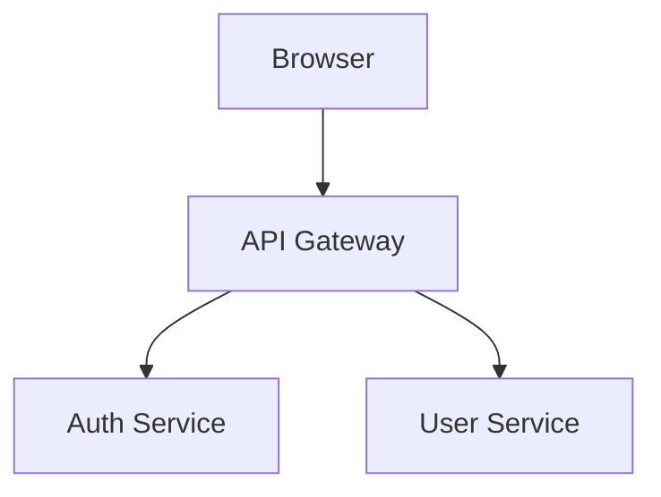
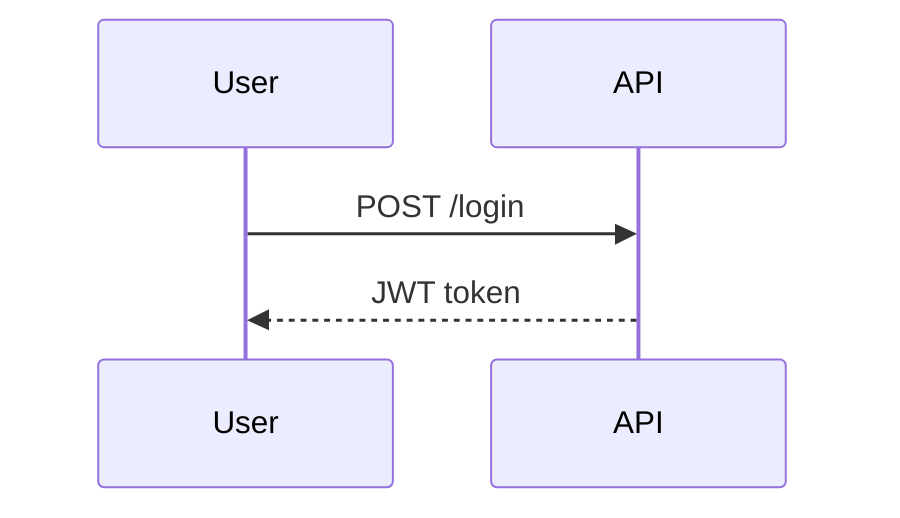
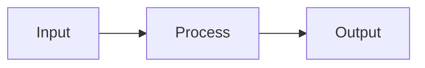

# User Stories

| Key     | Value                    |
| ------- | ------------------------ |
| Date    | 2026-02-04T16:27:05.585Z |
| Version | 1.0.0                    |
| Git SHA | 73f2377                  |

## ✅ Deeply nested JSON structures

> Demonstrating complex nested JSON in documentation
> **Application Configuration**

```json
{
  "app": {
    "name": "MyApplication",
    "version": "2.1.0",
    "environment": "production"
  },
  "server": {
    "host": "api.example.com",
    "port": 443,
    "ssl": {
      "enabled": true,
      "certificate": "/path/to/cert.pem",
      "key": "/path/to/key.pem",
      "protocols": ["TLSv1.2", "TLSv1.3"]
    },
    "timeouts": {
      "connection": 30000,
      "read": 60000,
      "write": 60000
    }
  },
  "database": {
    "primary": {
      "host": "db-primary.example.com",
      "port": 5432,
      "name": "app_production",
      "pool": {
        "min": 5,
        "max": 20,
        "idle": 10000
      }
    },
    "replica": {
      "hosts": ["db-replica-1.example.com", "db-replica-2.example.com"],
      "loadBalancing": "round-robin"
    }
  },
  "cache": {
    "provider": "redis",
    "cluster": {
      "nodes": [
        {
          "host": "redis-1.example.com",
          "port": 6379
        },
        {
          "host": "redis-2.example.com",
          "port": 6379
        },
        {
          "host": "redis-3.example.com",
          "port": 6379
        }
      ]
    },
    "ttl": {
      "default": 3600,
      "session": 86400,
      "static": 604800
    }
  },
  "features": {
    "flags": {
      "newUI": true,
      "betaFeatures": false,
      "experimentalAPI": {
        "enabled": true,
        "allowedUsers": ["admin", "beta-tester"]
      }
    }
  }
}
```

- **Given** complex configuration is loaded
- **Then** nested structures are documented

## ✅ Arrays of complex objects

> Documenting arrays with complex nested structures
> **User Profiles**

```json
[
  {
    "id": "user-001",
    "profile": {
      "name": "Alice Johnson",
      "email": "alice@example.com",
      "avatar": "https://example.com/avatars/alice.jpg"
    },
    "permissions": {
      "roles": ["admin", "editor"],
      "resources": {
        "documents": ["read", "write", "delete"],
        "users": ["read", "write"],
        "settings": ["read", "write", "admin"]
      }
    },
    "preferences": {
      "theme": "dark",
      "notifications": {
        "email": true,
        "push": true,
        "sms": false
      },
      "language": "en-US"
    }
  },
  {
    "id": "user-002",
    "profile": {
      "name": "Bob Smith",
      "email": "bob@example.com",
      "avatar": "https://example.com/avatars/bob.jpg"
    },
    "permissions": {
      "roles": ["viewer"],
      "resources": {
        "documents": ["read"],
        "users": ["read"],
        "settings": []
      }
    },
    "preferences": {
      "theme": "light",
      "notifications": {
        "email": true,
        "push": false,
        "sms": false
      },
      "language": "en-GB"
    }
  }
]
```

- **Given** user profiles are loaded
- **Then** complex arrays are documented

## ✅ Large data tables

> Tables with many rows and columns
> **API Endpoints Reference**

| Method | Endpoint             | Auth   | Rate Limit | Description      |
| ------ | -------------------- | ------ | ---------- | ---------------- |
| GET    | /api/v1/users        | Bearer | 100/min    | List all users   |
| GET    | /api/v1/users/:id    | Bearer | 200/min    | Get user by ID   |
| POST   | /api/v1/users        | Bearer | 50/min     | Create new user  |
| PUT    | /api/v1/users/:id    | Bearer | 50/min     | Update user      |
| DELETE | /api/v1/users/:id    | Bearer | 20/min     | Delete user      |
| GET    | /api/v1/orders       | Bearer | 100/min    | List all orders  |
| GET    | /api/v1/orders/:id   | Bearer | 200/min    | Get order by ID  |
| POST   | /api/v1/orders       | Bearer | 30/min     | Create new order |
| PUT    | /api/v1/orders/:id   | Bearer | 30/min     | Update order     |
| DELETE | /api/v1/orders/:id   | Bearer | 10/min     | Cancel order     |
| GET    | /api/v1/products     | None   | 500/min    | List products    |
| GET    | /api/v1/products/:id | None   | 1000/min   | Get product      |
| POST   | /api/v1/products     | Admin  | 20/min     | Create product   |
| PUT    | /api/v1/products/:id | Admin  | 20/min     | Update product   |
| DELETE | /api/v1/products/:id | Admin  | 5/min      | Delete product   |

**HTTP Status Codes Reference**

| Code | Status         | Category     | Common Use         |
| ---- | -------------- | ------------ | ------------------ |
| 200  | OK             | Success      | Successful GET/PUT |
| 201  | Created        | Success      | Successful POST    |
| 204  | No Content     | Success      | Successful DELETE  |
| 400  | Bad Request    | Client Error | Invalid input      |
| 401  | Unauthorized   | Client Error | Auth required      |
| 403  | Forbidden      | Client Error | Access denied      |
| 404  | Not Found      | Client Error | Resource missing   |
| 500  | Internal Error | Server Error | Server failure     |

- **Given** API documentation is needed
- **Then** large tables provide comprehensive reference

## ✅ SQL code examples

> SQL queries in documentation
> **Complex SELECT Query**

```sql
SELECT u.id, u.name, u.email, COUNT(o.id) as order_count
FROM users u
LEFT JOIN orders o ON u.id = o.user_id
WHERE u.status = 'active'
GROUP BY u.id, u.name, u.email;
```

- **Given** SQL examples are documented
- **Then** SQL syntax is highlighted

## ✅ YAML configuration examples

> YAML configuration files in documentation
> **Docker Compose Configuration**

```yaml
version: '3.8'
services:
  app:
    build: { context: . }
    ports: ['3000:3000']
  db:
    image: postgres:15
```

- **Given** YAML configs are documented
- **Then** YAML syntax is highlighted

## ✅ Shell script examples

> Bash scripts and commands in documentation
> **Deployment Script**

```bash
#!/bin/bash
set -euo pipefail
echo "Deploying..."
npm ci && npm run build && npm test
```

- **Given** shell scripts are documented
- **Then** bash syntax is highlighted

## ✅ Various Mermaid diagram types

> Different types of Mermaid diagrams
> **System Architecture**



**Authentication Flow**



- **Given** various diagram types are documented
- **Then** all Mermaid diagram types render

## ✅ Story with complex metadata structure

Tags: `comprehensive`, `documentation`, `complex-data`
Tickets: `DOCS-001`, `TECH-456`

> This story demonstrates complex metadata in story options

- **Given** story has rich metadata
- **When** documentation is generated
- **Then** metadata is preserved in output

## ✅ All complex data types in one story

> Comprehensive example combining all complex data documentation
> `comprehensive` `all-in-one`

- **Documentation Version:** 2.0
- **Completeness:** 100%
  [Full Documentation](https://docs.example.com)
  **Sample API Response**

```json
{
  "data": {
    "users": [
      {
        "id": 1,
        "name": "Test"
      }
    ],
    "pagination": {
      "page": 1,
      "total": 100
    }
  },
  "meta": {
    "version": "1.0"
  }
}
```

**Quick Reference**

| Type     | Example        | Support |
| -------- | -------------- | ------- |
| JSON     | Nested objects | Full    |
| Tables   | Multi-column   | Full    |
| Code     | Multiple langs | Full    |
| Diagrams | Mermaid        | Full    |

**Quick Start**

```typescript
import { story } from 'executable-stories-vitest';

it('My Test', ({ task }) => {
  story.init(task);
  story.json('Data', { key: 'value' });
});
```

**Simple Flow**



**Additional Notes**

This story demonstrates:

- Nested JSON structures
- Large tables
- Multiple code formats
- Various Mermaid diagrams
- Complex metadata

- **Given** all documentation types are used
- **Then** comprehensive documentation is generated
