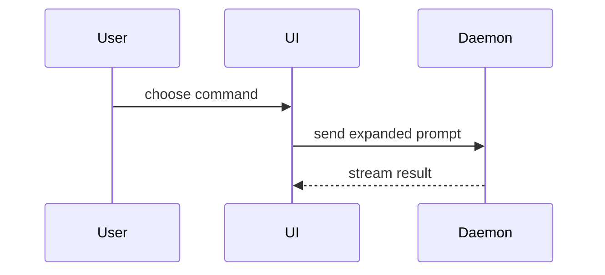

# Show Me

Someone in the conversation needs to see the thing, not read three paragraphs about it.
Skip the preamble, keep the prose short, pick the smallest view that makes the point.

Two ways this goes wrong. One is a wall of text where a five-line call tree would do. The
other is worse and specific to this repo: a beautiful diagram of behaviour nobody checked.
This repo runs the system on every test run and keeps the answer in artifacts. Drawing your
own picture of what the code "does" while that run sits unread is how a confident wrong
diagram gets into someone's head.

## First, split the question

**Behaviour** (what happens when X, what the system does, why this case fails): the run
already answers it. Do not draw. Go and get it.

**Shape** (how the code is laid out, control flow, types, what a change touches): the run
says nothing useful. Sketch it inline, cheapest form first.

Most "show me" questions are shape. The ones that are behaviour are the ones worth being
careful about.

## Behaviour: show the run, do not redraw it

```bash
executable-stories list reports/by-file --list-format json    # find the scenarios
executable-stories format reports/raw-run.json --format agent-text --output-dir reports
```

Over MCP: `list_scenarios`, `get_scenario`, `get_failing_scenarios`, `get_feature_summary`.

Then show what is there: the Given/When/Then, the status, and the doc entries the scenario
already carries. Screenshots, state frames, tables and mermaid diagrams may already exist
on the story, put there by whoever wrote it. Reuse them. A second drawing of the same flow
is a second copy that will disagree with the first.

If nothing covers the question, say **"not covered by a scenario"** in the same breath as
the sketch you then draw. That gap is useful information, and it stops an inferred picture
reading like a verified one.

## Shape: the catalogue

Use one, sometimes two. It is unlikely you will use all of them.

- Logic or an algorithm as pseudocode:

```text
on(save)
  if content is unchanged
    return cached result
  write new content
  return fresh result
```

- Runtime control flow as a call tree:

```text
submitForm
  createSession
    persistPrompt
    launchAgent
  navigateToSession
```

- UI structure as a component tree, with the state and module boundaries that matter:

```tsx
<SessionPage> (apps/example/src/routes/session.tsx)
  useSessionEvents()
  <SessionToolbar>
    <RunSkillButton> (packages/ui)
```

- File responsibility or a broad refactor as a shallow file tree:

```text
src/
├── commands/       # parses user actions
├── sessions/       # owns session state
└── transport/      # sends API requests
```

- Component interaction, control flow or data flow with Mermaid. Renders live in the HTML
  report already, so this one promotes to `story.mermaid` for free:

````text

````

- `diff` when the point is what changes and the surrounding shape already exists. Match the
  diff shape to the topic:

```diff
 src/
 ├── commands/
+│   └── show-me.ts       # expands the slash command
 ├── sessions/
-└── transport.ts
+└── transport/
+    ├── client.ts
+    └── stream.ts
```

```diff
 on(save)
-  write content
+  if content is unchanged
+    return cached result
+  write new content
+  invalidate cache
```

- The whole block when most of it is new, when omitted context would hide ownership or
  order, or when the reader needs a copyable target shape.

## Promote it when it will be asked again

A sketch that answers a question once belongs in the conversation. A sketch that answers a
question people keep asking, or that makes a claim about behaviour, belongs on the story
that proves it, where it renders in every report format and goes stale visibly:

| Shape                 | Home                                              |
| --------------------- | ------------------------------------------------- |
| Flow, sequence, state | `story.mermaid({ code, title })`                  |
| Files touched         | `story.custom({ type: "file-tree", data })`       |
| Record or schema      | `story.custom({ type: "data-model", data })`      |
| Before and after      | `story.state`, `story.table`                      |
| Annotated code        | `story.code({ label, content, lang })`            |
| Prose                 | `story.section({ title, markdown })`              |
| Interactive figure    | `story.html` (sandboxed iframe)                   |

Say so when you drew a block from reading code rather than from a run. Nothing can tell the
difference after the fact, so declare it while you write — it is the only thing separating
your picture from the scenario next to it.

The `file-tree` and `data-model` blocks render the marker for you. Put `authored: "agent"`
inside `data`, and it appears as "AI-authored, not verified by a run":

```ts
story.custom({ type: "file-tree", data: { title: "Files touched", authored: "agent", files } });
```

No other block reads that field, so for `mermaid`, `code`, `section`, `state`, `table` and
`html` put it in the text the block already shows — the `title`, the `label`, or the first
line of the markdown:

```ts
story.mermaid({ title: "Checkout flow (AI-authored, not verified by a run)", code });
```

Then render and open:

```bash
executable-stories format reports/raw-run.json --format html --output-dir reports --open
```

## HTML is the last resort

When the point really needs a page (a layout comparison, a state matrix, a concept too
dense for Mermaid), write it as `story.html` so it lands in the report with the behaviour
it illustrates. Self-contained vanilla HTML, CSS and JS, no external requests, real labels
and real data, works on a phone.

Only when no story owns it, write `reports/show-me/<slug>.html` and open it:

```bash
open reports/show-me/<slug>.html
```

Never a global temp directory. A file in `/tmp` is a picture that cannot be found again and
cannot be checked when the behaviour moves.

## Guidance

Put each visual next to the short text it supports. Keep only the calls, files, props,
states and boundaries that answer the question actually in front of you. Do not overwhelm
the reader with a gallery.

## Neighbouring skills

- `show-me` answers the question being asked right now, in the conversation.
- `explain-change` publishes an explainer for a diff, with provenance frontmatter, evidence
  citations and a quiz.
- `explain-system` orients someone in a whole area they have never seen.
- `executable-lessons` turns a topic people keep relearning into runnable lessons.

If the same show-me keeps getting asked, stop drawing it and promote it to one of those.
